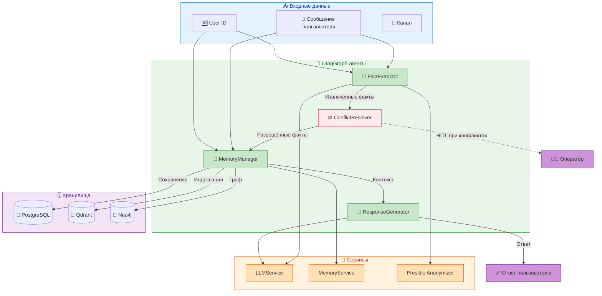
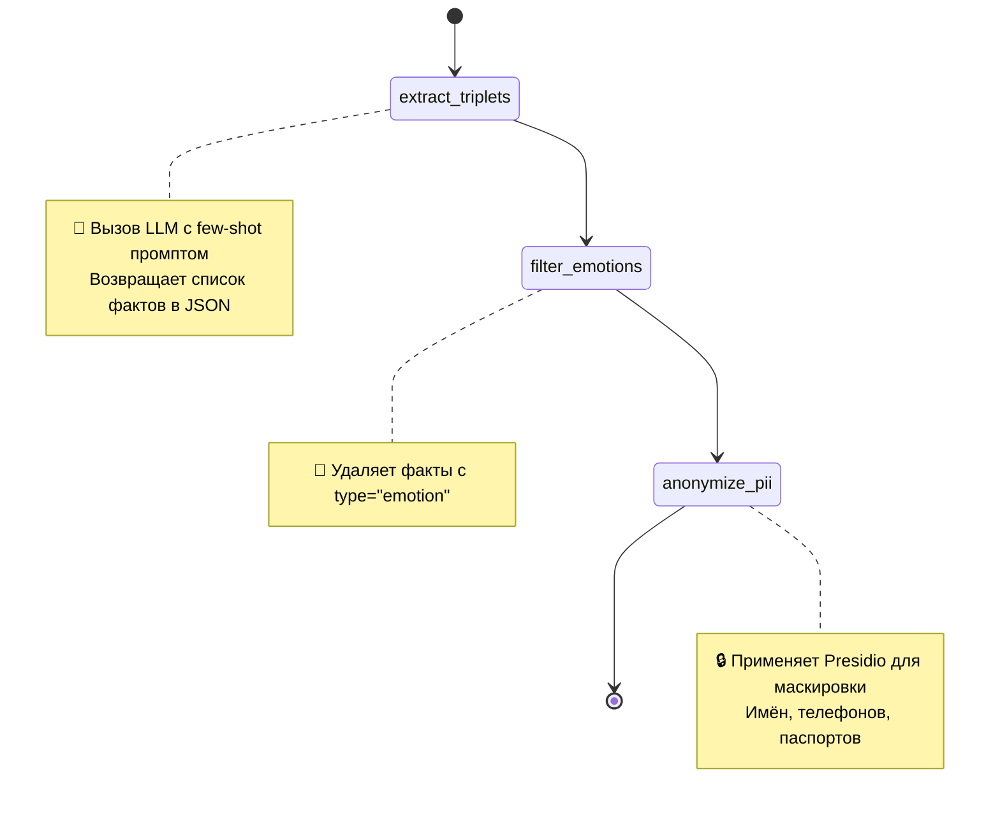
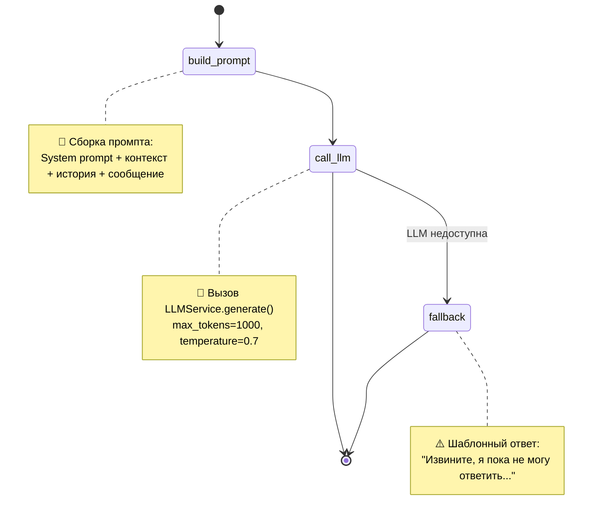
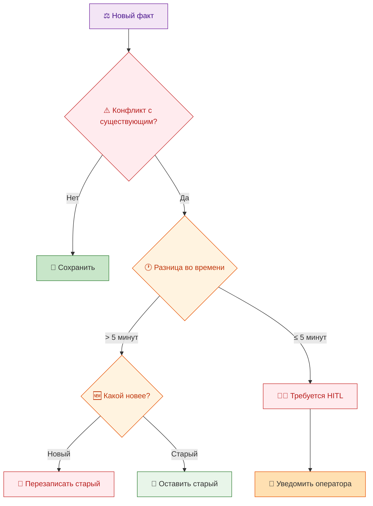

# 🤖 AGENTS_REFERENCE.md

## 1. Введение

### 1.1. Цель документа

Настоящий документ содержит детальное описание всех AI-агентов системы «Омниканальный агент с долговременной памятью», построенных на базе **LangGraph**. Он предназначен для разработчиков, ML-инженеров, архитекторов и всех, кто хочет понять внутреннее устройство агентов, их графы состояний, логику работы и интеграцию с другими компонентами системы.

В отличие от [ARCHITECTURE.md](ARCHITECTURE.md), где представлен общий обзор агентов, настоящий документ фокусируется на **детальной реализации каждого агента**:

- Структура графа (узлы, рёбра, условные переходы).
- Код каждого узла с пояснениями.
- Входные и выходные данные.
- Трассировка требований (из [SPEC.md](SPEC.md)).
- Примеры использования.
- Тесты и метрики.

Все агенты используют **LangGraph** — фреймворк для построения графов состояний с поддержкой чекпоинтов, условных переходов и human-in-the-loop (HITL). Агенты находятся в директории [backend/src/agents/](../backend/src/agents/).

### 1.2. Обзор агентов

| Агент | Файл | Назначение | Тип |
|-------|------|------------|-----|
| **FactExtractor** | [fact_extractor.py](../backend/src/agents/fact_extractor.py) | Извлечение структурированных фактов из текста | Онлайн (синхронный) |
| **MemoryManager** | [memory_manager.py](../backend/src/agents/memory_manager.py) | Управление памятью (чтение/запись) | Онлайн (синхронный) |
| **ResponseGenerator** | [response_generator.py](../backend/src/agents/response_generator.py) | Генерация персонализированных ответов | Онлайн (синхронный) |
| **ConflictResolver** | [conflict_resolver.py](../backend/src/agents/conflict_resolver.py) | Разрешение конфликтов между фактами | Онлайн (синхронный) |
| **DecayAgent** | [decay_tasks.py](../backend/src/tasks/decay_tasks.py) | Фоновое устаревание фактов | Фоновый (Celery) |

### 1.3. Трассировка требований

| Требование | Описание | Агенты |
|------------|----------|--------|
| R01 | Доля диалогов с памятью > 30% | MemoryManager, ResponseGenerator |
| R03 | Снижение повторных обращений | FactExtractor, DecayAgent |
| R06 | Анонимизация PII | FactExtractor |
| R13 | Разрешение конфликтов | ConflictResolver |

---

## 2. Общая архитектура агентов

### 2.1. Диаграмма взаимодействия



### 2.2. Общий принцип работы

1. **FactExtractor** — получает текст сообщения, извлекает факты с помощью LLM, фильтрует эмоции, анонимизирует PII.
2. **ConflictResolver** — проверяет новые факты на противоречия с существующими, разрешает по правилу «позднее перекрывает раннее».
3. **MemoryManager** — сохраняет факты в тройное хранилище (PG + Qdrant + Neo4j) и выполняет поиск релевантных фактов для контекста.
4. **ResponseGenerator** — формирует персонализированный ответ с использованием контекста из памяти и текущего сообщения.

**Фоновый агент:**
5. **DecayAgent** — периодически пересчитывает веса фактов, удаляет устаревшие.

---

## 3. Agent: FactExtractor

### 3.1. Назначение

Извлечение структурированных фактов из текстового сообщения пользователя. Агент преобразует неструктурированный текст в формат, пригодный для хранения в памяти.

**Трассировка требований:**
- R01 — извлечение фактов для использования в памяти.
- R06 — анонимизация PII перед сохранением.

**Файл:** [backend/src/agents/fact_extractor.py](../backend/src/agents/fact_extractor.py)

### 3.2. Граф состояний



### 3.3. Реализация

**Класс:** `FactExtractorAgent`

```python
class FactExtractorAgent:
    def __init__(self) -> None:
        self.llm = LLMService()

    async def extract(self, message: str) -> list[dict[str, Any]]:
        # Шаг 1: Извлечение через LLM
        facts = await self._extract_triplets(message)
        # Шаг 2: Фильтрация эмоций
        facts = self._filter_emotions(facts)
        # Шаг 3: Анонимизация PII
        facts = self._anonymize_pii(facts)
        return facts
```

#### 3.3.1. Узел: `extract_triplets`

**Назначение:** Вызов LLM с промптом для извлечения фактов в формате JSON.

**Код:**
```python
EXTRACTION_PROMPT = (
    "Извлеки факты из следующего сообщения пользователя.\n"
    "Верни JSON-массив объектов с полями:\n"
    "- type: тип факта (preference, fact, intent, emotion)\n"
    "- content: текст факта\n"
    "- weight: важность (0.1-1.0)\n"
    "\nПравила:\n"
    "- Не извлекай эмоции (type=\"emotion\") - они будут отфильтрованы\n"
    "- Факты должны быть конкретными и полезными для запоминания\n"
    "- Примеры: \"любит кофе\" (preference), "
    "\"работает в Яндексе\" (fact), "
    "\"хочет купить машину\" (intent)\n"
    "\nСообщение: {message}\n"
    "\nОтвет (только JSON):"
)

async def _extract_triplets(self, message: str) -> list[dict[str, Any]]:
    if not settings.ENABLE_LLM:
        return []
    try:
        prompt = EXTRACTION_PROMPT.format(message=message)
        response = await self.llm.generate(
            prompt=prompt,
            max_tokens=500,
            temperature=0.3,
        )
        # Парсинг JSON с обработкой markdown-обёртки и лишнего текста
        json_str = self._extract_json(response)
        parsed = json.loads(json_str)
        if not isinstance(parsed, list):
            parsed = [parsed]
        return parsed
    except Exception as e:
        logger.error(f"Fact extraction failed: {e}")
        return []
```

**Особенности:**
- `temperature=0.3` — низкая температура для детерминированных ответов.
- `max_tokens=500` — достаточно для списка фактов.
- Устойчивость к невалидному JSON (парсинг через `re.search` для извлечения массива).

**Ссылки на код:** [backend/src/agents/fact_extractor.py#L45-L95](../backend/src/agents/fact_extractor.py)

#### 3.3.2. Узел: `filter_emotions`

**Назначение:** Удаление фактов с типом `emotion`, чтобы не хранить эмоциональные высказывания в памяти.

**Код:**
```python
def _filter_emotions(self, facts: list[dict[str, Any]]) -> list[dict[str, Any]]:
    filtered = [
        f for f in facts
        if f.get("type", "").lower() != "emotion"
    ]
    removed = len(facts) - len(filtered)
    if removed:
        logger.info("Filtered %d emotional facts", removed)
    return filtered
```

**Трассировка требований:** R01 — хранение только значимых фактов.

#### 3.3.3. Узел: `anonymize_pii`

**Назначение:** Замена персональных данных на маски с помощью Microsoft Presidio.

**Код:**
```python
def _anonymize_pii(self, facts: list[dict[str, Any]]) -> list[dict[str, Any]]:
    if not settings.ENABLE_LLM:
        return facts
    try:
        from backend.src.utils.presidio_anonymizer import anonymize_text
        for fact in facts:
            content = fact.get("content", "")
            if content:
                anonymized = anonymize_text(content)
                fact["content"] = anonymized
                if anonymized != content:
                    fact["pii_masked"] = True
        return facts
    except Exception as e:
        logger.warning(f"PII anonymization failed: {e}")
        return facts
```

**Пример:**
- Вход: `"Меня зовут Иван Петров, мой телефон +79991234567"`
- Выход: `"Меня зовут <PERSON>, мой телефон <PHONE_NUMBER>"`

**Трассировка требований:** R06 — анонимизация PII.

**Ссылки на код:** [backend/src/agents/fact_extractor.py#L115-L135](../backend/src/agents/fact_extractor.py)

### 3.4. Пример работы

**Вход:**
```
message = "Я хочу подключить безлимитный тариф, но у меня нет паспорта под рукой"
```

**Промпт к LLM (сокращённо):**
```
Извлеки факты из следующего сообщения...
Сообщение: Я хочу подключить безлимитный тариф, но у меня нет паспорта под рукой
```

**Ответ LLM:**
```json
[
  {"type": "intent", "content": "подключить безлимитный тариф", "weight": 0.9},
  {"type": "obstacle", "content": "нет паспорта под рукой", "weight": 0.7}
]
```

**После фильтрации эмоций:** без изменений (нет эмоциональных фактов).

**После анонимизации PII:** без изменений (нет PII).

**Итог:**
```python
[
  {"type": "intent", "content": "подключить безлимитный тариф", "weight": 0.9},
  {"type": "obstacle", "content": "нет паспорта под рукой", "weight": 0.7}
]
```

### 3.5. Тесты

**Файл:** [backend/tests/unit/test_agents.py](../backend/tests/unit/test_agents.py)

Тесты покрывают:
- Успешное извлечение фактов.
- Фильтрацию эмоций.
- Анонимизацию PII.
- Обработку ошибок LLM (невалидный JSON, пустой ответ).
- Работу при `ENABLE_LLM=false`.

**Количество тестов:** 5+ для FactExtractor.

---

## 4. Agent: MemoryManager

### 4.1. Назначение

Управление памятью: сохранение фактов в тройное хранилище (PostgreSQL, Qdrant, Neo4j) и поиск релевантных фактов для формирования контекста.

**Трассировка требований:**
- R01 — поиск памяти для персонализации.
- R03 — хранение фактов с весами для decay.

**Файл:** [backend/src/agents/memory_manager.py](../backend/src/agents/memory_manager.py)

### 4.2. Архитектура (DI)

В отличие от других агентов, `MemoryManager` **не создаёт** свои зависимости, а принимает их через конструктор (Dependency Injection). Это сделано для тестируемости и гибкости.

**Код:**
```python
class MemoryManagerAgent:
    def __init__(self, memory_service: MemoryService) -> None:
        self.memory_service = memory_service
```

**Где создаётся:** в `ChatService` и `VoiceService`.

```python
# backend/src/services/chat_service.py
memory_svc = Mem0MemoryService(db)
memory_agent = MemoryManagerAgent(memory_service=memory_svc)
```

### 4.3. Методы

#### 4.3.1. `store_facts`

**Назначение:** Сохранение списка фактов в память.

**Код:**
```python
async def store_facts(
    self,
    user_id: uuid.UUID,
    facts: list[dict[str, Any]],
    channel: str = "text",
) -> list[dict[str, Any]]:
    stored = []
    for fact_data in facts:
        fact_type = fact_data.get("type", "fact")
        content = fact_data.get("content", "")
        weight = fact_data.get("weight", 0.5)
        if not content:
            continue
        try:
            result = await self.memory_service.store_fact(
                user_id=user_id,
                fact_type=fact_type,
                value=content,
                channel=channel,
                weight=weight,
            )
            stored.append({
                "id": str(result.id),
                "type": fact_type,
                "content": content,
                "weight": weight,
                "status": "stored",
            })
        except Exception as e:
            logger.error(f"Failed to store fact: {e}")
            stored.append({"type": fact_type, "content": content, "error": str(e)})
    return stored
```

**Что делает `MemoryService.store_fact`:**
1. Сохраняет в PostgreSQL (через `FactService`) — зашифрованное значение.
2. Индексирует в Qdrant (вектор) — best-effort.
3. Создаёт узел в Neo4j — best-effort.

**Ссылки на код:** [backend/src/agents/memory_manager.py#L25-L60](../backend/src/agents/memory_manager.py)

#### 4.3.2. `retrieve_facts`

**Назначение:** Поиск релевантных фактов для пользователя по текстовому запросу.

**Код:**
```python
async def retrieve_facts(
    self,
    user_id: uuid.UUID,
    query: str,
    limit: int = 10,
) -> list[dict[str, Any]]:
    results = await self.memory_service.search_facts(
        user_id, query, limit
    )
    return [
        {
            "id": str(fact.id),
            "type": fact.type,
            "content": fact.value,
            "weight": fact.weight,
            "source": "memory_service",
        }
        for fact in results
    ]
```

**Поиск включает:**
- Ключевой поиск (PostgreSQL) — по тексту факта.
- Векторный поиск (Qdrant) — семантическая близость.
- Графовый поиск (Neo4j) — связи между фактами.
- Реранкинг (Cross-Encoder) — улучшение релевантности.

**Ссылки на код:** [backend/src/agents/memory_manager.py#L62-L80](../backend/src/agents/memory_manager.py)

### 4.4. Пример работы

**Сохранение факта:**
```python
facts = [
    {"type": "intent", "content": "подключить безлимитный тариф", "weight": 0.9}
]
await memory_agent.store_facts(user_id, facts, channel="MAX")
```

**Поиск факта:**
```python
results = await memory_agent.retrieve_facts(user_id, "тариф")
# Вернёт: [{"id": "...", "type": "intent", "content": "подключить безлимитный тариф", "weight": 0.9}]
```

### 4.5. Тесты

**Файл:** [backend/tests/unit/test_agents.py](../backend/tests/unit/test_agents.py)

- Тесты с мок-объектом `MemoryService`.
- Проверка вызова `store_fact` с правильными параметрами.
- Проверка обработки ошибок.

---

## 5. Agent: ResponseGenerator

### 5.1. Назначение

Генерация персонализированного ответа пользователю на основе контекста (фактов из памяти) и текущего сообщения.

**Трассировка требований:**
- R01 — персонализация ответов с использованием памяти.
- R15 — graceful degradation (fallback при недоступности LLM).

**Файл:** [backend/src/agents/response_generator.py](../backend/src/agents/response_generator.py)

### 5.2. Граф состояний



### 5.3. Реализация

**Класс:** `ResponseGeneratorAgent`

```python
class ResponseGeneratorAgent:
    def __init__(self, db: AsyncSession) -> None:
        self.db = db
        self.llm = LLMService()
        self.memory_search = MemorySearchService(db)

    async def generate(
        self,
        user_id: Any,
        message: str,
        history: list[dict[str, str]] | None = None,
    ) -> dict[str, Any]:
        # 1. Получение контекста памяти
        context = ""
        context_used = False
        if user_uuid:
            try:
                context = await self.memory_search.get_memory_context(
                    user_id=user_uuid,
                    current_message=message,
                    max_facts=5,
                )
                context_used = bool(context)
            except Exception as e:
                logger.warning(f"Memory search failed: {e}")

        # 2. Сборка промпта
        prompt = self._build_prompt(message, context, history)

        # 3. Вызов LLM или fallback
        if settings.ENABLE_LLM:
            try:
                response = await self.llm.generate(
                    prompt=prompt,
                    max_tokens=1000,
                    temperature=0.7,
                )
                return {"response": response, "context_used": context_used, "fallback": False}
            except Exception as e:
                logger.error(f"LLM generation failed: {e}")

        # 4. Fallback
        return {
            "response": FALLBACK_RESPONSE,
            "context_used": False,
            "fallback": True,
        }
```

#### 5.3.1. Узел: `build_prompt`

**Код:**
```python
SYSTEM_PROMPT = (
    "Ты - полезный персональный ассистент.\n"
    "Используй информацию из памяти для персонализации ответа.\n"
    "Не упоминай, что ты используешь память - просто отвечай естественно.\n"
)

def _build_prompt(self, message: str, context: str, history: list | None) -> str:
    parts = [SYSTEM_PROMPT, ""]
    if context:
        parts.append(context)
        parts.append("")
    if history:
        parts.append("История диалога:")
        for msg in history[-10:]:
            parts.append(f"{msg['role']}: {msg['content']}")
        parts.append("")
    parts.append(f"Пользователь: {message}")
    parts.append("Ответ:")
    return "\n".join(parts)
```

**Пример промпта:**
```
Ты - полезный персональный ассистент.
Используй информацию из памяти для персонализации ответа.

Релевантная информация из памяти:
1. пользователь хочет подключить безлимитный тариф

Пользователь: Здравствуйте, я по поводу тарифа
Ответ:
```

#### 5.3.2. Узел: `call_llm`

**Код:** вызов `self.llm.generate()` с параметрами:
- `max_tokens=1000` — достаточно для развёрнутого ответа.
- `temperature=0.7` — баланс между креативностью и детерминизмом.

**Пример ответа LLM:**
```
Здравствуйте! Я вижу, вы интересовались безлимитным тарифом. Хотите подключить его сейчас?
```

#### 5.3.3. Узел: `fallback`

**Код:**
```python
FALLBACK_RESPONSE = (
    "Извините, я пока не могу ответить на этот вопрос. "
    "Попробуйте позже."
)
```

**Трассировка требований:** R15 — graceful degradation.

**Ссылки на код:** [backend/src/agents/response_generator.py#L15-L25](../backend/src/agents/response_generator.py)

### 5.4. Пример работы

**Вход:**
```python
user_id = "550e8400-e29b-41d4-a716-446655440000"
message = "Здравствуйте, я по поводу тарифа"
# В памяти есть факт: {type: "intent", content: "подключить безлимитный тариф"}
```

**Контекст из памяти:**
```
Релевантная информация из памяти:
1. пользователь хочет подключить безлимитный тариф
```

**Ответ:**
```json
{
  "response": "Здравствуйте! Я вижу, вы интересовались безлимитным тарифом. Хотите подключить его сейчас?",
  "context_used": true,
  "fallback": false
}
```

### 5.5. Тесты

**Файл:** [backend/tests/unit/test_agents.py](../backend/tests/unit/test_agents.py)

- Тесты с мок-объектами LLM и MemorySearch.
- Проверка использования контекста при наличии фактов.
- Проверка fallback при отключённой LLM.

---

## 6. Agent: ConflictResolver

### 6.1. Назначение

Разрешение конфликтов между новыми и существующими фактами. Использует правило «позднее перекрывает раннее» и HITL для близких по времени конфликтов.

**Трассировка требований:**
- R13 — разрешение конфликтов между фактами из разных каналов.

**Файл:** [backend/src/agents/conflict_resolver.py](../backend/src/agents/conflict_resolver.py)

### 6.2. Граф принятия решений



### 6.3. Реализация

**Класс:** `ConflictResolverAgent`

```python
class ConflictResolverAgent:
    def __init__(self) -> None:
        self.hitl_threshold = timedelta(minutes=5)

    def resolve(
        self,
        existing_fact: dict[str, Any],
        new_fact: dict[str, Any],
    ) -> dict[str, Any]:
        existing_time = self._parse_time(existing_fact.get("created_at"))
        new_time = self._parse_time(new_fact.get("created_at"))

        if existing_time is None or new_time is None:
            return self._resolve_by_weight(existing_fact, new_fact)

        time_diff = abs(new_time - existing_time)

        if time_diff > self.hitl_threshold:
            if new_time > existing_time:
                return {
                    "action": "override",
                    "fact": new_fact,
                    "requires_hitl": False,
                    "reason": f"Newer fact (delta={time_diff})",
                }
            else:
                return {
                    "action": "keep_existing",
                    "fact": existing_fact,
                    "requires_hitl": False,
                    "reason": f"Existing fact is newer (delta={time_diff})",
                }
        else:
            return {
                "action": "flag_for_review",
                "fact": existing_fact,
                "new_fact": new_fact,
                "requires_hitl": True,
                "reason": f"Conflicts within {time_diff}, HITL required",
            }
```

### 6.4. Пример работы

**Сценарий 1: Новый факт перекрывает старый (>5 минут)**

```python
existing = {"content": "работает в Яндексе", "created_at": "2026-07-16T10:00:00"}
new = {"content": "работает в Сбере", "created_at": "2026-07-16T12:00:00"}
result = resolver.resolve(existing, new)
# result["action"] == "override"
# result["fact"]["content"] == "работает в Сбере"
```

**Сценарий 2: Конфликт требует HITL (<5 минут)**

```python
existing = {"content": "хочет безлимит", "created_at": "2026-07-16T10:00:00"}
new = {"content": "не хочет безлимит", "created_at": "2026-07-16T10:03:00"}
result = resolver.resolve(existing, new)
# result["action"] == "flag_for_review"
# result["requires_hitl"] == True
```

### 6.5. Тесты

**Файл:** [backend/tests/unit/test_agents.py](../backend/tests/unit/test_agents.py)

- Тесты на правило «позднее перекрывает раннее».
- Тесты на HITL при близких конфликтах.
- Тесты на разрешение по весу при отсутствии времени.

---

## 7. Agent: DecayAgent (фоновый)

### 7.1. Назначение

Периодическое устаревание фактов: уменьшение веса старых фактов и удаление тех, чей вес стал меньше порога.

**Трассировка требований:**
- R03 — снижение повторных обращений (актуальность памяти).
- R12 — Memory Decay (естественное забывание).

**Файл:** [backend/src/tasks/decay_tasks.py](../backend/src/tasks/decay_tasks.py)

### 7.2. Расписание

Запускается **Celery Beat** раз в час (`schedule=3600`).

```python
# backend/src/celery_app.py
beat_schedule = {
    "decay-agent-hourly": {
        "task": "backend.src.tasks.decay_tasks.run_decay_agent",
        "schedule": 3600.0,
    },
}
```

### 7.3. Реализация

```python
@celery_app.task
def run_decay_agent() -> dict:
    async def _decay():
        async with async_session_factory() as db:
            # 1. Плавное уменьшение веса (×0.99 за цикл)
            await db.execute(
                update(Fact)
                .where(Fact.is_superseded == False)
                .values(weight=Fact.weight * 0.99)
            )

            # 2. Факты с весом < 0.1 помечаем как superseded
            expired = await db.execute(
                update(Fact)
                .where(Fact.weight < 0.1, Fact.is_superseded == False)
                .values(is_superseded=True, weight=0.1)
            )
            await db.commit()
            return {"decayed_facts": expired.rowcount}

    result = asyncio.run(_decay())
    return result
```

### 7.4. Параметры

| Параметр | Значение | Описание |
|----------|----------|----------|
| `DECAY_FACTOR` | 0.99 | Множитель уменьшения веса за цикл |
| `MIN_WEIGHT` | 0.1 | Минимальный вес для участия в поиске |
| `DECAY_INTERVAL` | 1 час | Периодичность запуска |

### 7.5. Пример работы

1. **Факт создан:** вес = 1.0, `created_at = 2026-07-16T10:00:00`.
2. **Через 24 часа (24 цикла):** вес = 1.0 * (0.99)^24 ≈ 0.79.
3. **Через 30 дней (720 циклов):** вес ≈ 1.0 * (0.99)^720 ≈ 0.0007 < 0.1 → факт помечается `superseded` и удаляется из поиска.

**Трассировка требований:** R03 — снижение повторных обращений за счёт актуальной памяти.

---

## 8. Интеграция агентов в пайплайн

### 8.1. Текстовый пайплайн (ChatService)

```python
# backend/src/services/chat_service.py
async def send_message(self, user_id, message, channel_type):
    # 1. Поиск памяти
    memory_agent = MemoryManagerAgent(self.memory)
    facts = await memory_agent.retrieve_facts(user_id, message)

    # 2. Генерация ответа
    response_agent = ResponseGeneratorAgent(self.db)
    response = await response_agent.generate(user_id, message, facts)

    # 3. Асинхронное извлечение и сохранение фактов
    extract_facts.delay(user_id, message, channel_type)

    return response
```

### 8.2. Голосовой пайплайн (VoiceService)

```python
# backend/src/services/voice_service.py
async def process_voice(self, audio_data, caller_id):
    # 1. ASR
    text = await self.asr.transcribe(audio_data)

    # 2. Текстовый пайплайн (как выше)
    response = await self.chat_service.send_message(user_id, text, "VOICE")

    # 3. TTS
    audio = await self.tts.synthesize(response["response"])

    return {"text": response["response"], "audio": audio}
```

### 8.3. Фоновое извлечение фактов (Celery)

```python
# backend/src/tasks/fact_tasks.py
@celery_app.task
def extract_facts(self, user_id: str, message: str, channel: str) -> dict:
    # 1. Извлечение
    extractor = FactExtractorAgent()
    facts = await extractor.extract(message)

    # 2. Сохранение
    memory_agent = MemoryManagerAgent(self.memory)
    await memory_agent.store_facts(user_id, facts, channel)

    # 3. Разрешение конфликтов
    resolver = ConflictResolverAgent()
    for fact in facts:
        # ... проверка и разрешение
```

---

## 9. Метрики агентов

| Метрика | Тип | Описание | Агент |
|---------|-----|----------|-------|
| `facts_extracted_total` | Counter | Количество извлечённых фактов | FactExtractor |
| `conflicts_detected_total` | Counter | Количество конфликтов (по разрешению) | ConflictResolver |
| `llm_request_duration` | Histogram | Задержка вызова LLM | FactExtractor, ResponseGenerator |
| `memory_search_duration` | Histogram | Задержка поиска памяти | MemoryManager |

**Ссылки:** [backend/src/metrics.py](../backend/src/metrics.py)

---

## 10. Заключение

Агенты построены на LangGraph с чёткими графами состояний, что обеспечивает детерминизм и прозрачность. Каждый агент решает свою задачу:

- **FactExtractor** — извлечение фактов с анонимизацией.
- **MemoryManager** — хранение и поиск памяти.
- **ResponseGenerator** — персонализированные ответы.
- **ConflictResolver** — разрешение противоречий.
- **DecayAgent** — фоновое устаревание.

Агенты интегрированы в единый пайплайн через `ChatService` и `VoiceService`, а асинхронные задачи вынесены в Celery.
