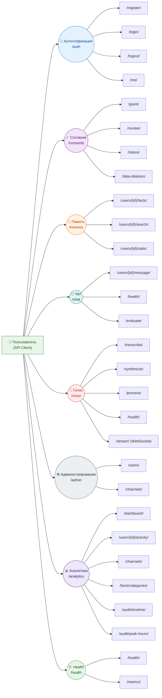

# 📚 API_REFERENCE.md

## 1. Общие сведения

### 1.1. Аутентификация

Система использует **JWT (JSON Web Token)** для аутентификации. Токен хранится в **httpOnly cookie** с именем `access_token`. Это обеспечивает защиту от XSS-атак.

- **Установка cookie**: происходит автоматически при успешном входе (`POST /auth/login`).
- **Отправка запросов**: браузер автоматически отправляет cookie с каждым запросом. Для программных клиентов необходимо вручную установить cookie или использовать заголовок `Authorization: Bearer <token>` (не реализовано, только cookie).

**Время жизни токена**: 24 часа (настраивается через `JWT_EXPIRATION_HOURS`).

### 1.2. CSRF-защита

Для защищённых методов (POST, PUT, DELETE, PATCH) используется **double‑submit cookie**:

- Cookie `csrf_token` устанавливается при логине (не httpOnly, доступен для JavaScript).
- Клиент должен отправлять значение этого cookie в заголовке `X-CSRF-Token` при каждом изменяющем запросе.

**Исключения**: CSRF-проверка отключена в development-режиме (`ENABLE_CSRF=false`), но в production включена по умолчанию.

### 1.3. Форматы данных

- **Запросы и ответы**: JSON.
- **Даты и время**: ISO 8601 в UTC (`2026-07-16T10:00:00Z`).
- **Идентификаторы**: UUID (строковый формат).
- **Коды ошибок**: HTTP-статусы с телом в формате [RFC 7807](https://datatracker.ietf.org/doc/html/rfc7807) (Problem Details). Пример:

```json
{
  "type": "about:blank",
  "title": "Validation Error",
  "status": 400,
  "detail": "Invalid phone number format",
  "instance": "/auth/register"
}
```
---

## 2. Группы эндпоинтов

Ниже представлена общая схема API:



---

## 3. Аутентификация (`/auth`)

### `POST /auth/register`

**Описание:** Регистрация нового пользователя.

**Тело запроса**:
```json
{
  "phone": "+79991234567",
  "password": "TestPass123!"
}
```

**Параметры**:
| Поле | Тип | Описание |
|------|-----|----------|
| `phone` | string | Номер телефона в формате `+7XXXXXXXXXX` |
| `password` | string | Пароль (минимум 8 символов) |

**Пример ответа (201 Created)**:
```json
{
  "id": "123e4567-e89b-12d3-a456-426614174000",
  "phone_hash": "a4f5c6d7e8f9a0b1c2d3e4f5g6h7i8j9",
  "created_at": "2026-07-16T10:00:00Z",
  "is_active": true,
  "tenant_id": "default"
}
```

**Коды ошибок**:
- `400` — Некорректные данные (неверный формат телефона или пароль слишком короткий).
- `409` — Пользователь с таким телефоном уже существует.

**Ссылки на код**: [backend/src/api/auth.py](../backend/src/api/auth.py), [backend/src/services/auth_service.py](../backend/src/services/auth_service.py)

---

### `POST /auth/login`

**Описание:** Вход в систему. Устанавливает `access_token` cookie и CSRF-токен.

**Тело запроса**:
```json
{
  "phone": "+79991234567",
  "password": "TestPass123!"
}
```

**Пример ответа (200 OK)**:
```json
{
  "access_token": "eyJhbGciOiJIUzI1NiIs...",
  "token_type": "bearer"
}
```

**Cookie**:
- `access_token` (httpOnly, SameSite=Strict, Secure в production).
- `csrf_token` (не httpOnly, для отправки в заголовке).

**Коды ошибок**:
- `401` — Неверный телефон или пароль.
- `429` — Превышено количество попыток входа (см. защиту от брутфорса).

**Ссылки на код**: [backend/src/api/auth.py](../backend/src/api/auth.py), [backend/src/services/auth_service.py](../backend/src/services/auth_service.py)

---

### `POST /auth/logout`

**Описание:** Выход из системы. Очищает `access_token` и `csrf_token` cookie.

**Тело запроса**: отсутствует.

**Пример ответа (200 OK)**:
```json
{
  "message": "Successfully logged out"
}
```

**Коды ошибок**:
- `401` — Не авторизован (cookie отсутствует).

---

### `GET /auth/me`

**Описание:** Получение информации о текущем аутентифицированном пользователе.

**Заголовки**: требуется наличие `access_token` cookie.

**Пример ответа (200 OK)**:
```json
{
  "id": "123e4567-e89b-12d3-a456-426614174000",
  "phone_hash": "a4f5c6d7e8f9a0b1c2d3e4f5g6h7i8j9",
  "created_at": "2026-07-16T10:00:00Z",
  "is_active": true,
  "tenant_id": "default"
}
```

**Коды ошибок**:
- `401` — Токен отсутствует, истёк или недействителен.

---

## 4. Согласие на обработку данных (`/consents`) — 152-ФЗ

### `POST /consents/grant`

**Описание:** Выдача согласия на обработку персональных данных.

**Тело запроса**:
```json
{
  "channel": "WEB",
  "ip_address": "192.168.1.1"   // опционально
}
```

**Параметры**:
| Поле | Тип | Описание |
|------|-----|----------|
| `channel` | string | Канал (WEB, MAX, TG, VK, VOICE) |
| `ip_address` | string | IP-адрес пользователя (для аудита) |

**Пример ответа (201 Created)**:
```json
{
  "has_active_consent": true,
  "granted_at": "2026-07-16T10:00:00Z",
  "revoked_at": null
}
```

**Коды ошибок**:
- `401` — Не авторизован.
- `400` — Некорректный канал или пользователь не найден.

---

### `POST /consents/revoke`

**Описание:** Отзыв согласия. Триггерит каскадное удаление всех данных пользователя (RTBF).

**Тело запроса**: отсутствует.

**Пример ответа (200 OK)**:
```json
{
  "has_active_consent": false,
  "granted_at": "2026-07-16T10:00:00Z",
  "revoked_at": "2026-07-16T10:05:00Z"
}
```

**Коды ошибок**:
- `401` — Не авторизован.
- `400` — Нет активного согласия для отзыва.

---

### `GET /consents/status`

**Описание:** Получение текущего статуса согласия.

**Пример ответа (200 OK)**:
```json
{
  "has_active_consent": true,
  "granted_at": "2026-07-16T10:00:00Z",
  "revoked_at": null
}
```

---

### `POST /consents/data-deletion`

**Описание:** Запрос на полное удаление данных пользователя (Right to be Forgotten). Аналогично `revoke`, но выделено в отдельный эндпоинт для явного запроса.

**Тело запроса**: отсутствует.

**Пример ответа (200 OK)**:
```json
{
  "status": "deleted",
  "postgres_facts_deleted": 15,
  "qdrant_facts_deleted": 15,
  "neo4j_facts_deleted": 15,
  "user_deleted": true
}
```

**Коды ошибок**:
- `401` — Не авторизован.

**Ссылки на код**: [backend/src/api/consents.py](../backend/src/api/consents.py), [backend/src/services/right_to_be_forgotten_service.py](../backend/src/services/right_to_be_forgotten_service.py)

---

## 5. Память (`/memory`)

### `POST /memory/users/{user_id}/facts`

**Описание:** Создание нового факта в памяти пользователя. Требует активного согласия.

**Параметры пути**:
| Параметр | Тип | Описание |
|----------|-----|----------|
| `user_id` | UUID | Идентификатор пользователя |

**Тело запроса**:
```json
{
  "fact_type": "preference",
  "value": "Любит кофе с молоком",
  "weight": 0.8,
  "channel": "TG"
}
```

**Параметры тела**:
| Поле | Тип | Описание |
|------|-----|----------|
| `fact_type` | string | Один из: `intent`, `preference`, `complaint`, `agreement`, `rejection`, `personal_info` |
| `value` | string | Текст факта (будет зашифрован в БД) |
| `weight` | float | Важность (0–1), по умолчанию 1.0 |
| `channel` | string | Канал (MAX, TG, VK, VOICE, WEB) |

**Пример ответа (201 Created)**:
```json
{
  "id": "fact-uuid",
  "type": "preference",
  "value": "Любит кофе с молоком",
  "weight": 0.8,
  "channel": "TG",
  "created_at": "2026-07-16T10:00:00Z",
  "is_superseded": false
}
```

**Коды ошибок**:
- `401` — Не авторизован.
- `403` — Нет активного согласия.
- `400` — Некорректный тип факта.

**Ссылки на код**: [backend/src/api/memory.py](../backend/src/api/memory.py), [backend/src/services/fact_service.py](../backend/src/services/fact_service.py)

---

### `GET /memory/users/{user_id}/facts`

**Описание:** Получение списка фактов пользователя (с пагинацией и фильтрацией).

**Параметры пути**:
| Параметр | Тип | Описание |
|----------|-----|----------|
| `user_id` | UUID | Идентификатор пользователя |

**Параметры запроса (query)**:
| Параметр | Тип | Описание |
|----------|-----|----------|
| `fact_type` | string | Фильтр по типу (опционально) |
| `limit` | int | Максимум записей (по умолчанию 100, максимум 500) |

**Пример ответа (200 OK)**:
```json
[
  {
    "id": "fact-uuid-1",
    "type": "preference",
    "value": "Любит кофе с молоком",
    "weight": 0.8,
    "channel": "TG",
    "created_at": "2026-07-16T10:00:00Z",
    "is_superseded": false
  },
  {
    "id": "fact-uuid-2",
    "type": "intent",
    "value": "Хочет подключить безлимитный тариф",
    "weight": 0.9,
    "channel": "MAX",
    "created_at": "2026-07-15T14:30:00Z",
    "is_superseded": false
  }
]
```

---

### `GET /memory/users/{user_id}/facts/{fact_id}`

**Описание:** Получение конкретного факта по ID.

**Параметры пути**:
| Параметр | Тип | Описание |
|----------|-----|----------|
| `user_id` | UUID | Идентификатор пользователя |
| `fact_id` | UUID | Идентификатор факта |

**Пример ответа (200 OK)**:
```json
{
  "id": "fact-uuid",
  "type": "preference",
  "value": "Любит кофе с молоком",
  "weight": 0.8,
  "channel": "TG",
  "created_at": "2026-07-16T10:00:00Z",
  "is_superseded": false
}
```

**Коды ошибок**:
- `404` — Факт не найден или не принадлежит пользователю.

---

### `DELETE /memory/users/{user_id}/facts/{fact_id}`

**Описание:** Удаление факта (hard delete). Используется для RTBF.

**Параметры пути**:
| Параметр | Тип | Описание |
|----------|-----|----------|
| `user_id` | UUID | Идентификатор пользователя |
| `fact_id` | UUID | Идентификатор факта |

**Пример ответа (200 OK)**:
```json
{
  "status": "deleted"
}
```

**Коды ошибок**:
- `404` — Факт не найден.
- `403` — Нет активного согласия.

---

### `POST /memory/users/{user_id}/search`

**Описание:** Гибридный поиск по памяти (ключевые слова + векторный + графовый).

**Параметры пути**:
| Параметр | Тип | Описание |
|----------|-----|----------|
| `user_id` | UUID | Идентификатор пользователя |

**Тело запроса**:
```json
{
  "query": "безлимитный тариф",
  "search_type": "hybrid",
  "limit": 10
}
```

**Параметры тела**:
| Поле | Тип | Описание |
|------|-----|----------|
| `query` | string | Поисковый запрос |
| `search_type` | string | `keyword`, `vector`, `graph`, `hybrid` (по умолчанию `hybrid`) |
| `limit` | int | Максимум результатов (по умолчанию 10) |

**Пример ответа (200 OK)**:
```json
{
  "query": "безлимитный тариф",
  "search_type": "hybrid",
  "results": [
    {
      "id": "fact-uuid",
      "type": "intent",
      "content": "Хочет подключить безлимитный тариф",
      "score": 0.95,
      "category": "intent"
    }
  ],
  "metadata": {
    "total": 1
  }
}
```

---

### `GET /memory/users/{user_id}/stats`

**Описание:** Статистика по фактам пользователя.

**Параметры пути**:
| Параметр | Тип | Описание |
|----------|-----|----------|
| `user_id` | UUID | Идентификатор пользователя |

**Пример ответа (200 OK)**:
```json
{
  "total": 5,
  "intent": 2,
  "preference": 1,
  "complaint": 1,
  "agreement": 0,
  "rejection": 1,
  "personal_info": 0
}
```

---

## 6. Чат (`/chat`)

### `POST /chat/users/{user_id}/message`

**Описание:** Отправить сообщение агенту и получить персонализированный ответ с использованием памяти.

**Параметры пути**:
| Параметр | Тип | Описание |
|----------|-----|----------|
| `user_id` | UUID | Идентификатор пользователя |

**Тело запроса**:
```json
{
  "message": "Здравствуйте, я хотел бы узнать о тарифах на интернет",
  "channel_type": "web",
  "history": []   // опционально: история диалога
}
```

**Параметры тела**:
| Поле | Тип | Описание |
|------|-----|----------|
| `message` | string | Текст сообщения |
| `channel_type` | string | Канал (web, MAX, TG, VK, VOICE) |
| `history` | array | Список предыдущих сообщений (опционально) |

**Пример ответа (200 OK)**:
```json
{
  "response": "Здравствуйте! Я вижу, вы интересовались безлимитным тарифом в прошлый раз. Хотите подключить его сейчас?",
  "evaluation": {
    "score": 0.9,
    "checks": {
      "toxicity": { "score": 1.0, "detected": false },
      "pii": { "detected": false, "types": [] },
      "relevance": { "score": 0.8 }
    },
    "warnings": []
  },
  "facts_stored": 0
}
```

**Коды ошибок**:
- `401` — Не авторизован.
- `403` — Нет активного согласия.
- `503` — LLM недоступна (возвращается fallback-ответ).

**Ссылки на код**: [backend/src/api/chat.py](../backend/src/api/chat.py), [backend/src/services/chat_service.py](../backend/src/services/chat_service.py)

---

### `GET /chat/health`

**Описание:** Проверка состояния LLM-сервиса.

**Пример ответа (200 OK)**:
```json
{
  "provider": "yandexgpt",
  "enabled": true,
  "initialized": true
}
```

---

### `POST /chat/evaluate`

**Описание:** Вспомогательный эндпоинт для оценки качества ответа (используется для отладки).

**Параметры запроса (query)**:
| Параметр | Тип | Описание |
|----------|-----|----------|
| `response` | string | Текст ответа для оценки |
| `context` | string | Исходное сообщение пользователя (контекст) |

**Пример ответа (200 OK)**:
```json
{
  "score": 0.9,
  "checks": {
    "toxicity": { "score": 1.0, "detected": false },
    "pii": { "detected": false, "types": [] },
    "relevance": { "score": 0.8 }
  },
  "warnings": []
}
```

---

## 7. Голосовой пайплайн (`/voice`)

### `POST /voice/transcribe`

**Описание:** Распознавание речи (ASR). Отправляется аудиофайл, возвращается текст.

**Заголовки**: `Content-Type: multipart/form-data`

**Параметры формы**:
| Поле | Тип | Описание |
|------|-----|----------|
| `audio` | file | Аудиофайл (WAV, MP3, WebM, OGG; макс. 10 МБ) |
| `language` | string | Язык (по умолчанию `ru-RU`) |

**Пример ответа (200 OK)**:
```json
{
  "success": true,
  "text": "Здравствуйте, я хочу подключить безлимитный интернет",
  "confidence": 0.95
}
```

**Коды ошибок**:
- `400` — Некорректный формат или пустой файл.
- `413` — Файл слишком большой (>10 МБ).
- `503` — ASR-сервис недоступен (если `ENABLE_ASR=false`).

**Ссылки на код**: [backend/src/api/voice.py](../backend/src/api/voice.py), [backend/src/services/whisper_asr.py](../backend/src/services/whisper_asr.py)

---

### `POST /voice/synthesize`

**Описание:** Синтез речи (TTS). Отправляется текст, возвращается аудио в base64.

**Тело запроса**:
```json
{
  "text": "Здравствуйте, я хочу подключить безлимитный интернет",
  "voice": "alena",
  "speed": 1.0
}
```

**Параметры тела**:
| Поле | Тип | Описание |
|------|-----|----------|
| `text` | string | Текст для озвучивания (не пустой) |
| `voice` | string | Голос (по умолчанию `alena`) |
| `speed` | float | Скорость речи (0.5–2.0) |

**Пример ответа (200 OK)**:
```json
{
  "success": true,
  "audio": "// base64-encoded WAV data",
  "duration": 3.2
}
```

**Коды ошибок**:
- `400` — Пустой текст.
- `503` — TTS-сервис недоступен (если `ENABLE_TTS=false`).

---

### `POST /voice/process`

**Описание:** Полный голосовой пайплайн: ASR → Memory → LLM → TTS. Отправляется аудио, возвращается озвученный ответ.

**Заголовки**: `Content-Type: multipart/form-data`

**Параметры формы**:
| Поле | Тип | Описание |
|------|-----|----------|
| `audio` | file | Аудиофайл |
| `caller_id` | string | Идентификатор звонящего (для привязки к пользователю) |

**Пример ответа (200 OK)**:
```json
{
  "success": true,
  "text": "Здравствуйте! Я вижу, вы интересовались безлимитным тарифом. Хотите подключить его сейчас?",
  "audio": "// base64-encoded WAV data",
  "confidence": 0.92
}
```

**Коды ошибок**:
- `503` — Voice-пайплайн отключён (`ENABLE_VOICE=false`).

---

### `GET /voice/health`

**Описание:** Проверка состояния голосовых сервисов.

**Пример ответа (200 OK)**:
```json
{
  "asr_enabled": true,
  "tts_enabled": true,
  "voice_enabled": true
}
```

---

### WebSocket `/voice/stream`

**Описание:** Реальное время аудиостриминг. Клиент подключается по WebSocket и отправляет аудио-чанки, получает транскрипцию и озвученный ответ.

**Протокол**:
1. Клиент устанавливает WebSocket-соединение: `wss://app.example.com/voice/stream`.
2. Отправляет бинарные данные (аудио).
3. Получает JSON-сообщения:
   - `{"type": "transcription", "text": "...", "confidence": 0.9}`
   - `{"type": "error", "message": "..."}`
4. Получает бинарные данные — аудио ответ (синтезированная речь).

**Коды ошибок** (закрытие соединения):
- `1000` — Нормальное завершение.
- `4000` — Голосовой пайплайн отключён.

**Ссылки на код**: [backend/src/api/voice.py](../backend/src/api/voice.py) (websocket-эндпоинт)

---

## 8. Администрирование (`/admin`) — только для роли `admin`

Все эндпоинты требуют аутентификации и роли `admin`.

### `GET /admin/users`

**Описание:** Список всех пользователей (с пагинацией).

**Параметры запроса (query)**:
| Параметр | Тип | Описание |
|----------|-----|----------|
| `skip` | int | Смещение (по умолчанию 0) |
| `limit` | int | Максимум записей (по умолчанию 50) |

**Пример ответа (200 OK)**:
```json
[
  {
    "id": "user-uuid",
    "phone_hash": "...",
    "full_name": "Иван Иванов",
    "role": "operator",
    "created_at": "2026-07-16T10:00:00Z"
  }
]
```

**Ссылки на код**: [backend/src/api/admin_users.py](../backend/src/api/admin_users.py)

---

### `GET /admin/users/{user_id}`

**Описание:** Получение информации о пользователе.

**Параметры пути**:
| Параметр | Тип | Описание |
|----------|-----|----------|
| `user_id` | UUID | Идентификатор пользователя |

**Пример ответа** — аналогично списку.

---

### `PATCH /admin/users/{user_id}`

**Описание:** Обновление данных пользователя.

**Тело запроса**:
```json
{
  "full_name": "Иван Петров",
  "role": "admin"
}
```

**Пример ответа** — обновлённый объект пользователя.

---

### `DELETE /admin/users/{user_id}`

**Описание:** Удаление пользователя (hard delete).

**Пример ответа (200 OK)**:
```json
{
  "status": "deleted"
}
```

---

### `GET /admin/channels`

**Описание:** Список всех привязок каналов.

**Параметры запроса (query)**:
| Параметр | Тип | Описание |
|----------|-----|----------|
| `skip` | int | Смещение |
| `limit` | int | Максимум записей |

**Пример ответа**:
```json
[
  {
    "id": "binding-uuid",
    "user_id": "user-uuid",
    "channel_type": "TG",
    "external_id": "123456789",
    "is_active": true
  }
]
```

**Ссылки на код**: [backend/src/api/admin_channels.py](../backend/src/api/admin_channels.py)

---

### `POST /admin/channels`

**Описание:** Создание новой привязки канала.

**Тело запроса**:
```json
{
  "user_id": "user-uuid",
  "channel_type": "VK",
  "external_id": "789012345"
}
```

**Пример ответа** — созданная привязка.

---

### `DELETE /admin/channels/{binding_id}`

**Описание:** Удаление привязки канала (отвязка).

**Параметры пути**:
| Параметр | Тип | Описание |
|----------|-----|----------|
| `binding_id` | UUID | Идентификатор привязки |

**Пример ответа (200 OK)**:
```json
{
  "status": "unbound"
}
```

---

## 9. Аналитика (`/analytics`)

### `GET /analytics/dashboard`

**Описание:** Общая статистика дашборда.

**Пример ответа (200 OK)**:
```json
{
  "users": 150,
  "active_sessions": 12,
  "total_facts": 450,
  "active_consents": 130,
  "audit_today": 85
}
```

**Ссылки на код**: [backend/src/api/analytics.py](../backend/src/api/analytics.py), [backend/src/services/analytics_service.py](../backend/src/services/analytics_service.py)

---

### `GET /analytics/users/{user_id}/activity`

**Описание:** Активность пользователя за период.

**Параметры пути**:
| Параметр | Тип | Описание |
|----------|-----|----------|
| `user_id` | UUID | Идентификатор пользователя |

**Параметры запроса (query)**:
| Параметр | Тип | Описание |
|----------|-----|----------|
| `days` | int | Количество дней (по умолчанию 30) |

**Пример ответа (200 OK)**:
```json
{
  "user_id": "user-uuid",
  "period_days": 30,
  "sessions": 5,
  "facts_created": 12,
  "audit_actions": 20
}
```

---

### `GET /analytics/channels`

**Описание:** Распределение сессий по каналам.

**Пример ответа (200 OK)**:
```json
{
  "MAX": 120,
  "TG": 95,
  "VK": 60,
  "VOICE": 15
}
```

---

### `GET /analytics/facts/categories`

**Описание:** Распределение фактов по категориям (типам).

**Пример ответа (200 OK)**:
```json
{
  "intent": 150,
  "preference": 120,
  "complaint": 80,
  "agreement": 50,
  "rejection": 30,
  "personal_info": 20
}
```

---

### `GET /analytics/audit/timeline`

**Описание:** Количество аудит-событий по дням за указанный период.

**Параметры запроса (query)**:
| Параметр | Тип | Описание |
|----------|-----|----------|
| `days` | int | Количество дней (по умолчанию 7) |

**Пример ответа (200 OK)**:
```json
[
  { "date": "2026-07-10", "count": 45 },
  { "date": "2026-07-11", "count": 52 },
  { "date": "2026-07-12", "count": 38 }
]
```

---

### `GET /analytics/audit/peak-hours`

**Описание:** Распределение аудит-событий по часам суток.

**Пример ответа (200 OK)**:
```json
[
  { "hour": 8, "count": 5 },
  { "hour": 9, "count": 12 },
  { "hour": 10, "count": 20 }
]
```

---

## 10. Health и метрики

### `GET /health`

**Описание:** Проверка состояния всех зависимостей (PostgreSQL, Redis, Qdrant, Neo4j).

**Пример ответа (200 OK)**:
```json
{
  "status": "healthy",
  "services": {
    "postgres": "healthy",
    "redis": "healthy",
    "qdrant": "healthy",
    "neo4j": "healthy"
  }
}
```

Если какой-то сервис недоступен:
```json
{
  "status": "degraded",
  "services": {
    "postgres": "healthy",
    "redis": "healthy",
    "qdrant": "unhealthy: Connection refused",
    "neo4j": "healthy"
  }
}
```

**Ссылки на код**: [backend/src/api/health.py](../backend/src/api/health.py)

---

### `GET /metrics`

**Описание:** Метрики в формате Prometheus. Используется для мониторинга.

**Пример**: стандартный вывод Prometheus (текстовый формат).

---

## 11. Общие коды ошибок

| Код | Описание |
|-----|----------|
| `200` | Успех |
| `201` | Создано |
| `400` | Некорректный запрос (ошибка валидации) |
| `401` | Не авторизован (отсутствует или недействительный токен) |
| `403` | Доступ запрещён (нет прав или нет согласия) |
| `404` | Ресурс не найден |
| `413` | Тело запроса слишком большое (например, аудиофайл > 10 МБ) |
| `429` | Слишком много запросов (rate limiting) |
| `500` | Внутренняя ошибка сервера |
| `503` | Сервис временно недоступен (например, LLM или голос отключены) |
