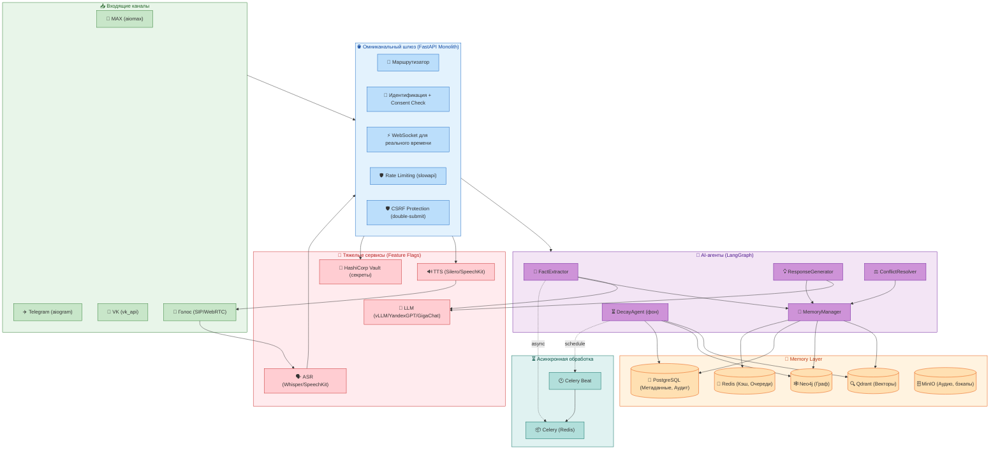
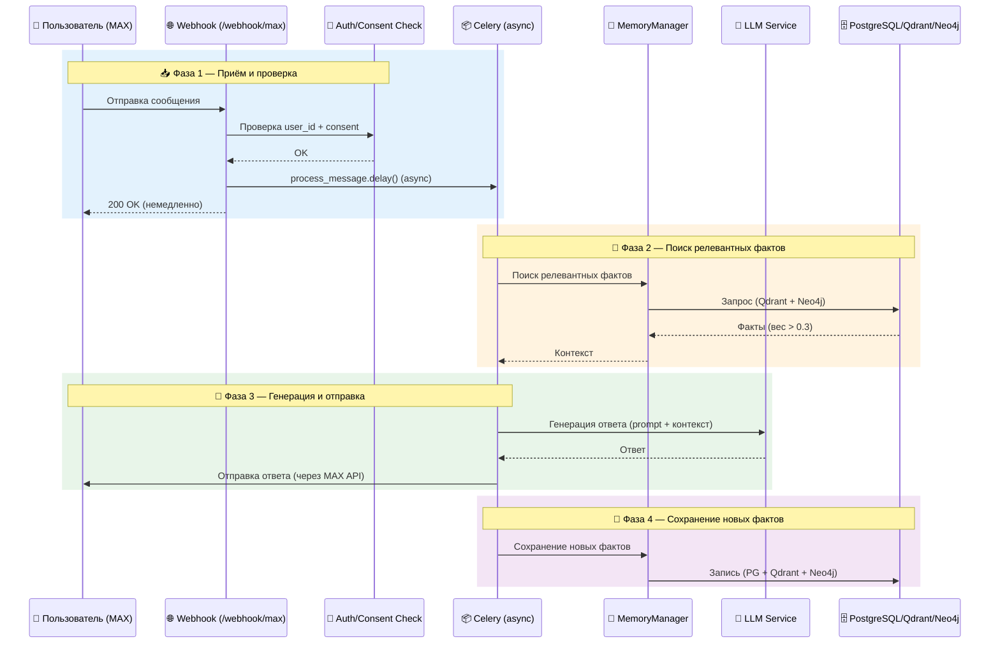
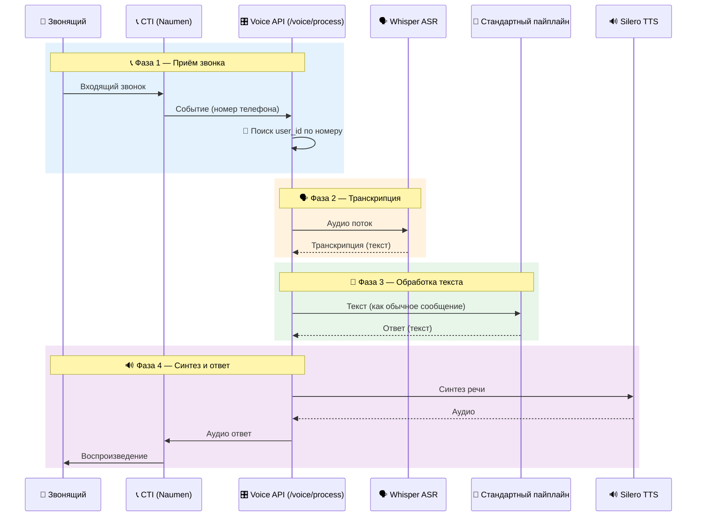
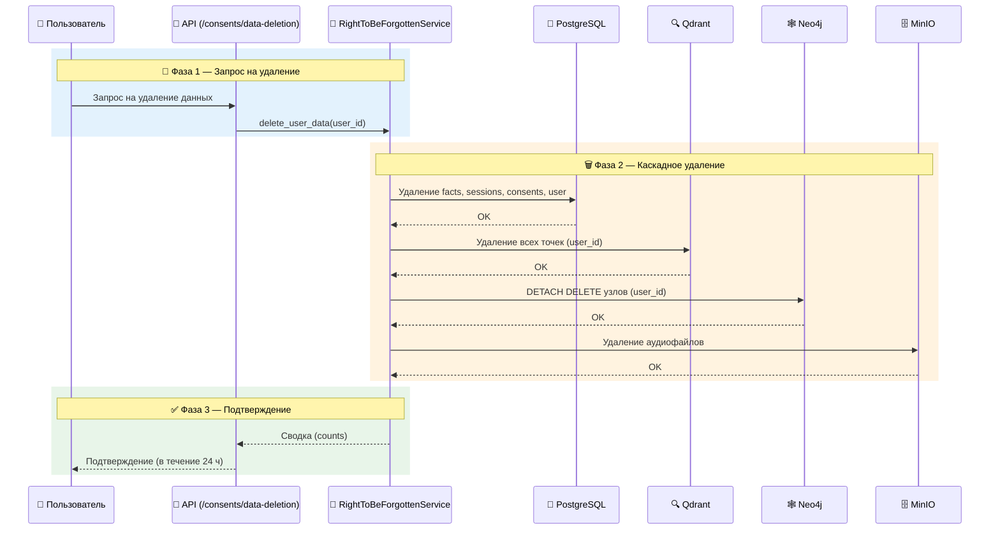
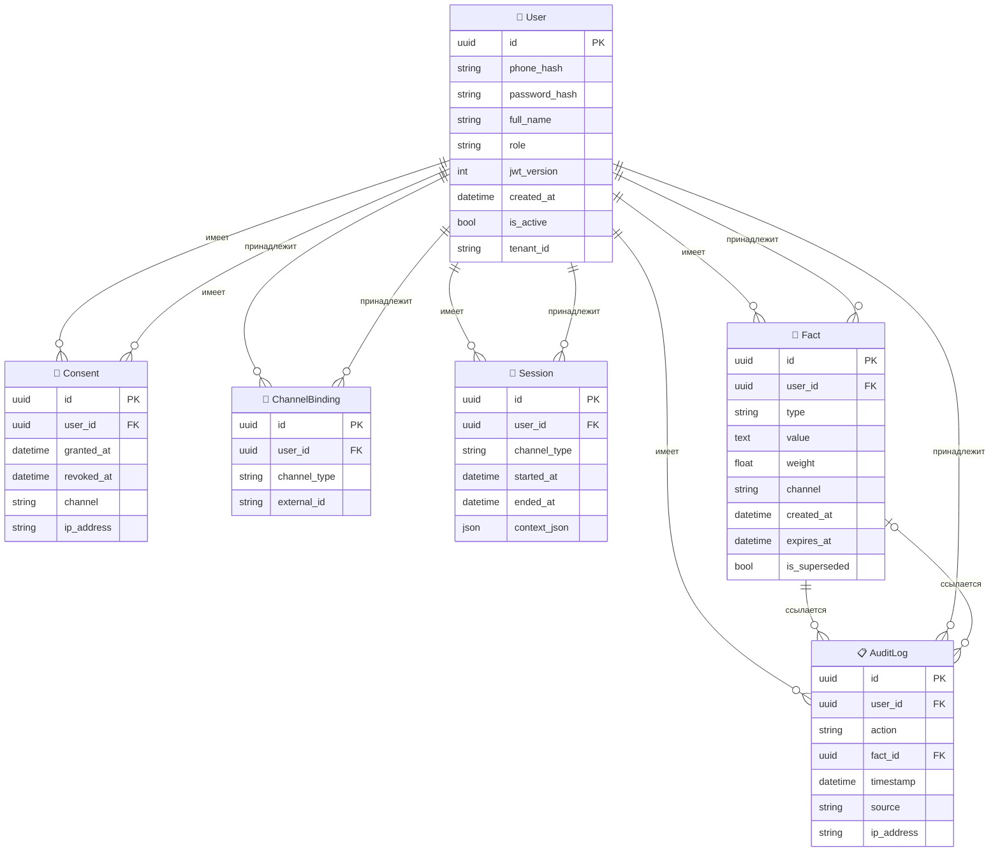

# 📐 ARCHITECTURE.md

## 1. Бизнес-цели и ожидаемый эффект

| Показатель | Текущее состояние | Целевое состояние | Эффект |
|------------|-------------------|-------------------|--------|
| **Доля диалогов с использованием исторического контекста** | 0% | **> 30%** | Персонализация на основе предыдущих обращений |
| **NPS (Net Promoter Score)** | Базовый уровень | **+5–10 пунктов** | Рост лояльности за счёт эффекта «вау» |
| **Повторное обращение по тому же вопросу** | 40–60% | **< 10%** | Агент «помнит» и решает с первого раза |
| **Среднее время решения (AHT)** | Текущее | **-15%** | Сокращение за счёт отсутствия переспросов |
| **Экономия на поддержке** | — | **~10% от бюджета** | За счёт снижения повторных обращений |

---

## 2. Архитектурные принципы

1. **KISS**: Минимум слоёв, только необходимая сложность.
2. **YAGNI**: Не добавляем функциональность «на будущее».
3. **Production-first**: Сразу используем реальные БД (PostgreSQL), очереди (Redis Streams), кэш. Никаких in‑memory заглушек.
4. **Parallel Frontend**: Фронтенд разрабатывается параллельно с бэкендом; API-контракты определяются на старте.
5. **Минимум тестов**: Только E2E (15–20 сценариев) и интеграционные (5–10). Unit-тесты только для сложных алгоритмов (например, расчёт веса фактов).
6. **Никаких отложенных фич**: Всё, что описано в SPEC, реализовано в текущем релизе.
7. **РФ‑специфика**: Полное соответствие 152‑ФЗ (согласие, право на забвение, анонимизация, аудит). Приоритет российских облаков (Yandex Cloud, VK Cloud) и on‑premise.
8. **Feature Flags (ENABLE_*)**: Тяжёлые внешние сервисы (LLM, ASR, TTS, LiveKit) управляются через флаги в `.env`. По умолчанию все выключены.
9. **Lazy Initialization**: Импорты библиотек (`torch`, `whisper`, `livekit`, `openai`) на верхнем уровне разрешены, но загрузка моделей и подключение к сервисам происходят ТОЛЬКО при первом реальном вызове (в методах).
10. **Монолит**: Всё в одном FastAPI приложении. Фронтенд отдельно, но в одном репозитории. Без микросервисов.

---

## 3. Технологический стек и ADR

### 3.1. Технологический стек

| Компонент | Технология | Версия | Обоснование |
|-----------|------------|--------|-------------|
| Backend | Python + FastAPI | 3.12+ | Высокая производительность, экосистема AI/ML |
| Frontend | React + TypeScript | 18+ | Стандарт индустрии, параллельная разработка |
| БД (Реляционная) | PostgreSQL | 16 | Хранение пользователей, сессий, аудита, фактов (метаданные) |
| БД (Векторная) | Qdrant (кластер) | Latest | Семантический поиск фактов, шардирование |
| БД (Графовая) | Neo4j (Enterprise) | 5.x | Хранение связей (граф знаний) |
| Кэш и Очереди | Redis (кластер) | 7.2+ | Сессионный кэш, Redis Streams для очередей задач |
| Объектное хранилище | MinIO | Latest | Хранение аудио, логов, бэкапов (S3‑совместимое) |
| Оркестрация агентов | LangGraph | Latest | Детерминированные графы, HITL, чекпоинты |
| Memory Layer | Mem0 (с обёрткой) | Latest | Специализированный слой памяти, интеграция с LangGraph |
| LLM | vLLM + YandexGPT | Latest | Инференс фактов и ответов. GigaChat как fallback |
| ASR | Whisper (fine‑tuned) / Yandex SpeechKit | Latest | Транскрибация голоса |
| TTS | Silero TTS v5 / Yandex SpeechKit | Latest | Синтез речи |
| Мессенджеры | aiomax, aiogram, vk_api | Latest | Интеграция с MAX, Telegram, VK |
| Телефония | Naumen CTI / Asterisk | Latest | SIP/WebRTC, определение номера |
| Безопасность | HashiCorp Vault, Presidio, NeMo Guardrails | Latest | Управление секретами, анонимизация, этичность |
| Очереди задач | Celery + Redis | Latest | Асинхронная обработка извлечения фактов, decay |
| Мониторинг | Prometheus + Grafana + Loki + Jaeger | Latest | Наблюдаемость, метрики, логи, трассировка |

### 3.2. ADR (Architecture Decision Records)

#### ADR #1: Оркестратор агентов (LangGraph vs CrewAI)

| Критерий | LangGraph | CrewAI |
|----------|-----------|--------|
| Детерминизм | Строгий граф состояний | Ролевая модель, менее предсказуема |
| Чекпоинты и HITL | Встроены | Ограниченно |
| Условные переходы | Conditional edges, циклы | Только последовательные вызовы |
| Производственная зрелость | Высокая | Средняя |

**Вердикт**: Выбираем **LangGraph**. Обеспечивает юридическую прозрачность, детерминизм и возможность паузы для ручного утверждения критичных действий (например, удаление памяти).

---

#### ADR #2: Memory Layer (Mem0 vs Zep)

| Критерий | Mem0 | Zep |
|----------|------|-----|
| Интеграция с LangGraph | Нативная | Требуется обёртка |
| Графовая память | Есть (через Neo4j) | Есть (temporal graphs) |
| Memory Decay | Встроен | Частично |
| Активность сообщества | Высокая | Средняя |
| Горизонтальное масштабирование | Ограничена | Ограничена |

**Вердикт**: Выбираем **Mem0** как основной, но предусматриваем слой абстракции для возможной замены. Для масштабирования разрабатываем обёртку, балансирующую запросы между несколькими инстансами Mem0 (см. ADR #8).

---

#### ADR #3: Хранение фактов (Qdrant + Neo4j)

- **Qdrant**: Быстрый семантический поиск по векторам.
- **Neo4j**: Структурированный поиск по графу связей (Cypher).

**Вердикт**: Используем **оба**. Qdrant для быстрого retrieval по смыслу, Neo4j для анализа причинно‑следственных связей. Данные синхронизируются через MemoryManager.

---

#### ADR #4: ASR/TTS (Whisper + Silero vs SpeechKit)

| Критерий | On‑premise (Whisper+Silero) | Yandex SpeechKit |
|----------|-----------------------------|------------------|
| Контроль данных | Полный, нет утечки голоса | Требует передачи аудио в облако |
| Соответствие 152‑ФЗ | Да | Требуется доп. соглашения |
| Требует GPU | Да | Нет |
| Простота старта | Сложнее (настройка моделей) | Проще (API) |

**Вердикт**: Базовый вариант — **On‑premise (Whisper + Silero)** для соблюдения 152‑ФЗ и on‑premise развертывания. SpeechKit используется как fallback через Feature Flags.

---

#### ADR #5: Async Task Queue (Celery)

| Критерий | Celery | Dramatiq | ARQ |
|----------|--------|----------|-----|
| Зрелость | Высокая (15+ лет) | Средняя | Низкая |
| Redis backend | Полная поддержка | Да | Да |
| Periodic tasks | Celery Beat (встроен) | Нет (нужен scheduler) | Да |
| Мониторинг | Flower, Prometheus exporter | Ограничен | Минимальный |

**Вердикт**: **Celery** — зрелость, Beat для periodic decay, Prometheus exporter.

---

#### ADR #6: Async Neo4j Driver

Neo4j 5.x предоставляет `AsyncGraphDatabase.driver()` для async/sync операций. Мы используем `async with driver.session()` для non-blocking доступа в async FastAPI endpoints. Реализация в [backend/src/services/graph_service.py](../backend/src/services/graph_service.py).

---

#### ADR #7: HPA (Horizontal Pod Autoscaler)

| Параметр | Значение | Обоснование |
|----------|----------|-------------|
| minReplicas | 2 | Высокая доступность |
| maxReplicas | 10 | Под нагрузкой |
| CPU target | 70% | Оптимальное использование |
| Memory target | 80% | Оптимальное использование |
| Scale-down window | 300s | Предотвращение дрожания |
| Scale-up window | 30s | Быстрый рост |

---

#### ADR #8: Масштабирование Mem0

**Проблема**: Текущая версия Mem0 не поддерживает горизонтальное масштабирование «из коробки». При росте нагрузки до 1000+ одновременных сессий один инстанс Mem0 может стать узким местом.

**Решение**: На этапе пилотного запуска используется один инстанс Mem0 с увеличенными ресурсами. Параллельно разрабатывается обёртка (`Mem0Pool`), которая балансирует запросы между несколькими инстансами Mem0, использующими общее хранилище (Qdrant + Neo4j + PostgreSQL). В перспективе — миграция на Mem0 Cloud или кастомную реализацию.

**Реализация**: В [backend/src/services/mem0_memory_service.py](../backend/src/services/mem0_memory_service.py) заложена возможность подключения пула инстансов. Текущий код использует один экземпляр.

**Вердикт**: Принимаем архитектуру с возможностью горизонтального масштабирования. Для пилота — один инстанс. План масштабирования описан в [SCALING_GUIDE.md](SCALING_GUIDE.md).

---

#### ADR #9: Circuit Breaker и Retry

**Проблема**: Внешние сервисы (LLM, Qdrant, Neo4j) могут быть временно недоступны. Без механизмов устойчивости система может падать или бесконечно ждать ответа.

**Решение**: Внедряем два паттерна:
- **Retry** (повторные попытки) — для временных сбоев (сеть, таймауты). Используем библиотеку `tenacity` с экспоненциальной задержкой.
- **Circuit Breaker** (размыкание цепи) — для защиты от длительных отказов. Используем библиотеку `circuitbreaker` с порогом ошибок (например, 5 ошибок за 60 секунд).

**Реализация**: Обёртки в [backend/src/utils/resilience.py](../backend/src/utils/resilience.py). Применяются к вызовам LLM, Qdrant и Neo4j.

**Вердикт**: Принимаем. Обеспечивает устойчивость при сбоях внешних зависимостей.

---

## 4. Общая схема

Ниже представлена общая архитектурная схема системы. Она показывает все основные компоненты, их взаимодействие и потоки данных между ними. Схема разделена на логические слои: входящие каналы, шлюз, AI-агенты, слой памяти и внешние сервисы.

Данная схема иллюстрирует, как сообщения от пользователей проходят через шлюз, проходят аутентификацию и проверку согласия, затем направляются в агентов. Агенты, в свою очередь, взаимодействуют со слоем памяти и внешними сервисами, а асинхронные задачи обрабатываются через Celery.

---

## 5. Описание компонентов

### 5.1. API-шлюз (FastAPI)

Единое монолитное приложение, реализованное в [backend/src/main.py](../backend/src/main.py). Принимает вебхуки от мессенджеров, SIP‑события от CTI, и REST-запросы от фронтенда. Не использует DTO/Мапперы: эндпоинты принимают Pydantic‑схемы для валидации, сервисы работают напрямую с SQLAlchemy моделями, возвращая их (или словари) для сериализации.

**Feature Flags** (из [backend/src/config.py](../backend/src/config.py)):
- `ENABLE_LLM` – включает интеграцию с LLM (факт‑экстракция, генерация ответов)
- `ENABLE_VOICE` – включает голосовой пайплайн (ASR/TTS, WebSocket)
- `ENABLE_ASR` – включает конкретный ASR‑движок
- `ENABLE_TTS` – включает конкретный TTS‑движок
- `ENABLE_MEMORY` – включает запись/чтение из Mem0

Если флаг выключен, соответствующие роуты не регистрируются, а вызовы методов возвращают fallback.

**Безопасность на уровне шлюза**:
- **JWT** — проверяется middleware [backend/src/middleware.py](../backend/src/middleware.py).
- **CSRF** — double‑submit cookie паттерн, реализован в [backend/src/api/auth.py](../backend/src/api/auth.py) (включён по умолчанию, может быть отключён через `ENABLE_CSRF_SKIP`).
- **Rate Limiting** — планируется через `slowapi` (см. [IMPLEMENTATION_PLAN.md](IMPLEMENTATION_PLAN.md), Фаза I.2).
- **CORS** — ограничен в production, настраивается через `CORS_ORIGINS`.

### 5.2. Базы данных

- **PostgreSQL** ([backend/src/models.py](../backend/src/models.py)): Хранение `User`, `Consent`, `Session`, `AuditLog`, `Fact`. Схема управляется через Alembic ([backend/alembic/](../backend/alembic/)).
- **Redis**: Кэш текущих сессий, брокер для Celery (очереди задач), хранение чекпоинтов LangGraph (с AOF для персистентности).
- **Qdrant**: Векторные представления фактов для семантического поиска. Интеграция через [backend/src/services/vector_store_service.py](../backend/src/services/vector_store_service.py).
- **Neo4j**: Граф знаний (Клиент → Интент → Тариф). Асинхронный драйвер, интеграция через [backend/src/services/graph_service.py](../backend/src/services/graph_service.py).
- **MinIO**: Хранение сырых аудиофайлов (до транскрибации) и зашифрованных бэкапов.

### 5.3. Очереди и асинхронная обработка (Celery)

Используется для асинхронной обработки: извлечение фактов (FactExtractor) и фоновое устаревание (Decay) выполняются в отдельных воркерах, чтобы не блокировать основной поток ответа клиенту.

**Реализация**:
- [backend/src/celery_app.py](../backend/src/celery_app.py) — конфигурация Celery с Redis брокером.
- Задачи:
  - `process_message` ([backend/src/tasks/message_tasks.py](../backend/src/tasks/message_tasks.py)) — обработка входящих сообщений.
  - `extract_facts` ([backend/src/tasks/fact_tasks.py](../backend/src/tasks/fact_tasks.py)) — извлечение фактов через LLM.
  - `run_decay_agent` ([backend/src/tasks/decay_tasks.py](../backend/src/tasks/decay_tasks.py)) — периодическое устаревание фактов.
- Celery Beat (`docker-compose.yml`) — запускает `run_decay_agent` раз в час.

### 5.4. Агенты (LangGraph)

Все агенты находятся в [backend/src/agents/](../backend/src/agents/) и используют LangGraph для построения графов состояний.

- **FactExtractor** ([backend/src/agents/fact_extractor.py](../backend/src/agents/fact_extractor.py)): Анализирует текст, извлекает триплеты, фильтрует эмоции. Использует LLM (YandexGPT/vLLM) и Presidio для анонимизации ПДн до сохранения.
- **MemoryManager** ([backend/src/agents/memory_manager.py](../backend/src/agents/memory_manager.py)): Читает/пишет в Mem0/Qdrant/Neo4j, разрешает конфликты (позднее перекрывает раннее). Принимает `MemoryService` через DI (см. ADR #8).
- **ResponseGenerator** ([backend/src/agents/response_generator.py](../backend/src/agents/response_generator.py)): Формирует ответ с учётом контекста и памяти. При недоступности LLM использует шаблонный fallback.
- **ConflictResolver** ([backend/src/agents/conflict_resolver.py](../backend/src/agents/conflict_resolver.py)): Подграф для HITL при обнаружении жёстких противоречий (разница во времени <5 минут) – отправляет уведомление оператору.
- **DecayAgent** ([backend/src/tasks/decay_tasks.py](../backend/src/tasks/decay_tasks.py)): Фоновый агент, запускаемый по расписанию (Celery Beat), пересчитывает вес фактов и удаляет устаревшие (вес <0.1).

### 5.5. Внешние интеграции

- **MAX**: Через официальный SDK `aiomax`, реализация в [backend/src/integrations/max_gateway.py](../backend/src/integrations/max_gateway.py).
- **Telegram**: Через `aiogram 3.x`, реализация в [backend/src/integrations/telegram_gateway.py](../backend/src/integrations/telegram_gateway.py).
- **VK**: Через `vk_api`, реализация в [backend/src/integrations/vk_gateway.py](../backend/src/integrations/vk_gateway.py).
- **Телефония**: Naumen CTI (REST/WebSocket), реализация в [backend/src/integrations/voice_gateway.py](../backend/src/integrations/voice_gateway.py).
- **LLM**: [backend/src/services/llm_service.py](../backend/src/services/llm_service.py) — поддержка YandexGPT, vLLM, GigaChat.
- **Vault**: [backend/src/vault_client.py](../backend/src/vault_client.py) — интеграция с HashiCorp Vault для управления секретами.

### 5.6. Voice‑пайплайн

Управляется флагами `ENABLE_VOICE`, `ENABLE_ASR`, `ENABLE_TTS`. 

При звонке аудио поток отправляется в ASR. Текст идёт в общий пайплайн агентов. Ответ идёт в TTS. 

**Реализация**:
- `WhisperASR` ([backend/src/services/whisper_asr.py](../backend/src/services/whisper_asr.py)): ленивая загрузка модели, транскрипция.
- `SileroTTS` ([backend/src/services/silero_tts.py](../backend/src/services/silero_tts.py)): ленивая загрузка модели, синтез речи.
- `VoiceService` ([backend/src/services/voice_service.py](../backend/src/services/voice_service.py)): полный пайплайн ASR → Memory → LLM → TTS.
- WebSocket эндпоинт `/voice/stream` в [backend/src/api/voice.py](../backend/src/api/voice.py) для реального аудиостриминга.

---

## 6. Основные потоки данных

### Сценарий 1: Текстовое сообщение в MAX с использованием памяти

Последовательность действий при обработке текстового сообщения от пользователя в канале MAX:

1. MAX отправляет webhook в FastAPI (`/webhook/max`).
2. Шлюз определяет `user_id` по `account_id` (связка в БД через `ChannelBinding`).
3. Проверяется наличие `Consent` (152‑ФЗ). Если нет — ответ "Запросите согласие".
4. Запускается `process_message` асинхронно через Celery (не блокирует ответ).
5. Синхронно (в воркере) `MemoryManager` ищет релевантные факты в Qdrant (семантический поиск) и Neo4j (графовые запросы), фильтрует по весу >0.3.
6. `ResponseGenerator` получает факты и текущее сообщение, вызывает LLM.
7. Ответ отправляется в MAX.
8. Фоново сохраняются новые факты (с анонимизацией через Presidio), `ConflictResolver` проверяет противоречия.

---

### Сценарий 2: Голосовой звонок (ENABLE_VOICE=true)

1. CTI отправляет событие о входящем звонке (номер телефона).
2. Шлюз находит `user_id` по номеру (через `ChannelBinding`).
3. Аудио поток передаётся в `WhisperASR.process_audio()` (модель загружается при первом вызове).
4. Текст передаётся в стандартный пайплайн (Сценарий 1).
5. Текстовый ответ передаётся в `SileroTTS.generate_audio()`.
6. Аудио отправляется в CTI.

---

### Сценарий 3: Право на забвение (RTBF)

1. Пользователь или оператор инициирует удаление через API (`/consents/data-deletion`).
2. Сервис находит все записи по `user_id`.
3. Выполняется каскадное удаление:
   - Qdrant (по фильтру `user_id`)
   - Neo4j (удаление узлов и рёбер)
   - PostgreSQL (удаление фактов, сессий, аудита; consent помечается revoked)
   - MinIO (удаление всех аудиофайлов пользователя)
4. Запись в `AuditLog` о факте удаления (сама запись не удаляется, но очищается от ПДн).
5. Отправка подтверждения пользователю в течение 24 часов.

---

## 7. Модель данных (SQLAlchemy)

*Все модели в одном файле [backend/src/models.py](../backend/src/models.py).*

### 7.1. Текущие модели

| Модель | Поля | Описание |
|--------|------|----------|
| **User** | `id` (UUID), `phone_hash`, `password_hash`, `full_name`, `role`, `jwt_version`, `created_at`, `is_active`, `tenant_id` | Пользователь системы. `password_hash` — bcrypt хэш. `jwt_version` — для отзыва токенов. |
| **Consent** | `id`, `user_id`, `granted_at`, `revoked_at`, `channel`, `ip_address` | Согласие на обработку ПДн (152‑ФЗ). |
| **ChannelBinding** | `id`, `user_id`, `channel_type` (MAX/TG/VK/VOICE), `external_id` | Привязка внешних ID к user_id. |
| **Session** | `id`, `user_id`, `channel_type`, `started_at`, `ended_at`, `context_json` | Сессия взаимодействия. |
| **Fact** | `id`, `user_id`, `type` (intent/preference/complaint/agreement/rejection/personal_info), `value` (зашифрован AES‑256‑GCM), `weight`, `channel`, `created_at`, `expires_at`, `is_superseded` | Факт памяти. Поле `encrypted_data` удалено в Omega δ.1 (коммит `0c8d979`). |
| **AuditLog** | `id`, `user_id`, `action` (READ/WRITE/DELETE), `fact_id`, `timestamp`, `source` (AI/OPERATOR), `ip_address` | Аудит операций с памятью (152‑ФЗ). |

### 7.2. ER-диаграмма

*Примечание: Сервисы работают с этими моделями напрямую. Никаких DTO или ORM‑обёрток.*

---

## 8. Интеграции

| Система | Протокол | Формат | Назначение | Реализация |
|---------|----------|--------|------------|------------|
| MAX | Webhook / Long Polling | JSON | Приём/отправка сообщений (aiomax) | [backend/src/integrations/max_gateway.py](../backend/src/integrations/max_gateway.py) |
| Telegram | Webhook | JSON | Приём/отправка сообщений (aiogram) | [backend/src/integrations/telegram_gateway.py](../backend/src/integrations/telegram_gateway.py) |
| VK | Callback API | JSON | Приём/отправка сообщений (vk_api) | [backend/src/integrations/vk_gateway.py](../backend/src/integrations/vk_gateway.py) |
| Naumen CTI | REST / WebSocket | JSON | Управление звонками, события | [backend/src/integrations/voice_gateway.py](../backend/src/integrations/voice_gateway.py) |
| YandexGPT / vLLM | REST (OpenAI compatible) | JSON | Инференс LLM | [backend/src/services/llm_service.py](../backend/src/services/llm_service.py) |
| GigaChat | REST | JSON | Fallback LLM | [backend/src/services/llm_service.py](../backend/src/services/llm_service.py) |
| HashiCorp Vault | REST | JSON | Управление секретами | [backend/src/vault_client.py](../backend/src/vault_client.py) |

---

## 9. Безопасность и 152‑ФЗ

### 9.1. Согласие
- **Запрос согласия** при первом контакте (текст с кнопкой в чате, голосовое уведомление + нажатие клавиши в телефонии).
- **Хранение** в таблице `Consent` с timestamp и каналом.
- **Отказ** – пользователь может отключить память в любой момент; все данные удаляются в течение 24 часов.

### 9.2. Анонимизация и шифрование
- **Presidio** ([backend/src/utils/presidio_anonymizer.py](../backend/src/utils/presidio_anonymizer.py)) маскирует ПДн (ФИО, адрес, паспорт) перед записью. Поддерживаются российские документы: паспорт РФ, СНИЛС, ИНН, ОГРН (см. [backend/src/utils/presidio_russian.py](../backend/src/utils/presidio_russian.py)).
- **Шифрование на уровне приложения**: каждый факт шифруется AES‑256‑GCM ([backend/src/utils/crypto.py](../backend/src/utils/crypto.py)), ключ в HashiCorp Vault или .env (fallback).
- **Шифрование at‑rest**: дисковое шифрование для всех БД.

### 9.3. Аудит
- Каждое действие с памятью логируется в `AuditLog`.
- Логи хранятся 3 года в защищённом хранилище (MinIO с шифрованием).
- В структурированных логах ([backend/src/logging_config.py](../backend/src/logging_config.py)) реализована PII‑редикция (маскировка телефонов и email).

### 9.4. Право на забвение
- Полное каскадное удаление данных из всех хранилищ по запросу пользователя.
- Срок исполнения < 24 часа.
- Подтверждение пользователю.

### 9.5. Защита API
- **JWT** с версионированием (`jwt_version`) — отзыв токенов при смене пароля.
- **CSRF** — double‑submit cookie паттерн, включён по умолчанию.
- **Rate Limiting** — планируется (см. [IMPLEMENTATION_PLAN.md](IMPLEMENTATION_PLAN.md), Фаза I.2).
- **Брутфорс‑защита** — планируется (Фаза I.4).
- **CORS** — ограничен в production (`APP_ENV=production`).

### 9.6. Разделение тенантов
- Для multi‑tenant используется поле `tenant_id` во всех таблицах и индексах.
- В Qdrant и Neo4j – префикс `tenant_id` в именах коллекций и метках.

---

## 10. Масштабирование и отказоустойчивость

| Компонент | Стратегия масштабирования | Graceful Degradation |
|-----------|---------------------------|----------------------|
| API‑шлюз | Горизонтальное (K8s ReplicaSet, ≥3 подов) | – |
| LangGraph‑агенты | Горизонтальное, состояние в Redis (чекпоинты) | – |
| Mem0 | Обёртка с балансировкой запросов к нескольким инстансам (планируется); при недоступности – режим без памяти | Если Mem0 недоступен – работа без памяти |
| Qdrant | Кластер 3+ нод, Raft consensus | Если Qdrant недоступен – только кэш Redis |
| Neo4j | Enterprise‑кластер (core + read‑replicas) | Если Neo4j недоступен – только Qdrant |
| PostgreSQL | Master‑replica с автоматическим переключением | – |
| Redis | Кластер 6 нод (3 master + 3 slave), AOF для персистентности | – |
| LLM | vLLM с несколькими GPU, fallback на GigaChat | Если LLM недоступен – шаблонный ответ или эскалация на оператора |
| Voice | Отдельные поды для ASR/TTS, управление через Feature Flags | Если ENABLE_VOICE=false – голосовой канал недоступен |
| Celery | HPA по длине очереди (планируется) | – |
| Внешние сервисы | Circuit Breaker + Retry (ADR #9) | При сбоях — повторные попытки, затем fallback |

**Бэкапы**: ежедневные дампы PostgreSQL, Qdrant snapshot, Neo4j dump. RPO ≤ 1 час, RTO ≤ 4 часа. Подробнее в [BACKUP_AND_RESTORE.md](BACKUP_AND_RESTORE.md).

---

## 11. Мониторинг и наблюдаемость

### 11.1. Метрики (Prometheus)

Технические метрики (из [backend/src/metrics.py](../backend/src/metrics.py)):
- `LLM_REQUEST_DURATION` — задержка LLM (по провайдеру).
- `QDRANT_SEARCH_DURATION` — задержка поиска в Qdrant.
- `FACTS_EXTRACTED_TOTAL` — количество извлечённых фактов (по каналу).
- `CONFLICTS_DETECTED_TOTAL` — количество конфликтов (по разрешению).
- `MEMORY_STORE_DURATION` — задержка записи в память.

Бизнес‑метрики (планируются):
- `memory_usage_percent` — доля диалогов с памятью.
- `repeated_issues_percent` — доля повторных обращений.
- `aht_seconds` — среднее время обработки (по каналу).

### 11.2. Дашборды (Grafana)

- **Omnichannel Backend** ([config/grafana/provisioning/dashboards/json/omnichannel-backend.json](../config/grafana/provisioning/dashboards/json/omnichannel-backend.json)): технические метрики (запросы, задержки, ошибки).
- **Business Metrics** ([config/grafana/provisioning/dashboards/json/business.json](../config/grafana/provisioning/dashboards/json/business.json)): бизнес‑показатели (память, NPS, AHT, повторные обращения).

### 11.3. Логирование

- Структурированные JSON‑логи ([backend/src/logging_config.py](../backend/src/logging_config.py)).
- Поля: `timestamp`, `level`, `logger`, `message`, `trace_id`, `user_id`.
- PII‑редикция (маскировка телефонов, email).
- Сбор через Promtail → Loki, просмотр в Grafana.

### 11.4. Трассировка

- OpenTelemetry + Jaeger ([backend/src/tracing.py](../backend/src/tracing.py)).
- Позволяет отслеживать путь запроса через агентов, БД и внешние сервисы.

### 11.5. Алерты (Prometheus)

Настроены в [config/prometheus-rules.json](../config/prometheus-rules.json):

| Alert | Severity | Условие |
|-------|----------|---------|
| HighLLMLatency | warning | P95 LLM > 5s за 5 минут |
| BackendHighLatency | warning | P95 API > 3s за 5 минут |
| QdrantHighLatency | warning | P95 Qdrant > 2s за 5 минут |
| BackendHighErrRate | critical | 5xx > 5% за 5 минут |
| HighConflictRate | warning | HITL конфликты > 10/час |

---

## 12. Планы по развитию

1. **Масштабирование Mem0** (см. ADR #8) — разработка обёртки для балансировки между несколькими инстансами.
2. **A/B‑тестирование моделей** — внедрение MLflow для версионирования моделей и канареечных развёртываний.
3. **Дообучение ASR/TTS** на российских данных колл‑центров.
4. **Интеграция с CRM** (Битрикс24) для обогащения профиля клиента.
5. **Улучшение точности извлечения фактов** — fine‑tuning LLM на размеченных диалогах.