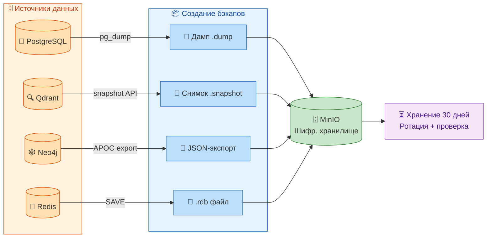

# 💾 BACKUP_AND_RESTORE.md

## 1. Введение

### 1.1. Цель документа

Данное руководство описывает процедуры создания резервных копий (бэкапов) и восстановления данных для всех компонентов системы «Омниканальный агент с долговременной памятью». Оно предназначено для DevOps-инженеров и администраторов, ответственных за сохранность данных и обеспечение отказоустойчивости системы.

В документе детально рассмотрены: расписание бэкапов, используемые инструменты, команды для каждого компонента, хранение и ротация бэкапов, а также пошаговые инструкции по восстановлению. В отличие от [RECOVERY_PLAN.md](RECOVERY_PLAN.md), где описаны сценарии аварийного восстановления, данный документ фокусируется на повседневных операциях по созданию и проверке бэкапов.

### 1.2. Принципы создания бэкапов

- **Регулярность:** все бэкапы создаются автоматически по расписанию.
- **Консистентность:** для реляционных БД используются транзакционно-консистентные дампы.
- **Шифрование:** бэкапы хранятся в зашифрованном виде (MinIO с SSE-S3 или шифрование на стороне клиента).
- **Ротация:** старые бэкапы удаляются через 30 дней.
- **Проверка:** целостность бэкапов проверяется еженедельно.



---

## 2. Бэкап PostgreSQL

### 2.1. Создание бэкапа

**Инструмент:** `pg_dump` (формат custom).  
**Скрипт:** [scripts/backup.sh](../scripts/backup.sh).

**Команда:**
```bash
PGPASSWORD=${POSTGRES_PASSWORD} pg_dump \
  -h ${POSTGRES_HOST} \
  -p ${POSTGRES_PORT} \
  -U ${POSTGRES_USER} \
  -d ${POSTGRES_DB} \
  -Fc \
  > /tmp/backups/postgres_$(date +%Y%m%d_%H%M%S).dump
```

**Параметры:**
- `-Fc` — формат custom (сжатый, поддерживает параллельное восстановление).
- Включает все схемы, данные, индексы, ограничения.
- Используется транзакционный режим (снимок на момент начала дампа).

**Проверка:**
```bash
pg_restore --list /tmp/backups/postgres_latest.dump | head -20
```

### 2.2. Восстановление

**Команда:**
```bash
# Создать пустую БД
createdb -U postgres omnichannel_restore

# Восстановить дамп
pg_restore -U postgres -d omnichannel_restore /tmp/backups/postgres_latest.dump
```

**Опции:**
- `-j 4` — параллельное восстановление (ускоряет для больших дампов).
- `--clean` — очистить существующие объекты перед восстановлением (при перезаписи).

**Проверка:**
```bash
psql -U postgres -d omnichannel_restore -c "SELECT count(*) FROM users;"
```

---

## 3. Бэкап Qdrant

### 3.1. Создание бэкапа

**Инструмент:** Qdrant Snapshot API.  
**Скрипт:** [scripts/backup.sh](../scripts/backup.sh).

**Команды:**
```bash
# 1. Создать снимок
curl -X POST "http://${QDRANT_HOST}:${QDRANT_PORT}/collections/omnichannel/snapshots"

# 2. Получить список снимков и имя последнего
SNAPSHOT=$(curl -s "http://${QDRANT_HOST}:${QDRANT_PORT}/collections/omnichannel/snapshots" | \
  python3 -c "import sys,json; print(json.load(sys.stdin)['result'][0]['name'])")

# 3. Скачать снимок
curl -o /tmp/backups/qdrant_$(date +%Y%m%d_%H%M%S).snapshot \
  "http://${QDRANT_HOST}:${QDRANT_PORT}/collections/omnichannel/snapshots/${SNAPSHOT}"
```

**Проверка:**
```bash
# Проверить размер снимка (должен быть > 0)
ls -lh /tmp/backups/qdrant_*.snapshot
```

### 3.2. Восстановление

**Команды:**
```bash
# 1. Остановить Qdrant или удалить коллекцию (если восстанавливаем поверх)
curl -X DELETE "http://${QDRANT_HOST}:${QDRANT_PORT}/collections/omnichannel"

# 2. Загрузить снимок
curl -X PUT "http://${QDRANT_HOST}:${QDRANT_PORT}/collections/omnichannel/snapshots" \
  -F "snapshot=@/tmp/backups/qdrant_latest.snapshot"
```

**Проверка:**
```bash
curl -s "http://${QDRANT_HOST}:${QDRANT_PORT}/collections/omnichannel" | jq '.result.points_count'
```

---

## 4. Бэкап Neo4j

### 4.1. Создание бэкапа

**Инструмент:** APOC `export.json.all`.  
**Скрипт:** [scripts/backup.sh](../scripts/backup.sh).

**Команда (через cURL):**
```bash
curl -s -u ${NEO4J_USER}:${NEO4J_PASSWORD} \
  -H "Content-Type: application/json" \
  -X POST "http://${NEO4J_HOST}:${NEO4J_PORT}/db/neo4j/tx/commit" \
  -d '{
    "statements": [
      {
        "statement": "CALL apoc.export.json.all(\"/backups/neo4j_'"$(date +%Y%m%d_%H%M%S)"'.json\", {useTypes:true})"
      }
    ]
  }'
```

**Примечание:** Экспорт сохраняется внутри контейнера Neo4j в папку `/backups`. После этого файл копируется в общее хранилище бэкапов.

**Копирование из контейнера:**
```bash
docker cp omnichannel-neo4j:/backups/neo4j_*.json /tmp/backups/
# или в K8s:
kubectl cp deployment/neo4j:/backups/neo4j_*.json /tmp/backups/
```

**Проверка:**
```bash
# Проверить, что JSON содержит узлы
cat /tmp/backups/neo4j_*.json | jq '.nodes | length'
```

### 4.2. Восстановление

**Команда (через APOC import):**
```bash
# Скопировать JSON в контейнер
kubectl cp /tmp/backups/neo4j_latest.json deployment/neo4j:/tmp/

# Выполнить импорт через cypher-shell
kubectl exec -it deployment/neo4j -n omnichannel -- \
  cypher-shell "CALL apoc.import.json('file:///tmp/neo4j_latest.json', {useTypes:true})"
```

**Проверка:**
```bash
kubectl exec -it deployment/neo4j -n omnichannel -- \
  cypher-shell "MATCH (n) RETURN count(n);"
```

---

## 5. Бэкап Redis

### 5.1. Создание бэкапа

**Инструмент:** Redis `SAVE` (синхронный) или `BGSAVE` (фоновый).  
**Скрипт:** [scripts/backup.sh](../scripts/backup.sh).

**Команды:**
```bash
# Запустить BGSAVE (создаёт dump.rdb в /data)
redis-cli -h ${REDIS_HOST} -p ${REDIS_PORT} BGSAVE

# Дождаться завершения
redis-cli -h ${REDIS_HOST} -p ${REDIS_PORT} INFO persistence | grep rdb_bgsave_in_progress

# Скопировать RDB-файл из контейнера
docker cp omnichannel-redis:/data/dump.rdb /tmp/backups/redis_$(date +%Y%m%d_%H%M%S).rdb
```

**Внимание:** Redis бэкап опционален, так как данные Redis являются временными (кэш, очереди). Однако чекпоинты LangGraph и сессии могут быть восстановлены.

**Проверка:**
```bash
redis-check-rdb /tmp/backups/redis_*.rdb
```

### 5.2. Восстановление

**Команды:**
```bash
# Остановить Redis
kubectl scale deployment redis -n omnichannel --replicas=0

# Поместить RDB-файл в /data
kubectl cp /tmp/backups/redis_latest.rdb deployment/redis:/data/dump.rdb

# Запустить Redis
kubectl scale deployment redis -n omnichannel --replicas=1
```

---

## 6. Бэкап MinIO (объектного хранилища)

MinIO хранит аудиофайлы и бэкапы других компонентов. Бэкап MinIO выполняется через `mc` (MinIO Client).

### 6.1. Создание бэкапа

**Команды:**
```bash
# Синхронизация всей корзины в локальную директорию
mc mirror minio/omnichannel /tmp/backups/minio_$(date +%Y%m%d)/

# Или синхронизация с другой корзиной (репликация)
mc mirror minio/omnichannel minio/omnichannel-backup/
```

**Рекомендация:** Для production использовать репликацию между корзинами в разных регионах или облаках.

### 6.2. Восстановление

**Команды:**
```bash
# Восстановить из локальной копии
mc mirror /tmp/backups/minio_latest/ minio/omnichannel/

# Или из реплики
mc mirror minio/omnichannel-backup/ minio/omnichannel/
```

---

## 7. Автоматизация бэкапов

### 7.1. Скрипт `backup.sh`

Основной скрипт [scripts/backup.sh](../scripts/backup.sh) выполняет все бэкапы последовательно. Он запускается через cron (в контейнере) или через Kubernetes CronJob.

**CronJob в K8s:**
```yaml
apiVersion: batch/v1
kind: CronJob
metadata:
  name: backup
  namespace: omnichannel
spec:
  schedule: "0 2 * * *"   # каждый день в 02:00
  jobTemplate:
    spec:
      template:
        spec:
          containers:
          - name: backup
            image: omnichannel-backend:latest
            command: ["/bin/bash", "/scripts/backup.sh"]
          restartPolicy: OnFailure
```

### 7.2. Очистка старых бэкапов

Скрипт [scripts/backup-cleanup.sh](../scripts/backup-cleanup.sh) удаляет бэкапы старше 30 дней.

**Команда:**
```bash
mc rm --recursive --older-than 30d minio/omnichannel-backups/backups/
```

---

## 8. Проверка целостности бэкапов

### 8.1. Еженедельная проверка

Рекомендуется еженедельно проверять бэкапы автоматически:

```bash
# PostgreSQL
pg_restore --list /tmp/backups/postgres_latest.dump > /dev/null 2>&1 && echo "PostgreSQL OK" || echo "PostgreSQL FAILED"

# Qdrant (загружаем в тестовую коллекцию)
curl -X PUT "http://localhost:6333/collections/test" -d '{"vectors": {"size": 384, "distance": "Cosine"}}'
curl -X PUT "http://localhost:6333/collections/test/snapshots" -F "snapshot=@/tmp/backups/qdrant_latest.snapshot"

# Neo4j (парсим JSON)
python -c "import json; json.load(open('/tmp/backups/neo4j_latest.json'))" && echo "Neo4j OK" || echo "Neo4j FAILED"
```

### 8.2. Ежеквартальное тестирование восстановления

Каждый квартал выполняйте полное восстановление на отдельном окружении и проверяйте работоспособность системы (см. [RECOVERY_PLAN.md](RECOVERY_PLAN.md), раздел 9).

---

## 9. Хранение и безопасность

### 9.1. Шифрование бэкапов

- **MinIO:** включите SSE-S3 для автоматического шифрования.
- **Client-side:** используйте `gpg` или `openssl` для шифрования перед загрузкой.

Пример шифрования перед загрузкой:
```bash
openssl enc -aes-256-cbc -salt -in postgres.dump -out postgres.dump.enc -pass pass:${BACKUP_ENCRYPTION_KEY}
```

### 9.2. Доступ к бэкапам

Ограничьте доступ к корзине MinIO только для служебных аккаунтов:

```bash
mc admin policy set minio backup-only user=backup-user
```

---

## 10. Сводная таблица бэкапов

| Компонент | Инструмент | Формат | Расписание | Retention | Восстановление |
|-----------|------------|--------|------------|-----------|----------------|
| PostgreSQL | pg_dump | .dump (custom) | Ежедневно 02:00 UTC | 30 дней | pg_restore |
| Qdrant | Snapshot API | .snapshot | Ежедневно 02:00 UTC | 30 дней | Upload через API |
| Neo4j | APOC export | .json | Ежедневно 02:00 UTC | 30 дней | APOC import |
| Redis | BGSAVE | .rdb | Ежедневно 02:00 UTC | 30 дней | Копирование в /data |
| MinIO | mc mirror | Объекты | Ежедневно 02:00 UTC | 30 дней | mc mirror обратно |
