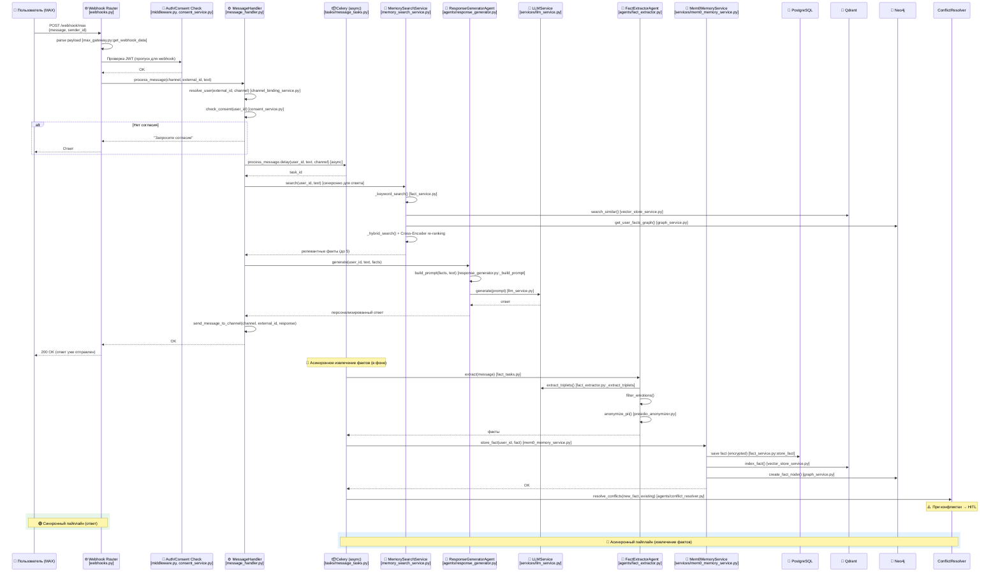
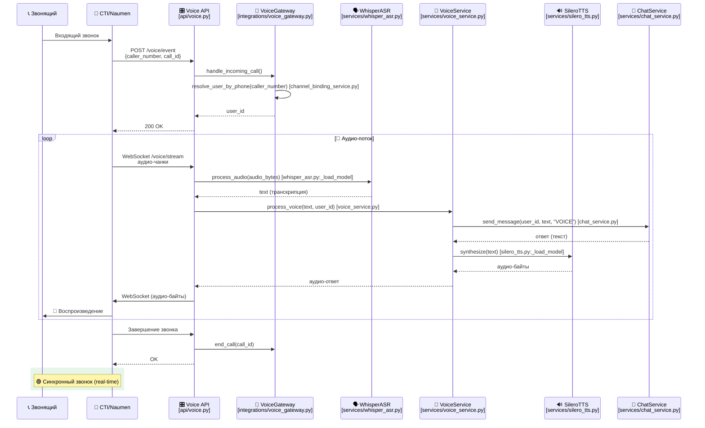
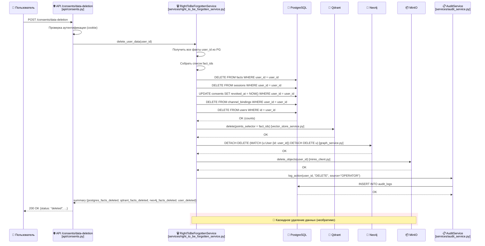
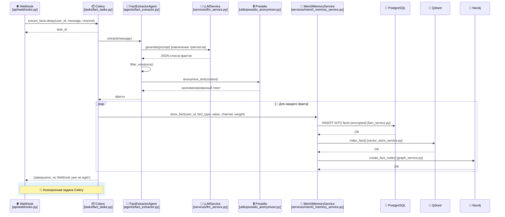
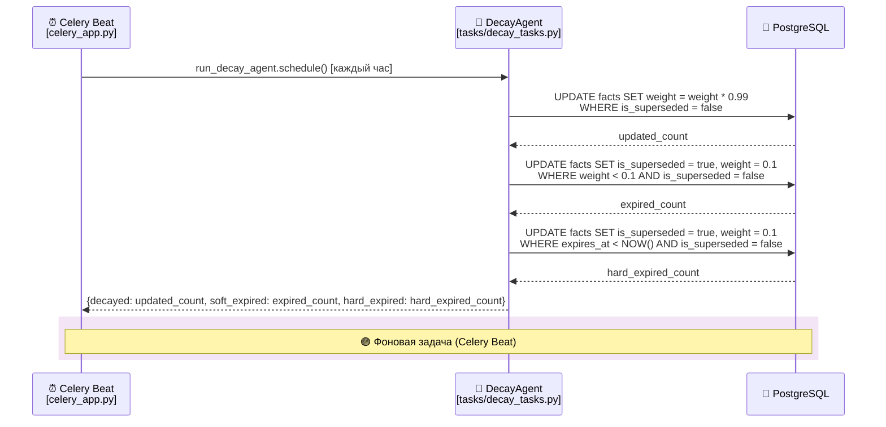
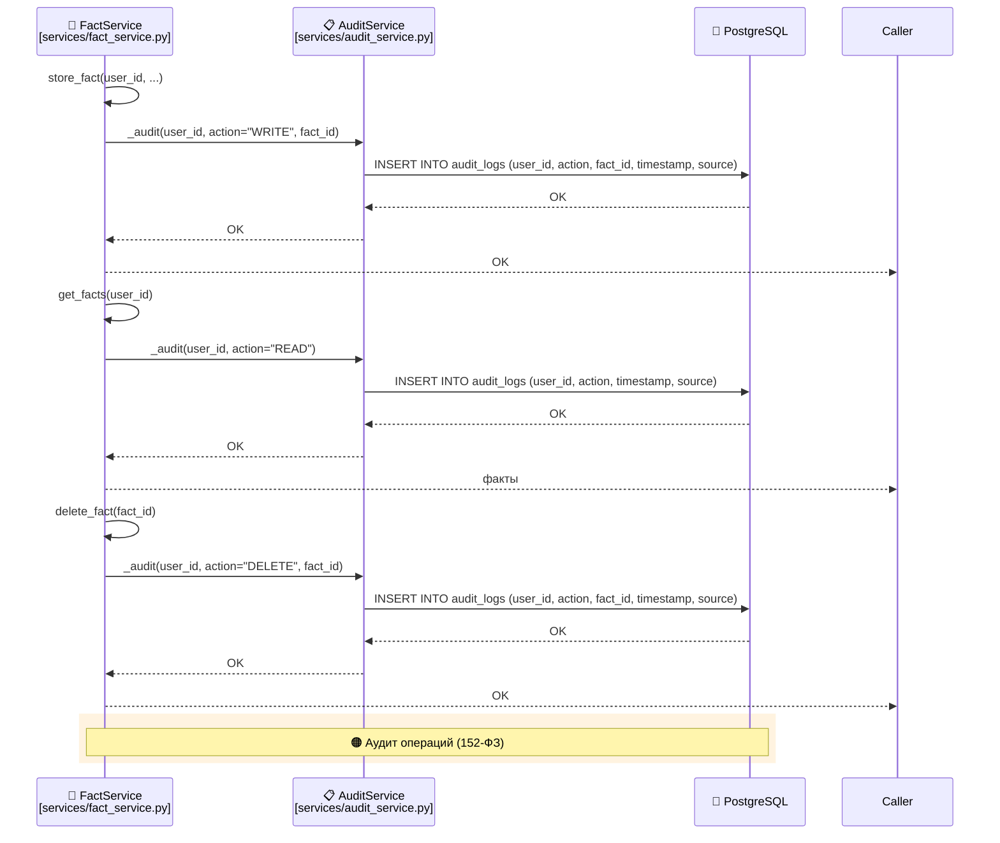
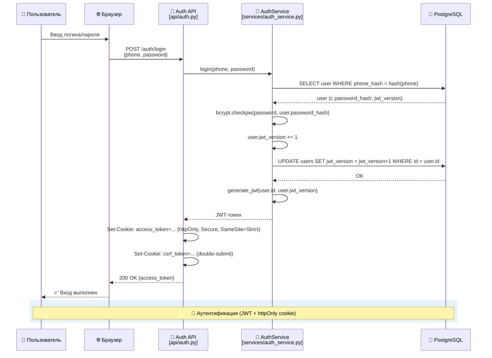
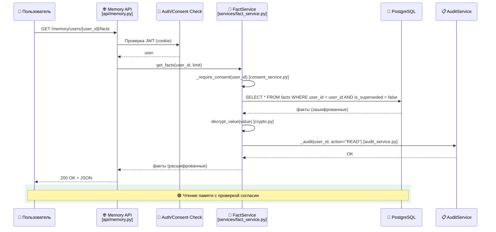
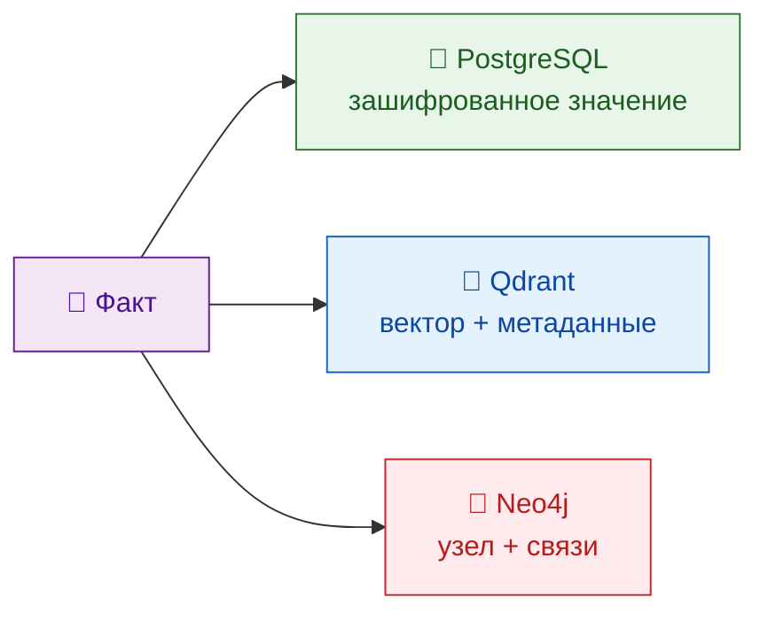
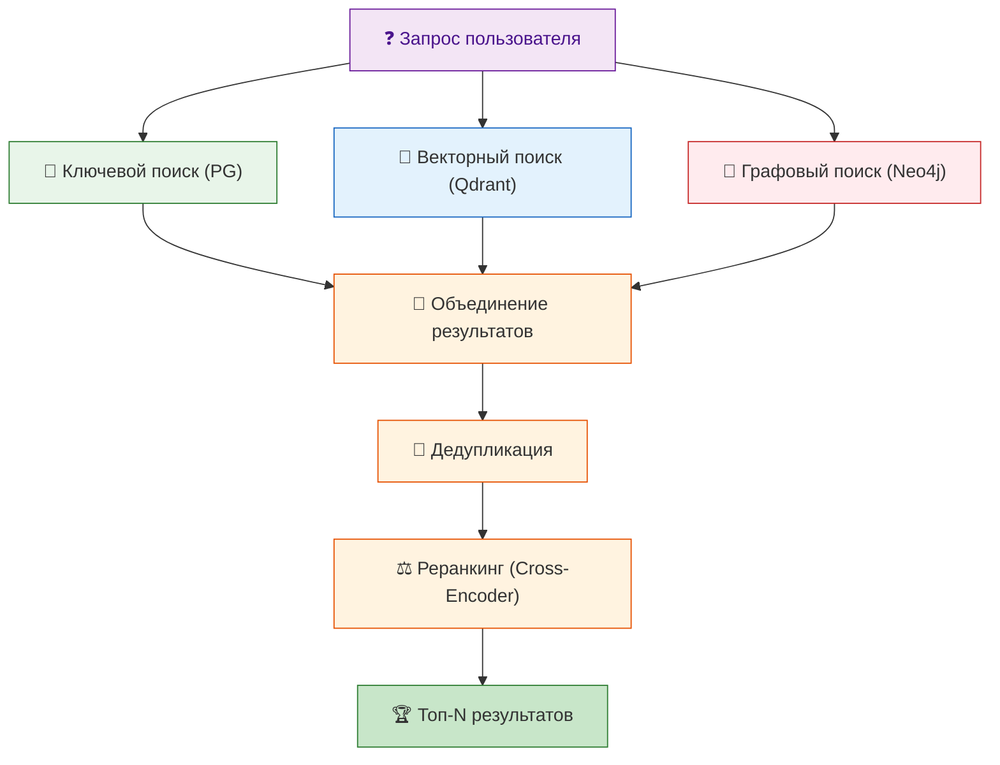

# 🌊 DATA_FLOWS.md

## 1. Введение

### 1.1. Цель документа

Настоящий документ содержит **детальное описание всех потоков данных** в системе «Омниканальный агент с долговременной памятью». Он предназначен для архитекторов, разработчиков, QA-инженеров и всех, кто хочет понять, как данные движутся через систему: от входящего запроса до ответа пользователю, включая все внутренние взаимодействия между компонентами, сервисами и базами данных.

В отличие от [ARCHITECTURE.md](ARCHITECTURE.md), где представлены общие схемы потоков, настоящий документ фокусируется на **конкретных сценариях** с детальными диаграммами последовательности (Mermaid), указанием конкретных файлов и строк кода, а также трассировкой бизнес-требований из [SPEC.md](SPEC.md).

Каждый сценарий содержит:

- **Диаграмму последовательности** — визуальное представление всех шагов.
- **Пошаговое описание** — текстовое объяснение каждого этапа.
- **Ссылки на код** — конкретные файлы, классы и методы.
- **Трассировку требований** — какие бизнес-требования покрываются.
- **Схему данных** — какие сущности создаются или изменяются.

### 1.2. Обзор сценариев

| № | Сценарий | Тип | Ключевые компоненты |
|---|----------|-----|---------------------|
| 1 | Текстовое сообщение в MAX с памятью | Синхронный + асинхронный | Webhook, MessageHandler, FactExtractor, MemorySearch, ResponseGenerator, Celery |
| 2 | Голосовой звонок | Синхронный | Voice API, Whisper ASR, VoiceService, Silero TTS |
| 3 | Право на забвение (RTBF) | Синхронный | Consents API, RightToBeForgottenService |
| 4 | Асинхронное извлечение фактов (Celery) | Асинхронный | Celery, FactExtractor, MemoryService |
| 5 | Decay (фоновое устаревание) | Фоновый (Celery Beat) | DecayAgent, FactService |
| 6 | Аудит операции с памятью | Синхронный | AuditService, FactService |
| 7 | Аутентификация и установка JWT | Синхронный | Auth API, AuthService |
| 8 | Получение списка фактов | Синхронный | Memory API, FactService |

### 1.3. Легенда обозначений

| Обозначение | Значение |
|-------------|----------|
| `→` | Синхронный вызов (запрос-ответ) |
| `-.->` | Асинхронный вызов (например, Celery) |
| `-->` | Возврат данных |
| `[FILE.py:строка]` | Ссылка на файл и строку кода |
| `RXX` | Ссылка на требование из SPEC.md |

---

## 2. Сценарий 1: Текстовое сообщение в MAX с использованием памяти

### 2.1. Описание сценария

Пользователь отправляет текстовое сообщение через канал MAX. Система должна:
1. Идентифицировать пользователя по external_id.
2. Проверить наличие активного согласия (152-ФЗ).
3. Найти релевантные факты из памяти.
4. Сгенерировать персонализированный ответ.
5. Асинхронно извлечь новые факты и сохранить их в память.
6. Отправить ответ пользователю.

**Трассировка требований:**
- R01 — доля диалогов с памятью > 30%.
- R05 — согласие на обработку ПДн.
- R10 — омниканальность.

### 2.2. Диаграмма последовательности



### 2.3. Пошаговое описание

#### Шаг 1: Приём сообщения

**Файл:** [backend/src/api/webhooks.py](../backend/src/api/webhooks.py)  
**Метод:** `max_webhook()` (строка ~45)

MAX отправляет POST-запрос на `/webhook/max` с JSON-полезной нагрузкой.

```python
# backend/src/api/webhooks.py
@router.post("/max")
async def max_webhook(request: Request, db: AsyncSession = Depends(get_db)):
    data = await request.json()
    parsed = await max_gateway.get_webhook_data(data)   # [integrations/max_gateway.py:get_webhook_data]
    # parsed = {"external_id": "...", "text": "..."}
```

**Ссылка на код:** [backend/src/api/webhooks.py#L45-L55](../backend/src/api/webhooks.py)

#### Шаг 2: Идентификация и проверка согласия

**Файл:** [backend/src/services/message_handler.py](../backend/src/services/message_handler.py)  
**Метод:** `handle_message()` (строка ~30)

```python
# backend/src/services/message_handler.py
async def handle_message(self, channel_type, external_id, text):
    # 1. Поиск user_id по external_id
    user = await self.binding_service.find_user_by_channel(channel_type, external_id)
    # 2. Проверка согласия
    has_consent = await self.consent_service.has_active_consent(user.id)
    if not has_consent:
        return "Для обработки сообщений необходимо дать согласие на обработку ПДн."
```

**Ссылки на код:**
- [backend/src/services/channel_binding_service.py#L15-L25](../backend/src/services/channel_binding_service.py)
- [backend/src/services/consent_service.py#L55-L65](../backend/src/services/consent_service.py)

#### Шаг 3: Асинхронный запуск извлечения фактов

**Файл:** [backend/src/tasks/message_tasks.py](../backend/src/tasks/message_tasks.py)  
**Метод:** `process_message.delay()` (строка ~15)

```python
# backend/src/api/webhooks.py
process_message.delay(
    channel_type="MAX",
    external_id=parsed["external_id"],
    text=parsed["text"],
)
```

Это асинхронный вызов через Celery. Он не блокирует ответ пользователю.

**Ссылка на код:** [backend/src/api/webhooks.py#L58-L62](../backend/src/api/webhooks.py)

#### Шаг 4: Синхронный поиск памяти для формирования ответа

**Файл:** [backend/src/services/memory_search_service.py](../backend/src/services/memory_search_service.py)  
**Метод:** `search()` (строка ~40)

```python
# backend/src/services/memory_search_service.py
async def search(self, user_id, query, search_type="hybrid", limit=10):
    if search_type == "keyword":
        results = await self._keyword_search(user_id, query, limit)
    elif search_type == "vector":
        results = await self._vector_search(user_id, query, limit)
    elif search_type == "graph":
        results = await self._graph_search(user_id, query, limit)
    else:  # hybrid
        results = await self._hybrid_search(user_id, query, limit)
    return results
```

**Подробно о гибридном поиске:**

1. **Ключевой поиск** (`_keyword_search`):
   - Вызов `FactService.search_facts()` — поиск по тексту в PostgreSQL.
   - Возвращает факты, содержащие ключевые слова.

2. **Векторный поиск** (`_vector_search`):
   - Генерация эмбеддинга запроса через `VectorStoreService.get_embedding()`.
   - Запрос к Qdrant: `search_similar()`.
   - Возвращает факты с семантической близостью.

3. **Графовый поиск** (`_graph_search`):
   - Запрос к Neo4j: `get_user_facts_graph()`.
   - Возвращает связанные факты.

4. **Реранкинг** (в `_hybrid_search`):
   - Загрузка Cross-Encoder: `BAAI/bge-reranker-large`.
   - Переранжировка результатов по релевантности.
   - Возвращает топ-N фактов.

**Ссылки на код:**
- [backend/src/services/memory_search_service.py#L50-L95](../backend/src/services/memory_search_service.py)
- [backend/src/services/vector_store_service.py#L80-L110](../backend/src/services/vector_store_service.py)
- [backend/src/services/graph_service.py#L60-L85](../backend/src/services/graph_service.py)

#### Шаг 5: Генерация персонализированного ответа

**Файл:** [backend/src/agents/response_generator.py](../backend/src/agents/response_generator.py)  
**Метод:** `generate()` (строка ~35)

```python
# backend/src/agents/response_generator.py
async def generate(self, user_id, message, history=None):
    # 1. Получение контекста
    context = await self.memory_search.get_memory_context(user_id, message, max_facts=5)
    # 2. Сборка промпта
    prompt = self._build_prompt(message, context, history)
    # 3. Вызов LLM
    response = await self.llm.generate(prompt, max_tokens=1000, temperature=0.7)
    return {"response": response, "context_used": bool(context)}
```

**Пример промпта:**
```
Ты - полезный персональный ассистент.
Используй информацию из памяти для персонализации ответа.

Релевантная информация из памяти:
1. пользователь хочет подключить безлимитный тариф

Пользователь: Здравствуйте, я по поводу тарифа
Ответ:
```

**Ссылки на код:** [backend/src/agents/response_generator.py#L35-L70](../backend/src/agents/response_generator.py)

#### Шаг 6: Отправка ответа

**Файл:** [backend/src/integrations/max_gateway.py](../backend/src/integrations/max_gateway.py)  
**Метод:** `send_message()` (строка ~25)

```python
# backend/src/integrations/max_gateway.py
async def send_message(self, user_external_id, text):
    client = self._get_client()   # lazy init
    await client.send_message(chat_id=user_external_id, text=text)
```

**Ссылка на код:** [backend/src/integrations/max_gateway.py#L25-L35](../backend/src/integrations/max_gateway.py)

#### Шаг 7: Асинхронное извлечение и сохранение фактов (в фоне)

**Файл:** [backend/src/tasks/fact_tasks.py](../backend/src/tasks/fact_tasks.py)  
**Метод:** `extract_facts()` (строка ~20)

```python
# backend/src/tasks/fact_tasks.py
@celery_app.task
def extract_facts(self, user_id, message, channel):
    # 1. Извлечение фактов
    extractor = FactExtractorAgent()
    facts = await extractor.extract(message)
    # 2. Сохранение
    memory = Mem0MemoryService(db)
    for fact in facts:
        await memory.store_fact(user_id, fact["type"], fact["content"], channel, fact.get("weight", 0.5))
    # 3. Разрешение конфликтов
    resolver = ConflictResolverAgent()
    # ... проверка и разрешение
```

**Ссылка на код:** [backend/src/tasks/fact_tasks.py#L20-L50](../backend/src/tasks/fact_tasks.py)

### 2.4. Схема данных

| Сущность | Создаётся/обновляется | Хранилище |
|----------|----------------------|-----------|
| `Session` | Создаётся при первом сообщении | PostgreSQL |
| `Fact` | Создаётся при извлечении факта | PostgreSQL (зашифрован) |
| `Fact` (вектор) | Создаётся при индексации | Qdrant |
| `Fact` (узел) | Создаётся при индексации | Neo4j |
| `AuditLog` | Создаётся при чтении/записи/удалении | PostgreSQL |

---

## 3. Сценарий 2: Голосовой звонок

### 3.1. Описание сценария

Пользователь звонит по телефону. Система должна:
1. Идентифицировать пользователя по номеру телефона.
2. Транскрибировать речь (ASR).
3. Обработать текст с использованием памяти (как в текстовом сценарии).
4. Синтезировать ответ в речь (TTS).
5. Отправить аудио-ответ.

**Трассировка требований:**
- R11 — Voice-пайплайн.

### 3.2. Диаграмма последовательности



### 3.3. Пошаговое описание

#### Шаг 1: Инициализация звонка

**Файл:** [backend/src/api/voice.py](../backend/src/api/voice.py)  
**Метод:** (WebSocket) `/voice/stream` (строка ~80)

```python
# backend/src/api/voice.py
@router.websocket("/stream")
async def voice_stream(websocket: WebSocket):
    await websocket.accept()
    # 1. Получение caller_id из query или первого сообщения
    # 2. Поиск user_id
```

**Ссылка на код:** [backend/src/api/voice.py#L80-L100](../backend/src/api/voice.py)

#### Шаг 2: ASR — транскрипция речи

**Файл:** [backend/src/services/whisper_asr.py](../backend/src/services/whisper_asr.py)  
**Метод:** `transcribe()` (строка ~30)

```python
# backend/src/services/whisper_asr.py
async def transcribe(self, audio_data: bytes) -> dict:
    model = self._load_model()   # lazy init
    with tempfile.NamedTemporaryFile(suffix=".wav") as tmp:
        tmp.write(audio_data)
        result = await loop.run_in_executor(None, model.transcribe, tmp_path)
    return {"text": result["text"], "confidence": result.get("avg_logprob")}
```

**Ссылка на код:** [backend/src/services/whisper_asr.py#L30-L55](../backend/src/services/whisper_asr.py)

#### Шаг 3: Обработка текста через ChatService

**Файл:** [backend/src/services/voice_service.py](../backend/src/services/voice_service.py)  
**Метод:** `process_voice()` (строка ~20)

```python
# backend/src/services/voice_service.py
async def process_voice(self, text, user_id):
    # Использует ChatService для генерации ответа
    response = await self.chat_service.send_message(user_id, text, "VOICE")
    return response["response"]
```

**Ссылка на код:** [backend/src/services/voice_service.py#L20-L35](../backend/src/services/voice_service.py)

#### Шаг 4: TTS — синтез речи

**Файл:** [backend/src/services/silero_tts.py](../backend/src/services/silero_tts.py)  
**Метод:** `synthesize()` (строка ~30)

```python
# backend/src/services/silero_tts.py
async def synthesize(self, text: str) -> dict:
    model = self._get_model()   # lazy init
    audio_tensor = model.apply_tts(text=text, speaker="ru_4", sample_rate=24000)
    audio_bytes = self._tensor_to_wav(audio_tensor)
    return {"audio": audio_bytes, "success": True}
```

**Ссылка на код:** [backend/src/services/silero_tts.py#L30-L55](../backend/src/services/silero_tts.py)

### 3.4. Трассировка требований

| Требование | Описание | Реализация |
|------------|----------|------------|
| R11 | Voice-пайплайн | Whisper ASR, Silero TTS, VoiceService |

---

## 4. Сценарий 3: Право на забвение (RTBF)

### 4.1. Описание сценария

Пользователь запрашивает полное удаление своих данных. Система должна:
1. Проверить аутентификацию пользователя.
2. Каскадно удалить данные из PostgreSQL, Qdrant, Neo4j, MinIO.
3. Записать факт удаления в аудит-лог.
4. Вернуть подтверждение пользователю.

**Трассировка требований:**
- R09 — право на забвение.

### 4.2. Диаграмма последовательности



### 4.3. Пошаговое описание

#### Шаг 1: Запрос на удаление

**Файл:** [backend/src/api/consents.py](../backend/src/api/consents.py)  
**Метод:** `request_data_deletion()` (строка ~85)

```python
# backend/src/api/consents.py
@router.post("/data-deletion")
async def request_data_deletion(current_user: UserResponse = Depends(get_current_user_from_cookie), db: AsyncSession = Depends(get_db)):
    rtbf = RightToBeForgottenService(db)
    summary = await rtbf.delete_user_data(current_user.id)
    return DataDeletionResponse(**summary)
```

**Ссылка на код:** [backend/src/api/consents.py#L85-L95](../backend/src/api/consents.py)

#### Шаг 2: Каскадное удаление

**Файл:** [backend/src/services/right_to_be_forgotten_service.py](../backend/src/services/right_to_be_forgotten_service.py)  
**Метод:** `delete_user_data()` (строка ~25)

```python
# backend/src/services/right_to_be_forgotten_service.py
async def delete_user_data(self, user_id: UUID) -> dict:
    # 1. PostgreSQL
    postgres_deleted = await self._delete_from_postgres(user_id)
    # 2. Qdrant
    qdrant_deleted = await self._delete_from_qdrant(user_id)
    # 3. Neo4j
    neo4j_deleted = await self._delete_from_neo4j(user_id)
    # 4. MinIO
    minio_deleted = await self._delete_from_minio(user_id)
    # 5. Аудит
    await self._audit_delete(user_id)
    return {
        "postgres_facts_deleted": postgres_deleted,
        "qdrant_facts_deleted": qdrant_deleted,
        "neo4j_facts_deleted": neo4j_deleted,
        "user_deleted": True,
    }
```

**Детали удаления из Qdrant:**
```python
# backend/src/services/right_to_be_forgotten_service.py
async def _delete_from_qdrant(self, user_id: UUID) -> int:
    client = self._get_qdrant_client()
    # Удаляем все точки с user_id
    client.delete(
        collection_name="facts",
        points_selector={"filter": {"must": [{"key": "user_id", "match": {"value": str(user_id)}}]}},
    )
    return count  # approximated
```

**Детали удаления из Neo4j:**
```python
# backend/src/services/right_to_be_forgotten_service.py
async def _delete_from_neo4j(self, user_id: UUID) -> int:
    driver = self._get_neo4j_driver()
    async with driver.session() as session:
        result = await session.run(
            "MATCH (u:User {id: $user_id}) DETACH DELETE u",
            user_id=str(user_id),
        )
        return result.consume().counters.nodes_deleted
```

**Ссылки на код:**
- [backend/src/services/right_to_be_forgotten_service.py#L25-L60](../backend/src/services/right_to_be_forgotten_service.py)
- [backend/src/services/right_to_be_forgotten_service.py#L90-L120](../backend/src/services/right_to_be_forgotten_service.py)
- [backend/src/services/right_to_be_forgotten_service.py#L130-L160](../backend/src/services/right_to_be_forgotten_service.py)

#### Шаг 3: Аудит

**Файл:** [backend/src/services/audit_service.py](../backend/src/services/audit_service.py)  
**Метод:** `log_action()` (строка ~15)

```python
# backend/src/services/audit_service.py
async def log_action(self, user_id, action, source, fact_id=None, ip_address=None):
    audit = AuditLog(user_id=user_id, action=action, source=source, fact_id=fact_id, ip_address=ip_address)
    self.db.add(audit)
    await self.db.flush()
```

**Ссылка на код:** [backend/src/services/audit_service.py#L15-L25](../backend/src/services/audit_service.py)

### 4.4. Трассировка требований

| Требование | Описание | Реализация |
|------------|----------|------------|
| R09 | Право на забвение | Каскадное удаление из PG, Qdrant, Neo4j, MinIO |

---

## 5. Сценарий 4: Асинхронное извлечение фактов (Celery)

### 5.1. Описание сценария

После получения сообщения, в фоне запускается задача Celery для извлечения фактов. Это не блокирует ответ пользователю.

**Трассировка требований:**
- R01 — извлечение фактов для памяти.
- R06 — анонимизация PII.

### 5.2. Диаграмма последовательности



### 5.3. Пошаговое описание

#### Шаг 1: Постановка задачи в очередь

**Файл:** [backend/src/tasks/fact_tasks.py](../backend/src/tasks/fact_tasks.py)  
**Метод:** `extract_facts` (строка ~15)

```python
# backend/src/tasks/fact_tasks.py
@celery_app.task
def extract_facts(self, user_id: str, message: str, channel: str) -> dict:
    async def _extract():
        async with async_session_factory() as db:
            # 1. Извлечение
            extractor = FactExtractorAgent()
            facts = await extractor.extract(message)
            # 2. Сохранение
            memory = Mem0MemoryService(db)
            stored = 0
            for fact in facts:
                await memory.store_fact(...)
                stored += 1
            await db.commit()
            return {"facts_stored": stored, "facts": facts}
    return asyncio.run(_extract())
```

**Ссылка на код:** [backend/src/tasks/fact_tasks.py#L15-L40](../backend/src/tasks/fact_tasks.py)

#### Шаг 2: Извлечение фактов (как в сценарии 1)

**Ссылка:** раздел 2.3, шаг 7.

#### Шаг 3: Сохранение фактов (как в сценарии 1)

**Ссылка:** раздел 2.3, шаг 7.

### 5.4. Трассировка требований

| Требование | Описание | Реализация |
|------------|----------|------------|
| R01 | Извлечение фактов | FactExtractorAgent |
| R06 | Анонимизация PII | Presidio |

---

## 6. Сценарий 5: Decay (фоновое устаревание)

### 6.1. Описание сценария

Периодический процесс, запускаемый Celery Beat, который уменьшает вес фактов и удаляет устаревшие.

**Трассировка требований:**
- R03 — снижение повторных обращений.
- R12 — Memory Decay.

### 6.2. Диаграмма последовательности



### 6.3. Пошаговое описание

#### Шаг 1: Настройка расписания

**Файл:** [backend/src/celery_app.py](../backend/src/celery_app.py)  
**Строка:** ~25

```python
# backend/src/celery_app.py
beat_schedule = {
    "decay-agent-hourly": {
        "task": "backend.src.tasks.decay_tasks.run_decay_agent",
        "schedule": 3600.0,   # раз в час
    },
}
```

**Ссылка на код:** [backend/src/celery_app.py#L25-L30](../backend/src/celery_app.py)

#### Шаг 2: Выполнение decay

**Файл:** [backend/src/tasks/decay_tasks.py](../backend/src/tasks/decay_tasks.py)  
**Метод:** `run_decay_agent()` (строка ~15)

```python
# backend/src/tasks/decay_tasks.py
@celery_app.task
def run_decay_agent() -> dict:
    async def _decay():
        async with async_session_factory() as db:
            # 1. Плавное уменьшение веса
            await db.execute(
                update(Fact)
                .where(Fact.is_superseded == False)
                .values(weight=Fact.weight * 0.99)
            )
            # 2. Мягкое удаление (вес < 0.1)
            soft_expired = await db.execute(
                update(Fact)
                .where(Fact.weight < 0.1, Fact.is_superseded == False)
                .values(is_superseded=True, weight=0.1)
            )
            # 3. Жёсткое удаление (expires_at)
            hard_expired = await db.execute(
                update(Fact)
                .where(Fact.expires_at < datetime.utcnow(), Fact.is_superseded == False)
                .values(is_superseded=True, weight=0.1)
            )
            await db.commit()
            return {"soft_expired": soft_expired.rowcount, "hard_expired": hard_expired.rowcount}
    return asyncio.run(_decay())
```

**Ссылка на код:** [backend/src/tasks/decay_tasks.py#L15-L45](../backend/src/tasks/decay_tasks.py)

### 6.4. Трассировка требований

| Требование | Описание | Реализация |
|------------|----------|------------|
| R03 | Снижение повторных обращений | Удаление устаревших фактов |
| R12 | Memory Decay | Постепенное уменьшение веса |

---

## 7. Сценарий 6: Аудит операции с памятью

### 7.1. Описание сценария

Каждая операция с памятью (чтение, запись, удаление) логируется для соответствия 152-ФЗ.

**Трассировка требований:**
- R08 — аудит операций.

### 7.2. Диаграмма последовательности



### 7.3. Пошаговое описание

#### Шаг 1: Запись аудита

**Файл:** [backend/src/services/fact_service.py](../backend/src/services/fact_service.py)  
**Метод:** `_audit()` (строка ~45)

```python
# backend/src/services/fact_service.py
async def _audit(self, user_id, action, fact_id=None, source="AI"):
    try:
        await self.audit_service.log_action(user_id, action, source, fact_id)
    except Exception as e:
        # Аудит не должен ломать основную операцию
        logger.error(f"Audit failed: {e}")
```

**Ссылка на код:** [backend/src/services/fact_service.py#L45-L55](../backend/src/services/fact_service.py)

#### Шаг 2: Вызовы аудита

- В `store_fact()` — `action="WRITE"`
- В `get_facts()`, `get_fact()`, `search_facts()` — `action="READ"`
- В `delete_fact()`, `supersede_fact()` — `action="DELETE"`

**Ссылки на код:**
- [backend/src/services/fact_service.py#L110-L115](../backend/src/services/fact_service.py)
- [backend/src/services/fact_service.py#L180-L185](../backend/src/services/fact_service.py)
- [backend/src/services/fact_service.py#L220-L225](../backend/src/services/fact_service.py)

### 7.4. Трассировка требований

| Требование | Описание | Реализация |
|------------|----------|------------|
| R08 | Аудит операций | AuditService, AuditLog |

---

## 8. Сценарий 7: Аутентификация и установка JWT

### 8.1. Описание сценария

Пользователь входит в систему, получает JWT в httpOnly cookie.

**Трассировка требований:**
- R05 — аутентификация.

### 8.2. Диаграмма последовательности



### 8.3. Пошаговое описание

#### Шаг 1: Проверка пароля

**Файл:** [backend/src/services/auth_service.py](../backend/src/services/auth_service.py)  
**Метод:** `login()` (строка ~40)

```python
# backend/src/services/auth_service.py
async def login(self, phone, password):
    user = await self._get_user_by_phone(phone)
    if not bcrypt.checkpw(password.encode(), user.password_hash.encode()):
        raise ValueError("Invalid credentials")
    # Инкремент версии
    user.jwt_version += 1
    await self.db.flush()
    return self._generate_token(user.id, user.jwt_version)
```

**Ссылка на код:** [backend/src/services/auth_service.py#L40-L55](../backend/src/services/auth_service.py)

#### Шаг 2: Генерация JWT

**Файл:** [backend/src/services/auth_service.py](../backend/src/services/auth_service.py)  
**Метод:** `_generate_token()` (строка ~80)

```python
# backend/src/services/auth_service.py
def _generate_token(self, user_id, version):
    payload = {
        "sub": str(user_id),
        "ver": version,
        "exp": datetime.utcnow() + timedelta(hours=24),
    }
    return jwt.encode(payload, settings.effective_jwt_secret, algorithm="HS256")
```

**Ссылка на код:** [backend/src/services/auth_service.py#L80-L90](../backend/src/services/auth_service.py)

#### Шаг 3: Установка cookie

**Файл:** [backend/src/api/auth.py](../backend/src/api/auth.py)  
**Метод:** `login()` (строка ~45)

```python
# backend/src/api/auth.py
response.set_cookie(
    key="access_token",
    value=token,
    httponly=True,
    secure=settings.APP_ENV == "production",
    samesite="strict",
    max_age=86400,
)
```

**Ссылка на код:** [backend/src/api/auth.py#L45-L55](../backend/src/api/auth.py)

### 8.4. Трассировка требований

| Требование | Описание | Реализация |
|------------|----------|------------|
| R05 | Аутентификация | JWT в httpOnly cookie |

---

## 9. Сценарий 8: Получение списка фактов

### 9.1. Описание сценария

Пользователь запрашивает свои факты через API.

**Трассировка требований:**
- R05 — согласие (проверяется при чтении).
- R08 — аудит (логируется чтение).

### 9.2. Диаграмма последовательности



### 9.3. Пошаговое описание

#### Шаг 1: Проверка согласия

**Файл:** [backend/src/services/fact_service.py](../backend/src/services/fact_service.py)  
**Метод:** `_require_consent()` (строка ~30)

```python
# backend/src/services/fact_service.py
async def _require_consent(self, user_id):
    if not await self.consent_service.has_active_consent(user_id):
        raise PermissionError("Active consent required for memory operations (152-FZ)")
```

**Ссылка на код:** [backend/src/services/fact_service.py#L30-L35](../backend/src/services/fact_service.py)

#### Шаг 2: Чтение из БД

**Файл:** [backend/src/services/fact_service.py](../backend/src/services/fact_service.py)  
**Метод:** `get_facts()` (строка ~130)

```python
# backend/src/services/fact_service.py
async def get_facts(self, user_id, limit=100):
    await self._require_consent(user_id)
    result = await self.db.execute(
        select(Fact).where(Fact.user_id == user_id, Fact.is_superseded == False).limit(limit)
    )
    facts = result.scalars().all()
    for fact in facts:
        fact.value = self._decrypt_value(fact.value)
    await self._audit(user_id, "READ")
    return facts
```

**Ссылка на код:** [backend/src/services/fact_service.py#L130-L145](../backend/src/services/fact_service.py)

#### Шаг 3: Аудит

**Ссылка:** раздел 7.3, шаг 2.

### 9.4. Трассировка требований

| Требование | Описание | Реализация |
|------------|----------|------------|
| R05 | Согласие при чтении | _require_consent() |
| R08 | Аудит чтения | _audit("READ") |

---

## 10. Сквозные потоки данных

### 10.1. Сохранение в тройное хранилище

При сохранении факта данные записываются одновременно в три хранилища:



**Код:** [backend/src/services/mem0_memory_service.py#L30-L60](../backend/src/services/mem0_memory_service.py)

```python
async def store_fact(self, user_id, fact_type, value, channel, weight):
    # 1. PostgreSQL (обязательно)
    fact = await self._fact_service.store_fact(...)
    # 2. Qdrant (best-effort)
    try:
        await self._vector_store.index_fact(fact.id, user_id, value, {"type": fact_type})
    except Exception as e:
        logger.warning(f"Qdrant indexing failed: {e}")
    # 3. Neo4j (best-effort)
    try:
        await self._graph_service.create_fact_node(fact.id, user_id, fact_type, value[:200])
    except Exception as e:
        logger.warning(f"Neo4j indexing failed: {e}")
    return fact
```

### 10.2. Гибридный поиск

Поиск объединяет результаты из трёх источников и переранжирует:



**Код:** [backend/src/services/memory_search_service.py#L90-L160](../backend/src/services/memory_search_service.py)

### 10.3. Обработка ошибок и graceful degradation

- **Qdrant недоступен:** векторный поиск пропускается, возвращаются только ключевые результаты.
- **Neo4j недоступен:** графовый поиск пропускается.
- **LLM недоступна:** ResponseGenerator возвращает fallback-ответ.
- **Celery недоступен:** извлечение фактов откладывается (задачи остаются в очереди).

**Код:** везде используются `try/except` с логированием ошибок и продолжением работы.

---

## 11. Таблица потоков и требований

| Сценарий | Требования | Ключевые файлы |
|----------|------------|----------------|
| Текстовое сообщение | R01, R05, R10 | webhooks.py, message_handler.py, memory_search_service.py, response_generator.py, fact_tasks.py |
| Голосовой звонок | R11 | voice.py, whisper_asr.py, voice_service.py, silero_tts.py |
| RTBF | R09 | consents.py, right_to_be_forgotten_service.py |
| Асинхронное извлечение | R01, R06 | fact_tasks.py, fact_extractor.py |
| Decay | R03, R12 | decay_tasks.py |
| Аудит | R08 | audit_service.py, fact_service.py |
| Аутентификация | R05 | auth.py, auth_service.py |
| Получение фактов | R05, R08 | memory.py, fact_service.py |

---

## 12. Заключение

Данные в системе проходят чёткие, детерминированные пути, обеспечивая персонализацию, безопасность и соответствие 152-ФЗ. Все потоки асинхронны там, где это возможно, и используют graceful degradation для устойчивости. Сценарии покрывают ключевые бизнес-требования и демонстрируют полную интеграцию всех компонентов.
