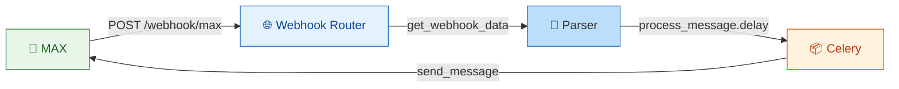
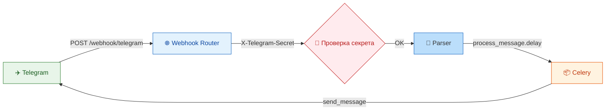
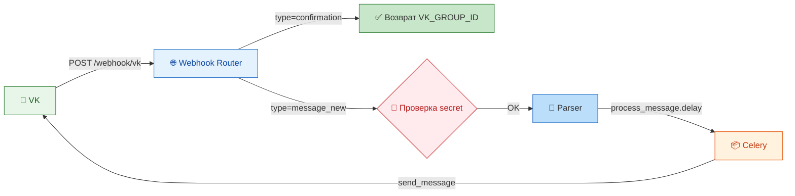
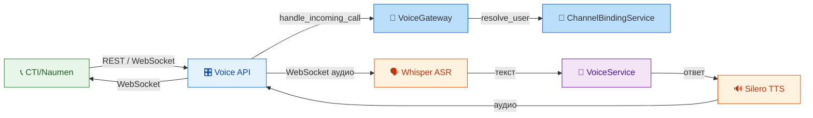
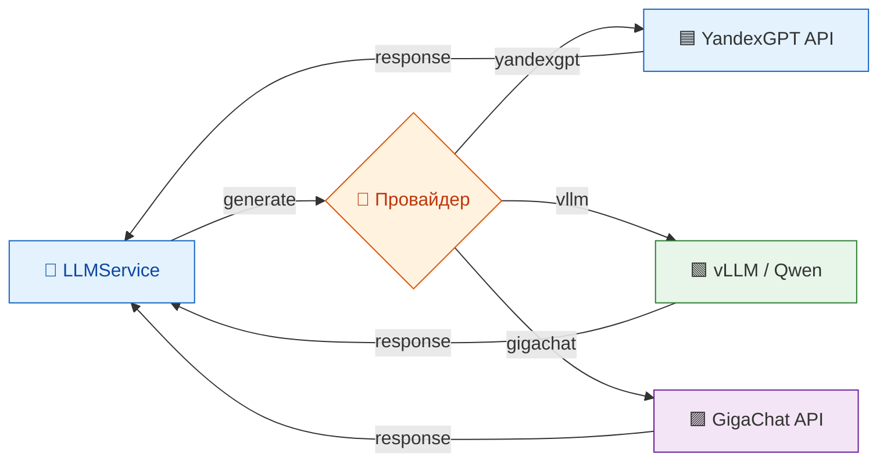
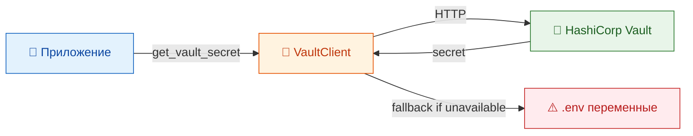

# 🔌 INTEGRATIONS_REFERENCE.md

## 1. Введение

### 1.1. Цель документа

Настоящий документ содержит **детальное описание всех внешних интеграций** системы «Омниканальный агент с долговременной памятью». Он предназначен для разработчиков, DevOps-инженеров, интеграторов и всех, кто подключает систему к внешним сервисам или поддерживает существующие подключения.

В отличие от [ARCHITECTURE.md](ARCHITECTURE.md), где интеграции перечислены на высоком уровне, настоящий документ фокусируется на **конкретных деталях реализации**:

- Протоколы и форматы данных.
- Примеры запросов и ответов (payload).
- Реализация в коде (файлы, классы, методы).
- Настройка и конфигурация (переменные окружения).
- Безопасность (аутентификация, шифрование, проверка подписей).
- Трассировка требований.
- Диаграммы взаимодействия.

Все описания основаны на актуальном коде из [backend/src/](../backend/src/) и конфигурациях из [config/](../config/) и [docker-compose.yml](../docker-compose.yml).

### 1.2. Список интеграций

| № | Интеграция | Тип | Протокол | Код |
|---|------------|-----|----------|-----|
| 1 | **MAX** | Мессенджер | Webhook / Long Polling | `integrations/max_gateway.py` |
| 2 | **Telegram** | Мессенджер | Webhook (Bot API) | `integrations/telegram_gateway.py` |
| 3 | **VK** | Мессенджер | Callback API | `integrations/vk_gateway.py` |
| 4 | **Голос / CTI (Naumen)** | Телефония | REST / WebSocket | `integrations/voice_gateway.py` |
| 5 | **LLM (YandexGPT, vLLM, GigaChat)** | AI | REST (OpenAI compatible) | `services/llm_service.py` |
| 6 | **HashiCorp Vault** | Безопасность | REST (KV v2) | `vault_client.py` |
| 7 | **PostgreSQL** | База данных | AsyncPG (SQLAlchemy) | `database.py`, `models.py` |
| 8 | **Redis** | Кэш / Очереди | RESP (Redis Protocol) | `celery_app.py`, `database.py` |
| 9 | **Qdrant** | Векторная БД | REST / gRPC | `services/vector_store_service.py` |
| 10 | **Neo4j** | Графовая БД | Bolt (async) | `services/graph_service.py` |
| 11 | **MinIO** | Объектное хранилище | S3 API | [scripts/backup.sh](../scripts/backup.sh) |
| 12 | **Prometheus** | Мониторинг | HTTP (metrics) | `metrics.py` |
| 13 | **Grafana** | Визуализация | HTTP (datasources) | `config/grafana/` |
| 14 | **Loki** | Логирование | HTTP (push) | `logging_config.py`, `promtail.yml` |
| 15 | **Jaeger** | Трассировка | OTLP / UDP | `tracing.py` |

---

## 2. Интеграция 1: MAX

### 2.1. Общее описание

MAX — российский мессенджер для бизнес-коммуникаций. Интеграция осуществляется через официальный SDK `aiomax` с использованием вебхуков для приёма сообщений.

**Трассировка требований:** R10 (омниканальность).

**Файл:** [backend/src/integrations/max_gateway.py](../backend/src/integrations/max_gateway.py)

### 2.2. Протокол и формат

- **Протокол:** Webhook (входящие) + Long Polling / REST (исходящие)
- **Формат:** JSON
- **Аутентификация:** Bot Token (в заголовке `Authorization: Bearer <token>`)

### 2.3. Конфигурация

**Переменные окружения:**
```bash
MAX_BOT_TOKEN=your-max-bot-token
```

**В [backend/src/config.py](../backend/src/config.py):**
```python
MAX_BOT_TOKEN: str = Field(default="", description="MAX messenger bot token")
```

### 2.4. Реализация

**Класс:** `MAXGateway`

**Методы:**
- `_get_client()` — ленивая инициализация `aiomax.Bot`.
- `send_message(user_external_id, text)` — отправка сообщения.
- `get_webhook_data(data)` — парсинг входящего вебхука.

**Пример отправки сообщения:**
```python
# backend/src/integrations/max_gateway.py
async def send_message(self, user_external_id: str, text: str) -> bool:
    client = self._get_client()
    await client.send_message(chat_id=user_external_id, text=text)
    return True
```

**Пример парсинга вебхука:**
```python
# backend/src/integrations/max_gateway.py
async def get_webhook_data(self, data: dict) -> dict:
    return {
        "channel": "MAX",
        "external_id": str(data.get("message", {}).get("sender", {}).get("id", "")),
        "text": data.get("message", {}).get("text", ""),
        "message_id": str(data.get("message", {}).get("id", "")),
        "timestamp": data.get("message", {}).get("date", 0),
    }
```

**Пример входящего payload:**
```json
{
  "event": "message",
  "payload": {
    "message": {
      "text": "Здравствуйте! Хочу подключить безлимитный тариф.",
      "mid": "123456789",
      "sender": {"id": "user_123", "name": "Иван Петров"},
      "date": 1689000000
    },
    "chat": {
      "chatId": "456",
      "type": "dialog"
    }
  }
}
```

### 2.5. Вебхук-эндпоинт

**Файл:** [backend/src/api/webhooks.py](../backend/src/api/webhooks.py)

```python
@router.post("/max")
async def max_webhook(request: Request, db: AsyncSession = Depends(get_db)):
    data = await request.json()
    parsed = await max_gateway.get_webhook_data(data)
    process_message.delay(
        channel_type="MAX",
        external_id=parsed["external_id"],
        text=parsed["text"],
    )
    return {"status": "ok"}
```

### 2.6. Диаграмма



---

## 3. Интеграция 2: Telegram

### 3.1. Общее описание

Telegram-бот для приёма и отправки сообщений через Bot API. Используется библиотека `aiogram 3.x`.

**Трассировка требований:** R10 (омниканальность), R05 (безопасность вебхуков).

**Файл:** [backend/src/integrations/telegram_gateway.py](../backend/src/integrations/telegram_gateway.py)

### 3.2. Протокол и формат

- **Протокол:** Webhook (Bot API)
- **Формат:** JSON
- **Аутентификация:** Bot Token в URL (при установке вебхука)
- **Безопасность:** `X-Telegram-Bot-Api-Secret-Token` заголовок

### 3.3. Конфигурация

**Переменные окружения:**
```bash
TELEGRAM_BOT_TOKEN=your-telegram-bot-token
TELEGRAM_WEBHOOK_SECRET=your-webhook-secret
```

**В [backend/src/config.py](../backend/src/config.py):**
```python
TELEGRAM_BOT_TOKEN: str = Field(default="", description="Telegram bot token")
TELEGRAM_WEBHOOK_SECRET: str = Field(default="", description="Telegram webhook secret token")
```

### 3.4. Реализация

**Класс:** `TelegramGateway`

**Методы:**
- `_get_bot()` — ленивая инициализация `aiogram.Bot`.
- `send_message(chat_id, text)` — отправка сообщения.
- `get_webhook_data(data)` — парсинг входящего обновления.

**Пример отправки сообщения:**
```python
# backend/src/integrations/telegram_gateway.py
async def send_message(self, chat_id: str | int, text: str) -> bool:
    bot = self._get_bot()
    await bot.send_message(chat_id=chat_id, text=text)
    return True
```

**Пример парсинга вебхука:**
```python
# backend/src/integrations/telegram_gateway.py
async def get_webhook_data(self, data: dict) -> dict:
    message = data.get("message", {}) or data.get("edited_message", {})
    from_user = message.get("from", {})
    return {
        "channel": "TG",
        "external_id": str(from_user.get("id", "")),
        "text": message.get("text", ""),
        "message_id": str(message.get("message_id", "")),
        "timestamp": message.get("date", 0),
        "username": from_user.get("username", ""),
        "first_name": from_user.get("first_name", ""),
    }
```

**Пример входящего payload (Update):**
```json
{
  "update_id": 123456789,
  "message": {
    "message_id": 1,
    "from": {
      "id": 123456,
      "is_bot": false,
      "first_name": "Иван",
      "last_name": "Петров",
      "username": "ivan_petrov",
      "language_code": "ru"
    },
    "chat": {
      "id": 123456,
      "first_name": "Иван",
      "last_name": "Петров",
      "username": "ivan_petrov",
      "type": "private"
    },
    "date": 1689000000,
    "text": "Здравствуйте! Хочу подключить безлимитный тариф."
  }
}
```

### 3.5. Безопасность (Secret Token)

**Файл:** [backend/src/api/webhooks.py](../backend/src/api/webhooks.py)

```python
def _verify_telegram_secret(request: Request) -> None:
    if not settings.TELEGRAM_WEBHOOK_SECRET:
        return
    received = request.headers.get("x-telegram-bot-api-secret-token", "")
    expected = settings.TELEGRAM_WEBHOOK_SECRET
    if not hmac.compare_digest(received, expected):
        raise HTTPException(status_code=403, detail="Forbidden")
```

### 3.6. Вебхук-эндпоинт

```python
@router.post("/telegram")
async def telegram_webhook(request: Request):
    _verify_telegram_secret(request)
    data = await request.json()
    parsed = await telegram_gateway.get_webhook_data(data)
    process_message.delay(channel_type="TG", external_id=parsed["external_id"], text=parsed["text"])
    return {"status": "ok"}
```

### 3.7. Диаграмма



---

## 4. Интеграция 3: VK

### 4.1. Общее описание

Интеграция с VK через Callback API. Используется библиотека `vk_api` для отправки сообщений.

**Трассировка требований:** R10 (омниканальность), R05 (безопасность).

**Файл:** [backend/src/integrations/vk_gateway.py](../backend/src/integrations/vk_gateway.py)

### 4.2. Протокол и формат

- **Протокол:** Callback API (HTTP POST)
- **Формат:** JSON
- **Аутентификация:** Access Token, Group ID
- **Безопасность:** Параметр `secret` в callback-запросе

### 4.3. Конфигурация

**Переменные окружения:**
```bash
VK_ACCESS_TOKEN=your-vk-access-token
VK_GROUP_ID=your-group-id
VK_CALLBACK_SECRET=your-callback-secret
```

**В [backend/src/config.py](../backend/src/config.py):**
```python
VK_ACCESS_TOKEN: str = Field(default="", description="VK API access token")
VK_GROUP_ID: str = Field(default="", description="VK group ID")
VK_CALLBACK_SECRET: str = Field(default="", description="VK callback secret")
```

### 4.4. Реализация

**Класс:** `VKGateway`

**Методы:**
- `_get_session()` — ленивая инициализация `vk_api.VkApi`.
- `send_message(user_id, message)` — отправка сообщения.
- `get_webhook_data(data)` — парсинг входящего callback.

**Пример отправки сообщения:**
```python
# backend/src/integrations/vk_gateway.py
async def send_message(self, user_id: str | int, message: str) -> bool:
    session = self._get_session()
    vk = session.get_api()
    vk.messages.send(user_id=user_id, message=message, random_id=0)
    return True
```

**Пример парсинга callback:**
```python
# backend/src/integrations/vk_gateway.py
async def get_webhook_data(self, data: dict) -> dict:
    object_data = data.get("object", {})
    message = object_data.get("message", {}) if isinstance(object_data, dict) else object_data
    return {
        "channel": "VK",
        "external_id": str(message.get("user_id", "")),
        "text": message.get("text", ""),
        "message_id": str(message.get("id", "")),
        "timestamp": message.get("date", 0),
    }
```

**Пример входящего payload:**
```json
{
  "type": "message_new",
  "object": {
    "message": {
      "id": 1,
      "date": 1689000000,
      "from_id": 123456,
      "text": "Здравствуйте! Хочу подключить безлимитный тариф.",
      "peer_id": 123456,
      "attachments": []
    }
  },
  "group_id": 789,
  "event_id": "abc123",
  "secret": "your-callback-secret"
}
```

### 4.5. Безопасность (Secret)

**Файл:** [backend/src/api/webhooks.py](../backend/src/api/webhooks.py)

```python
def _verify_vk_secret(data: dict) -> None:
    if not settings.VK_CALLBACK_SECRET:
        return
    received = data.get("secret", "")
    expected = settings.VK_CALLBACK_SECRET
    if not hmac.compare_digest(str(received), expected):
        raise HTTPException(status_code=403, detail="Forbidden")
```

### 4.6. Вебхук-эндпоинт

```python
@router.post("/vk")
async def vk_webhook(request: Request):
    data = await request.json()
    if data.get("type") == "confirmation":
        return {"response": settings.VK_GROUP_ID}
    _verify_vk_secret(data)
    parsed = await vk_gateway.get_webhook_data(data)
    process_message.delay(channel_type="VK", external_id=parsed["external_id"], text=parsed["text"])
    return {"status": "ok"}
```

### 4.7. Диаграмма



---

## 5. Интеграция 4: Голос / CTI (Naumen)

### 5.1. Общее описание

Интеграция с телефонией через CTI-систему Naumen (или Asterisk/FreeSWITCH). Поддерживается REST API для управления звонками и WebSocket для аудио-потока.

**Трассировка требований:** R11 (Voice-пайплайн).

**Файл:** [backend/src/integrations/voice_gateway.py](../backend/src/integrations/voice_gateway.py)

### 5.2. Протокол и формат

- **Протокол:** REST (управление) + WebSocket (аудио)
- **Формат:** JSON (события), binary (аудио)
- **Аутентификация:** API Key (в заголовке)

### 5.3. Конфигурация

**Переменные окружения:**
```bash
CTI_API_URL=your-cti-api-url
CTI_API_KEY=your-cti-api-key
```

### 5.4. Реализация

**Класс:** `VoiceGateway`

**Методы:**
- `handle_incoming_call(caller_id, call_id)` — обработка входящего звонка.
- `send_audio_response(call_id, audio_data)` — отправка аудио-ответа.
- `end_call(call_id)` — завершение звонка.
- `get_call_status(call_id)` — получение статуса.

**Класс:** `VoiceProcessor` — полный пайплайн ASR → Memory → LLM → TTS.

**Пример обработки звонка:**
```python
# backend/src/integrations/voice_gateway.py
async def handle_incoming_call(self, caller_id: str, call_id: str | None = None):
    if not settings.ENABLE_VOICE:
        return {"success": False, "error": "Voice disabled"}
    if not call_id:
        call_id = str(uuid.uuid4())
    logger.info(f"Incoming call: {caller_id} (call: {call_id})")
    return {"success": True, "call_id": call_id, "caller_id": caller_id, "status": "connected"}
```

### 5.5. API-эндпоинты

**Файл:** [backend/src/api/voice.py](../backend/src/api/voice.py)

```python
@router.websocket("/stream")
async def voice_stream(websocket: WebSocket):
    await websocket.accept()
    # Обработка аудио-потока
    while True:
        audio_chunk = await websocket.receive_bytes()
        text = await asr.transcribe(audio_chunk)
        response = await chat_service.send_message(user_id, text, "VOICE")
        audio_response = await tts.synthesize(response)
        await websocket.send_bytes(audio_response)
```

### 5.6. Диаграмма



---

## 6. Интеграция 5: LLM (YandexGPT, vLLM, GigaChat)

### 6.1. Общее описание

Поддержка нескольких LLM-провайдеров для извлечения фактов и генерации ответов.

**Трассировка требований:** R01 (персонализация), R14 (Feature Flags).

**Файл:** [backend/src/services/llm_service.py](../backend/src/services/llm_service.py)

### 6.2. Протокол и формат

- **Протокол:** REST (OpenAI compatible)
- **Формат:** JSON
- **Аутентификация:** API Key (в заголовке)

### 6.3. Конфигурация

**Переменные окружения:**
```bash
LLM_PROVIDER=yandexgpt  # или vllm, gigachat
YANDEXGPT_API_KEY=your-yandex-api-key
YANDEX_FOLDER_ID=your-folder-id
LLM_API_BASE_URL=http://vllm:8000
LLM_API_KEY=your-api-key
```

### 6.4. Реализация

**Класс:** `LLMService`

**Методы:**
- `_get_client()` — ленивая инициализация клиента.
- `generate(prompt, max_tokens, temperature)` — генерация текста.

**Пример вызова YandexGPT:**
```python
# backend/src/services/llm_service.py
async def _generate_yandex(self, client, prompt, max_tokens, temperature):
    result = client.texts().generate(
        modelUri=f"gpt://{settings.YANDEX_FOLDER_ID}/yandexgpt-lite",
        messages=[{"role": "system", "text": "Вы - полезный ассистент."}, {"role": "user", "text": prompt}],
        generationOptions={"maxTokens": str(max_tokens), "temperature": temperature},
    )
    return result.alternatives[0].message.text
```

**Пример вызова vLLM:**
```python
# backend/src/services/llm_service.py
async def _generate_vllm(self, client, prompt, max_tokens, temperature):
    response = await client.post("/v1/completions", json={
        "prompt": prompt,
        "max_tokens": max_tokens,
        "temperature": temperature,
    })
    return response.json()["choices"][0]["text"]
```

### 6.5. Метрики

**Файл:** [backend/src/metrics.py](../backend/src/metrics.py)

```python
LLM_REQUEST_DURATION = Histogram(
    "llm_request_duration_seconds",
    "LLM request latency in seconds",
    ["provider", "model"],
)
```

### 6.6. Диаграмма



---

## 7. Интеграция 6: HashiCorp Vault

### 7.1. Общее описание

Безопасное хранение секретов (JWT_SECRET, ENCRYPTION_KEY) с использованием Vault KV v2.

**Трассировка требований:** R05 (безопасность).

**Файл:** [backend/src/vault_client.py](../backend/src/vault_client.py)

### 7.2. Протокол и формат

- **Протокол:** REST (Vault API)
- **Формат:** JSON
- **Аутентификация:** Token

### 7.3. Конфигурация

**Переменные окружения:**
```bash
VAULT_URL=http://vault:8200
VAULT_TOKEN=your-vault-token
VAULT_PATH=secret/omnichannel
```

### 7.4. Реализация

**Клиент:** `vault_client.py`

```python
import hvac

def get_vault_client():
    settings = get_settings()
    if settings.APP_ENV == "production":
        client = hvac.Client(url=settings.VAULT_URL, token=settings.VAULT_TOKEN)
        if client.is_authenticated():
            return client
    return None

def get_vault_secret(path: str, key: str) -> str | None:
    client = get_vault_client()
    if client is None:
        return None
    response = client.secrets.kv.v2.read_secret_version(path=path)
    return response["data"]["data"].get(key)
```

**Использование в конфиге:**
```python
# backend/src/config.py
@property
def effective_jwt_secret(self) -> str:
    if self.APP_ENV == "production":
        val = get_vault_secret(self.VAULT_PATH, "jwt_secret")
        if val:
            return val
    return self.JWT_SECRET
```

### 7.5. Диаграмма



---

## 8. Интеграция 7: PostgreSQL

### 8.1. Общее описание

Основная реляционная база данных для хранения пользователей, согласий, сессий, фактов и аудита.

**Файл:** [backend/src/database.py](../backend/src/database.py), [backend/src/models.py](../backend/src/models.py)

### 8.2. Конфигурация

**Переменные окружения:**
```bash
POSTGRES_HOST=postgres
POSTGRES_PORT=5432
POSTGRES_DB=omnichannel
POSTGRES_USER=postgres
POSTGRES_PASSWORD=postgres
```

### 8.3. Подключение

```python
# backend/src/database.py
engine = create_async_engine(
    settings.postgres_url,
    echo=settings.APP_DEBUG,
    pool_pre_ping=True,
)
async_session_factory = async_sessionmaker(engine, class_=AsyncSession, expire_on_commit=False)
```

### 8.4. Миграции

**Инструмент:** Alembic  
**Файлы:** [backend/alembic/](../backend/alembic/)

```bash
alembic upgrade head
alembic revision --autogenerate -m "description"
```

---

## 9. Интеграция 8: Redis

### 9.1. Общее описание

Используется как кэш, брокер Celery и хранилище чекпоинтов LangGraph.

**Файлы:** [backend/src/celery_app.py](../backend/src/celery_app.py), [docker-compose.yml](../docker-compose.yml)

### 9.2. Конфигурация

```bash
REDIS_HOST=redis
REDIS_PORT=6379
REDIS_DB=0
```

### 9.3. Использование

**Кэш сессий:** (планируется)  
**Celery брокер:**
```python
celery_app = Celery(broker=settings.CELERY_BROKER_URL)
```
**LangGraph чекпоинты:** (планируется через RedisSaver)

---

## 10. Интеграция 9: Qdrant

### 10.1. Общее описание

Векторная база данных для семантического поиска фактов.

**Трассировка требований:** R01 (поиск памяти).

**Файл:** [backend/src/services/vector_store_service.py](../backend/src/services/vector_store_service.py)

### 10.2. Конфигурация

```bash
QDRANT_URL=http://qdrant:6333
QDRANT_API_KEY=your-api-key
EMBEDDING_MODEL=paraphrase-multilingual-MiniLM-L12-v2
```

### 10.3. Реализация

**Методы:**
- `index_fact(fact_id, user_id, content, metadata)` — индексация факта.
- `search_similar(user_id, query, limit)` — поиск похожих фактов.
- `delete_fact(fact_id)` — удаление факта.

**Пример индексации:**
```python
# backend/src/services/vector_store_service.py
async def index_fact(self, fact_id, user_id, content, metadata):
    embedding = await self.get_embedding(content)
    self._get_client().upsert(
        collection_name="facts",
        points=[{"id": str(fact_id), "vector": embedding, "payload": {"user_id": str(user_id), "content": content, **metadata}}],
    )
```

---

## 11. Интеграция 10: Neo4j

### 11.1. Общее описание

Графовая база данных для хранения связей между фактами.

**Файл:** [backend/src/services/graph_service.py](../backend/src/services/graph_service.py)

### 11.2. Конфигурация

```bash
NEO4J_URI=bolt://neo4j:7687
NEO4J_USER=neo4j
NEO4J_PASSWORD=password
```

### 11.3. Реализация

**Асинхронный драйвер:**
```python
from neo4j import AsyncGraphDatabase

driver = AsyncGraphDatabase.driver(settings.NEO4J_URI, auth=(settings.NEO4J_USER, settings.NEO4J_PASSWORD))
```

**Пример создания узла:**
```python
async def create_fact_node(self, fact_id, user_id, category, content_summary):
    async with self._get_driver().session() as session:
        await session.run(
            "MERGE (u:User {id: $user_id}) MERGE (f:Fact {id: $fact_id, category: $category, summary: $summary}) MERGE (u)-[:HAS_FACT]->(f)",
            user_id=str(user_id), fact_id=str(fact_id), category=category, summary=content_summary,
        )
```

---

## 12. Интеграция 11: MinIO

### 12.1. Общее описание

S3-совместимое объектное хранилище для бэкапов и аудиофайлов.

**Файлы:** [scripts/backup.sh](../scripts/backup.sh), [docker-compose.yml](../docker-compose.yml)

### 12.2. Конфигурация

```bash
MINIO_ENDPOINT=minio:9000
MINIO_ACCESS_KEY=minioadmin
MINIO_SECRET_KEY=minioadmin
MINIO_BUCKET=omnichannel
```

### 12.3. Использование

**Бэкапы:**
```bash
mc cp /tmp/backups/postgres.dump minio/omnichannel-backups/backups/
```

**Аудиофайлы:** (планируется загрузка файлов пользователей)

---

## 13. Интеграция 12-15: Мониторинг

### 13.1. Prometheus

**Файл:** [config/prometheus.yml](../config/prometheus.yml)

Сбор метрик с backend по эндпоинту `/metrics`.  
**Метрики:** [backend/src/metrics.py](../backend/src/metrics.py)

### 13.2. Grafana

**Файлы:** [config/grafana/provisioning/](../config/grafana/provisioning/)

Дашборды:
- `omnichannel-backend.json` — технические метрики.
- `business.json` — бизнес-показатели.

### 13.3. Loki

**Файлы:** [config/loki.yml](../config/loki.yml), [config/promtail.yml](../config/promtail.yml)

Сбор структурированных JSON-логов из контейнеров.

### 13.4. Jaeger

**Файл:** [backend/src/tracing.py](../backend/src/tracing.py)

Трассировка запросов через OpenTelemetry.

---

## 14. Сводная таблица

| Интеграция | Протокол | Порт | Аутентификация | Код |
|------------|----------|------|----------------|-----|
| MAX | Webhook | 443 | Bot Token | `max_gateway.py` |
| Telegram | Webhook | 443 | Secret Token | `telegram_gateway.py` |
| VK | Callback | 443 | Secret + Access Token | `vk_gateway.py` |
| CTI | REST/WebSocket | — | API Key | `voice_gateway.py` |
| LLM | REST | 8000 | API Key | `llm_service.py` |
| Vault | REST | 8200 | Token | `vault_client.py` |
| PostgreSQL | AsyncPG | 5432 | User/Pass | `database.py` |
| Redis | RESP | 6379 | — | `celery_app.py` |
| Qdrant | REST | 6333 | API Key | `vector_store_service.py` |
| Neo4j | Bolt | 7687 | User/Pass | `graph_service.py` |
| MinIO | S3 | 9000 | Access/Secret | `backup.sh` |
| Prometheus | HTTP | 9090 | — | `metrics.py` |
| Grafana | HTTP | 3000 | User/Pass | `config/grafana/` |
| Loki | HTTP | 3100 | — | `logging_config.py` |
| Jaeger | UDP/OTLP | 6831/4318 | — | `tracing.py` |

---

## 15. Заключение

Система интегрируется с широким спектром внешних сервисов: мессенджеры, телефония, LLM, базы данных, хранилища, мониторинг. Все интеграции построены на стандартных протоколах, используют асинхронные драйверы и обеспечивают безопасность (секреты, проверка подписей, шифрование).
