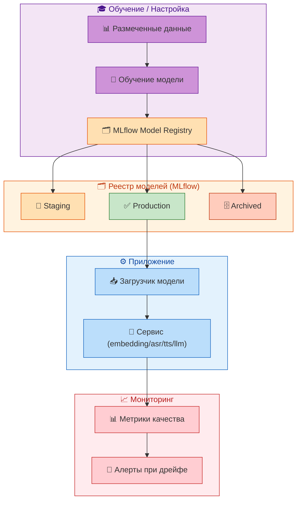

# 📦 MODEL_VERSIONING.md

## 1. Введение

### 1.1. Цель документа

Данный документ описывает политику версионирования, обновления и мониторинга ML-моделей, используемых в системе «Омниканальный агент с долговременной памятью». Он предназначен для ML-инженеров, DevOps и разработчиков, ответственных за поддержание и улучшение качества AI-компонентов системы.

В системе используются несколько типов моделей: эмбеддинги для векторного поиска, модели для реранкинга, ASR (распознавание речи), TTS (синтез речи) и LLM (генерация текста). Каждая из этих моделей имеет свои особенности обновления, версионирования и мониторинга. В документе описано текущее состояние, практики и планы по внедрению более формализованного процесса управления моделями.

### 1.2. Используемые модели

В системе применяются следующие модели:

| Модель | Тип | Назначение | Источник |
|--------|-----|------------|----------|
| `paraphrase-multilingual-MiniLM-L12-v2` | Эмбеддинг | Векторизация текстов фактов (384 dim) | sentence-transformers |
| `BAAI/bge-reranker-large` | Re-ranker | Переранжировка результатов поиска | sentence-transformers |
| `Whisper Large-v3` | ASR | Распознавание речи (русский, английский) | OpenAI |
| `Silero TTS v5` | TTS | Синтез речи (русский) | snakers4/silero-models |
| YandexGPT / vLLM / GigaChat | LLM | Извлечение фактов, генерация ответов | API / локальный инференс |

Каждая модель загружается с использованием **ленивой инициализации** — загрузка происходит только при первом реальном вызове, что сокращает время старта приложения.

---

## 2. Текущее состояние управления моделями

### 2.1. Хранение и загрузка моделей

**Эмбеддинги и Re-ranker:**
- **Загрузка:** через `sentence-transformers` в [backend/src/services/vector_store_service.py](../backend/src/services/vector_store_service.py) и [backend/src/services/memory_search_service.py](../backend/src/services/memory_search_service.py).
- **Версионирование:** через переменные окружения:
  - `EMBEDDING_MODEL` (по умолчанию: `paraphrase-multilingual-MiniLM-L12-v2`)
  - Cross-Encoder: жёстко задан (`BAAI/bge-reranker-large`)
- **Кэширование:** модели кэшируются в директории `~/.cache/huggingface/` (или `TORCH_HOME`).

**ASR (Whisper):**
- **Загрузка:** через `whisper.load_model()` в [backend/src/services/whisper_asr.py](../backend/src/services/whisper_asr.py).
- **Версионирование:** переменная `WHISPER_MODEL` (по умолчанию: `large-v3`).
- **Кэширование:** модель скачивается при первом использовании и сохраняется локально.

**TTS (Silero):**
- **Загрузка:** через `torch.hub.load()` в [backend/src/services/silero_tts.py](../backend/src/services/silero_tts.py).
- **Версионирование:** модель загружается с GitHub по тегу `v5` (последняя стабильная версия).
- **Кэширование:** `torch.hub` кэширует модель в `~/.cache/torch/hub/`.

**LLM:**
- **Загрузка:** через внешние API (YandexGPT, GigaChat) или локальный инференс (vLLM) в [backend/src/services/llm_service.py](../backend/src/services/llm_service.py).
- **Версионирование:** через `LLM_PROVIDER`, API-ключи и URL-адреса.
- **Кэширование:** результаты LLM не кэшируются (может быть добавлено в будущем).

### 2.2. Диаграмма жизненного цикла модели

```mermaid
flowchart LR
    subgraph Config["⚙️ Конфигурация (.env)"]
        EMB["📝 EMBEDDING_MODEL = paraphrase-multilingual-MiniLM-L12-v2"]
        WH["🎤 WHISPER_MODEL = large-v3"]
        LLMP["🤖 LLM_PROVIDER = yandexgpt"]
    end

    subgraph Loading["📥 Загрузка (Lazy)"]
        SENT["🧩 sentence-transformers"]
        WHISPER["🗣️ openai-whisper"]
        SILERO["🔊 torch.hub (Silero)"]
        LLM["🧠 LLM API / vLLM"]
    end

    subgraph Cache["💾 Кэширование"]
        HF["📂 ~/.cache/huggingface/"]
        TORCH["📂 ~/.cache/torch/hub/"]
    end

    Config --> Loading
    Loading --> Cache
    Cache --> Runtime["🚀 Использование в рантайме"]

    style Config fill:#fff3e0,stroke:#e65100,color:#bf360c
    style Loading fill:#e3f2fd,stroke:#1565c0,color:#0d47a1
    style Cache fill:#e8f5e9,stroke:#2e7d32,color:#1b5e20
    style EMB fill:#ffe0b2,stroke:#e65100
    style WH fill:#ffe0b2,stroke:#e65100
    style LLMP fill:#ffe0b2,stroke:#e65100
    style SENT fill:#bbdefb,stroke:#1565c0
    style WHISPER fill:#bbdefb,stroke:#1565c0
    style SILERO fill:#bbdefb,stroke:#1565c0
    style LLM fill:#bbdefb,stroke:#1565c0
    style HF fill:#c8e6c9,stroke:#2e7d32
    style TORCH fill:#c8e6c9,stroke:#2e7d32
    style Runtime fill:#f3e5f5,stroke:#6a1b9a,color:#4a148c
```



---

## 3. Политика версионирования моделей

### 3.1. Текущая практика

На данный момент версионирование моделей осуществляется через:
- **Переменные окружения** — изменение версии модели требует обновления `.env` и перезапуска соответствующего сервиса.
- **Фиксированные теги** — для Silero используется фиксированный тег `v5` (может быть обновлён в следующем мажорном релизе).
- **API-версии** — для LLM версионирование происходит на стороне провайдера.

**Недостатки текущего подхода:**
- Нет единого реестра моделей (неизвестно, какая модель используется в production).
- Нет возможности отката к предыдущей версии без перезапуска.
- Нет A/B-тестирования — только полная замена.

### 3.2. Планируемое улучшение (MLflow)

**Цель:** Внедрение **MLflow** для управления жизненным циклом моделей.

**Архитектура:**



**План внедрения:**

| Этап | Действие | Срок |
|------|----------|------|
| 1 | Установка MLflow Tracking Server | Пост-пилот (1–2 мес.) |
| 2 | Интеграция загрузки моделей с MLflow | 2–3 мес. |
| 3 | Добавление A/B-тестирования | 3–4 мес. |
| 4 | Автоматический откат при ухудшении качества | 4–6 мес. |

---

## 4. A/B-тестирование моделей

### 4.1. Стратегия канареечных развёртываний

Для безопасного обновления моделей используется стратегия **канареечного развёртывания** (canary deployment):

1. Новая модель загружается в staging-окружение.
2. Проводится автономное тестирование (на размеченном датасете).
3. Модель развёртывается на 5–10% трафика (через Feature Flag или динамическую маршрутизацию).
4. Сравниваются метрики качества (F1, задержка, пользовательская обратная связь).
5. При улучшении — rollout на 100% трафика. При ухудшении — откат.

**Реализация в коде (план):**
```python
# backend/src/services/llm_service.py (планируемое улучшение)
class LLMService:
    def __init__(self, use_canary: bool = False):
        self.provider = settings.LLM_PROVIDER
        self.canary_provider = settings.LLM_CANARY_PROVIDER
        self.canary_weight = settings.LLM_CANARY_WEIGHT  # 0.0 - 1.0

    async def generate(self, prompt: str) -> str:
        if random.random() < self.canary_weight:
            return await self._call_canary(prompt)
        return await self._call_production(prompt)
```

### 4.2. Метрики для A/B-тестирования

| Метрика | Назначение | Целевое значение |
|---------|------------|------------------|
| F1-score (извлечение фактов) | Точность извлечения | > 0.85 |
| Задержка (p95) | Производительность | < 3 с (LLM), < 300 мс (search) |
| Доля конфликтов | Качество памяти | < 2% |
| Пользовательская оценка (NPS) | Общая удовлетворённость | +5–10 пунктов |

---

## 5. Обновление моделей без перезапуска

### 5.1. Lazy Loading как основа

Благодаря ленивой загрузке, обновление моделей может быть выполнено без перезапуска всего приложения:

1. Изменить переменную окружения (например, `EMBEDDING_MODEL`).
2. Перезапустить только соответствующий сервис (или под).
3. При следующем вызове модель загрузится новая.

**Ограничения:**
- Для LLM (API) обновление происходит мгновенно (меняется провайдер/модель в конфиге).
- Для Silero TTS и Whisper ASR требуется перезагрузка модуля (можно через горячую перезагрузку).

### 5.2. План автоматизации

В будущем планируется внедрение **динамической перезагрузки моделей** без остановки сервиса:

1. Модель загружается в фоновом потоке.
2. После загрузки производится переключение на новую модель (atomic swap).
3. Старая модель выгружается из памяти (если не используется).

**Реализация** (планируемая):
```python
# backend/src/services/vector_store_service.py
class VectorStoreService:
    def __init__(self):
        self._model = None
        self._model_lock = asyncio.Lock()

    async def reload_model(self, new_model_name: str):
        async with self._model_lock:
            new_model = SentenceTransformer(new_model_name)
            # Атомарная замена
            old_model = self._model
            self._model = new_model
            # Освобождение памяти (если старая модель не используется)
            del old_model
```

---

## 6. Мониторинг качества моделей

### 6.1. Метрики для отслеживания

**Для эмбеддингов и реранкинга:**
- `embedding_generation_duration` — время генерации эмбеддинга.
- `search_relevance_score` — обратная связь от пользователей (клики, дочитывания).
- `drift_score` — изменение распределения эмбеддингов (мониторинг дрейфа).

**Для ASR (Whisper):**
- `asr_wer` — Word Error Rate на тестовом наборе.
- `asr_confidence` — средняя уверенность распознавания.

**Для TTS (Silero):**
- `tts_mos` — Mean Opinion Score (через обратную связь операторов).
- `tts_duration` — время синтеза.

**Для LLM:**
- `llm_f1_extraction` — F1-score извлечения фактов.
- `llm_response_relevance` — релевантность ответов (оценка операторами).
- `llm_toxicity_score` — уровень токсичности (через NeMo Guardrails).

### 6.2. Сбор метрик

Метрики собираются через Prometheus и отображаются в Grafana (см. [MONITORING_GUIDE.md](MONITORING_GUIDE.md)). Для ML-метрик планируется использовать специализированные инструменты (например, `prometheus-mlflow-exporter`).

```python
# backend/src/metrics.py (дополнительные ML-метрики)
ASR_WER = Gauge('asr_wer', 'Word Error Rate for ASR', ['model_version'])
LLM_F1 = Gauge('llm_f1_score', 'F1-score for fact extraction', ['model_version'])
```

### 6.3. Алерты при дрейфе

Настраиваются алерты при ухудшении качества:

```yaml
# prometheus-rules.json (дополнение)
{
  "alert": "LLMF1Drop",
  "expr": "llm_f1_score < 0.7",
  "for": "15m",
  "labels": {"severity": "warning"},
  "annotations": {"summary": "LLM F1-score dropped below 0.7"}
}
```

---

## 7. Практические рекомендации

### 7.1. При обновлении модели

1. **Проверка в staging:**
   - Загрузите новую модель в staging-окружение.
   - Прогоните тесты (включая интеграционные с реальными данными).
   - Проверьте задержки и потребление памяти.

2. **Канареечное развёртывание:**
   - Настройте `CANARY_WEIGHT=0.05` (5% трафика).
   - Собирайте метрики в течение 24 часов.
   - При успехе увеличьте до 50%, затем до 100%.

3. **Откат:**
   - При ухудшении метрик верните `CANARY_WEIGHT=0` или перезапустите с предыдущей версией модели.

### 7.2. При добавлении новой модели

1. Добавьте новую модель в `config.py` (с дефолтным значением).
2. Реализуйте ленивую загрузку в соответствующем сервисе.
3. Напишите интеграционные тесты (с моками, если модель тяжёлая).
4. Добавьте метрики мониторинга.
5. Обновите документацию (данный документ и [ARCHITECTURE.md](ARCHITECTURE.md)).

---

## 8. Сводная таблица моделей и их версий

| Модель | Переменная окружения | Текущая версия | Запасная версия |
|--------|----------------------|----------------|-----------------|
| Эмбеддинги | `EMBEDDING_MODEL` | `paraphrase-multilingual-MiniLM-L12-v2` | `rubert-tiny-v2` |
| Re-ranker | (фиксированная) | `BAAI/bge-reranker-large` | — |
| Whisper ASR | `WHISPER_MODEL` | `large-v3` | `medium` |
| Silero TTS | (фиксированная) | `v5` | `v4` |
| LLM (primary) | `LLM_PROVIDER` | `yandexgpt` | `gigachat` |