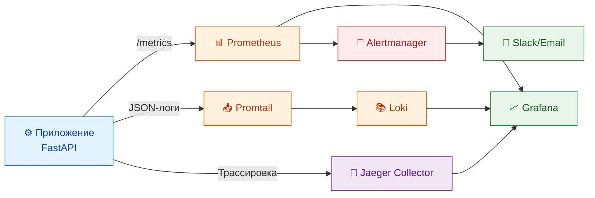

# 📊 MONITORING_GUIDE.md

## 1. Введение

### 1.1. Цель документа

Данное руководство описывает стек мониторинга, наблюдаемости и оповещений для системы «Омниканальный агент с долговременной памятью». Оно предназначено для DevOps-инженеров, администраторов и разработчиков, которым необходимо отслеживать состояние системы, выявлять проблемы и обеспечивать её стабильную работу.

В документе рассмотрены все аспекты наблюдаемости: сбор метрик, визуализация, логирование, распределённая трассировка и оповещения. Описаны существующие дашборды, метрики и правила алертов, а также даны рекомендации по их использованию.

### 1.2. Стек мониторинга

Система использует следующие инструменты для обеспечения наблюдаемости:

| Инструмент | Назначение | Реализация |
|------------|------------|------------|
| **Prometheus** | Сбор и хранение метрик | [config/prometheus.yml](../config/prometheus.yml) |
| **Grafana** | Визуализация метрик и логов | [config/grafana/](../config/grafana/) |
| **Loki** | Сбор и хранение логов | [config/loki.yml](../config/loki.yml) |
| **Promtail** | Агент сбора логов из Docker | [config/promtail.yml](../config/promtail.yml) |
| **Jaeger** | Распределённая трассировка | [backend/src/tracing.py](../backend/src/tracing.py) |
| **Alertmanager** | Управление оповещениями | [config/prometheus-rules.json](../config/prometheus-rules.json) |

Все эти сервисы могут быть запущены локально через Docker Compose с профилем `monitoring`:

```bash
docker compose --profile monitoring up -d
```

В production-окружении они обычно развёртываются отдельно (например, через Helm-чарты) и интегрируются с приложением через стандартные эндпоинты.



---

## 2. Метрики (Prometheus)

### 2.1. Технические метрики

Технические метрики позволяют оценить производительность и состояние компонентов системы. Они собираются автоматически через `prometheus-fastapi-instrumentator` и кастомные счётчики.

#### 2.1.1. HTTP-метрики (автоматические)

| Метрика | Тип | Описание |
|---------|-----|----------|
| `http_requests_total` | Counter | Общее количество HTTP-запросов по эндпоинтам и статусам |
| `http_request_duration_seconds` | Histogram | Задержка обработки запросов (гистограмма) |
| `http_request_size_bytes` | Histogram | Размер входящих запросов |
| `http_response_size_bytes` | Histogram | Размер исходящих ответов |

**Источник:** автоматически добавляется `prometheus-fastapi-instrumentator` в [backend/src/main.py](../backend/src/main.py).

#### 2.1.2. Бизнес-логика (кастомные)

Кастомные метрики определены в [backend/src/metrics.py](../backend/src/metrics.py):

| Метрика | Тип | Метки | Описание |
|---------|-----|-------|----------|
| `LLM_REQUEST_DURATION` | Histogram | `provider`, `model` | Задержка вызова LLM (сек) |
| `QDRANT_SEARCH_DURATION` | Histogram | `collection` | Задержка поиска в Qdrant (сек) |
| `FACTS_EXTRACTED_TOTAL` | Counter | `channel` | Количество извлечённых фактов |
| `CONFLICTS_DETECTED_TOTAL` | Counter | `resolution` | Количество конфликтов по типу разрешения |
| `MEMORY_STORE_DURATION` | Histogram | `store_type` | Задержка записи в память |

**Пример использования в коде:**
```python
# backend/src/services/fact_service.py
FACTS_EXTRACTED_TOTAL.labels(channel=channel).inc()

# backend/src/services/llm_service.py
LLM_REQUEST_DURATION.labels(provider=provider, model=model).observe(duration)
```

### 2.2. Бизнес-метрики (планируются)

Бизнес-метрики отражают ключевые показатели эффективности системы и используются для оценки достижения бизнес-целей.

| Метрика | Тип | Описание | Целевое значение |
|---------|-----|----------|------------------|
| `memory_usage_percent` | Gauge | Доля диалогов с использованием памяти | > 30% |
| `repeated_issues_percent` | Gauge | Доля повторных обращений по одному вопросу | < 10% |
| `aht_seconds` | Gauge | Среднее время обработки (по каналу) | -15% от текущего |
| `rtbf_requests_total` | Counter | Количество запросов на удаление данных (RTBF) | — |

**Планируемая реализация:** бизнес-метрики будут обновляться в сервисах (`ChatService`, `SessionService`, `RightToBeForgottenService`) и экспортироваться через Prometheus. Дашборды для них уже определены в [config/grafana/provisioning/dashboards/json/business.json](../config/grafana/provisioning/dashboards/json/business.json).

### 2.3. Инфраструктурные метрики

Инфраструктурные метрики собираются для всех контейнеров и позволяют отслеживать использование ресурсов:

- **CPU**: `container_cpu_usage_seconds_total`
- **Memory**: `container_memory_working_set_bytes`
- **Network**: `container_network_receive_bytes_total`, `container_network_transmit_bytes_total`
- **Disk**: `container_fs_usage_bytes`

Эти метрики доступны через `cAdvisor` или `kube-state-metrics` в Kubernetes-окружении.

---

## 3. Дашборды (Grafana)

Grafana используется для визуализации метрик. Все дашборды настраиваются через provisioning (файлы в `config/grafana/provisioning/dashboards/`).

### 3.1. Omnichannel Backend (технический дашборд)

**Файл:** [config/grafana/provisioning/dashboards/json/omnichannel-backend.json](../config/grafana/provisioning/dashboards/json/omnichannel-backend.json)

**Назначение:** Мониторинг технического состояния бэкенда, задержек и ошибок.

**Панели:**

| Панель | Метрика | Описание |
|--------|---------|----------|
| Request Rate | `rate(http_requests_total[5m])` | Количество запросов в секунду (по эндпоинтам и статусам) |
| Request Latency P95 | `histogram_quantile(0.95, http_request_duration_seconds)` | Задержка обработки запросов (перцентиль 95) |
| LLM Latency P95 | `histogram_quantile(0.95, llm_request_duration_seconds)` | Задержка LLM (перцентили 50 и 95) |
| Qdrant Search Latency P95 | `histogram_quantile(0.95, qdrant_search_duration_seconds)` | Задержка поиска в Qdrant |
| Facts Extracted | `sum(increase(facts_extracted_total[1h]))` | Количество извлечённых фактов за час (по каналам) |
| Conflicts Detected | `sum(increase(conflicts_detected_total[1h]))` | Количество конфликтов за час (по разрешению) |
| Memory Store Duration P95 | `histogram_quantile(0.95, memory_store_duration_seconds)` | Задержка записи в память (по типу хранилища) |

**Доступ:** `http://grafana.example.com/d/omnichannel-backend`

### 3.2. Business Metrics (бизнес-дашборд)

**Файл:** [config/grafana/provisioning/dashboards/json/business.json](../config/grafana/provisioning/dashboards/json/business.json)

**Назначение:** Визуализация бизнес-показателей для руководства и product-менеджеров.

**Панели:**

| Панель | Метрика | Описание | Целевое значение |
|--------|---------|----------|------------------|
| Memory Usage % | `sum(rate(memory_context_used[1h])) / sum(rate(messages_total[1h])) * 100` | Доля диалогов с памятью | > 30% |
| NPS Score (proxy) | `avg(nps_score) by (tenant)` | Средний NPS по тенанту | +5–10 пунктов |
| Repeated Issues % | `sum(rate(repeated_complaints[1h])) / sum(rate(complaints_total[1h])) * 100` | Доля повторных обращений | < 10% |
| AHT (Avg Handle Time) | `avg(session_duration_seconds) by (channel)` | Среднее время обработки по каналам | -15% |
| Active Users (24h) | `count(count by (user_id) (active_users_total[24h]))` | Активные пользователи за сутки | — |
| Facts Extracted (24h) | `sum(increase(facts_extracted_total[24h]))` | Фактов извлечено за сутки | — |
| RTBF Requests (24h) | `sum(increase(rtbf_requests_total[24h]))` | Запросов на удаление за сутки | — |

**Доступ:** `http://grafana.example.com/d/omnichannel-business`

### 3.3. Celery Dashboard (планируется)

Для мониторинга очередей и воркеров Celery рекомендуется добавить отдельный дашборд на основе метрик:
- Длина очередей (`celery_queue_length`)
- Количество выполненных задач (`celery_tasks_total`)
- Задержка выполнения задач

---

## 4. Алерты (Prometheus)

### 4.1. Правила оповещений

Правила определены в [config/prometheus-rules.json](../config/prometheus-rules.json).

| Alert | Severity | Условие | Период | Действие |
|-------|----------|---------|--------|----------|
| **HighLLMLatency** | `warning` | P95 LLM > 5s | 5 минут | Проверить LLM, увеличить ресурсы или переключить провайдера |
| **BackendHighLatency** | `warning` | P95 API > 3s | 5 минут | Проверить нагрузку, масштабировать backend |
| **QdrantHighLatency** | `warning` | P95 Qdrant > 2s | 5 минут | Проверить Qdrant, увеличить ресурсы |
| **BackendHighErrRate** | `critical` | 5xx > 5% | 5 минут | Проверить логи, перезапустить backend |
| **HighConflictRate** | `warning` | HITL конфликты > 10/час | 15 минут | Проверить логику ConflictResolver |
| **QdrantDown** | `critical` | `up{job='qdrant'} == 0` | 2 минуты | Перезапустить Qdrant, проверить хранилище |

### 4.2. Настройка Alertmanager

Alertmanager отправляет оповещения в каналы уведомлений:

- **Slack** (канал `#alerts`)
- **Email** (список рассылки)
- **PagerDuty** (для критических алертов)

Конфигурация Alertmanager находится в [config/alertmanager.yml](../config/alertmanager.yml) (если используется).

---

## 5. Логирование

### 5.1. Структура логов

Логи формируются в **JSON-формате** с помощью библиотеки `python-json-logger` ([backend/src/logging_config.py](../backend/src/logging_config.py)).

**Пример записи:**
```json
{
  "timestamp": "2026-07-16T10:00:00Z",
  "level": "INFO",
  "logger": "backend.src.services.fact_service",
  "message": "Fact stored: id=uuid, type=preference, channel=TG",
  "trace_id": "abc-123-def-456",
  "user_id": "user-uuid",
  "module": "fact_service",
  "line": 42
}
```

**Обязательные поля:**
- `timestamp` — время события (ISO 8601).
- `level` — уровень логирования (DEBUG, INFO, WARNING, ERROR, CRITICAL).
- `logger` — имя логгера (обычно имя модуля).
- `message` — текст сообщения.
- `trace_id` — идентификатор трассировки (для корреляции запросов).
- `user_id` — идентификатор пользователя (если доступен).

**Дополнительные поля:** могут добавляться в зависимости от контекста (например, `fact_id`, `session_id`).

### 5.2. Сбор логов (Loki + Promtail)

Логи собираются через **Promtail**, который читает логи из Docker-контейнеров и отправляет их в **Loki**.

**Конфигурация:**
- Promtail: [config/promtail.yml](../config/promtail.yml)
- Loki: [config/loki.yml](../config/loki.yml)

**Метки (labels):**
- `container` — имя контейнера
- `service` — имя сервиса (из docker-compose)
- `logstream` — поток логов (stdout/stderr)

### 5.3. Фильтрация PII в логах

**Реализация:** [backend/src/logging_config.py](../backend/src/logging_config.py) (класс `PIIRedactingFilter`)

**Фильтруемые паттерны:**
- Телефонные номера (`+7...`, `8...`) → заменяются на `[PHONE_REDACTED]`.
- Email-адреса → заменяются на `[EMAIL_REDACTED]`.

Это предотвращает попадание чувствительных данных в логи, даже если они были переданы в сообщении ошибки.

### 5.4. Просмотр логов в Grafana

В Grafana можно выполнять запросы к Loki:

```logql
{service="backend"} |= "ERROR" | json | level="ERROR"
```

Используйте фильтры по времени, меткам и содержимому для отладки.

---

## 6. Трассировка (Jaeger)

### 6.1. OpenTelemetry

Трассировка реализована через **OpenTelemetry** с экспортом в **Jaeger** ([backend/src/tracing.py](../backend/src/tracing.py)).

**Инструментарий:**
- `opentelemetry-instrumentation-fastapi` — автоматическое трассирование HTTP-запросов.
- Кастомные спаны для ключевых операций (LLM, Qdrant, Neo4j).

**Пример создания спана:**
```python
from backend.src.tracing import get_tracer
tracer = get_tracer(__name__)

with tracer.start_as_current_span("llm_generate") as span:
    span.set_attribute("llm.provider", provider)
    result = await llm.generate(prompt)
```

### 6.2. Использование Jaeger

**Доступ:** `http://jaeger.example.com` (или через порт-форвардинг).

**Возможности:**
- Просмотр распределённых трасс (запрос → агенты → БД → внешние сервисы).
- Анализ задержек на каждом шаге.
- Поиск по `trace_id` для отладки конкретных запросов.

**Сценарий использования:** при возникновении ошибки или высокой задержки, найдите `trace_id` из логов и откройте его в Jaeger, чтобы увидеть полный путь запроса.

---

## 7. Доступ к мониторингу

| Сервис | URL (локальный) | URL (production) | Логин/Пароль |
|--------|-----------------|------------------|--------------|
| **Grafana** | `http://localhost:3001` | `http://grafana.example.com` | `admin` / из секретов |
| **Prometheus** | `http://localhost:9090` | `http://prometheus.example.com` | — |
| **Loki** | `http://localhost:3100` | — | — |
| **Jaeger** | `http://localhost:16686` | `http://jaeger.example.com` | — |
| **Alertmanager** | `http://localhost:9093` | `http://alertmanager.example.com` | — |

В production доступ к мониторингу должен быть ограничен (например, через VPN или внутреннюю сеть).

---

## 8. Troubleshooting (мониторинг)

### Проблема: Нет метрик в Grafana

1. Проверьте, что Prometheus запущен и доступен:
   ```bash
   curl http://prometheus:9090/-/healthy
   ```

2. Проверьте, что приложение экспортирует метрики:
   ```bash
   curl http://backend:8000/metrics
   ```

3. Проверьте конфигурацию scrape в [config/prometheus.yml](../config/prometheus.yml).

### Проблема: Нет логов в Loki

1. Проверьте, что Loki и Promtail запущены:
   ```bash
   docker compose ps loki promtail
   ```

2. Проверьте, что Promtail собирает логи:
   ```bash
   docker compose logs promtail --tail=50
   ```

3. Проверьте конфигурацию Promtail: [config/promtail.yml](../config/promtail.yml).

### Проблема: Нет трассировки в Jaeger

1. Проверьте, что Jaeger запущен:
   ```bash
   docker compose ps jaeger
   ```

2. Проверьте, что в приложении настроена трассировка:
   ```bash
   grep -r "opentelemetry" backend/src/
   ```

3. Убедитесь, что переменная окружения `JAEGER_HOST` правильная.

### Проблема: Алерты не срабатывают

1. Проверьте, что правила загружены в Prometheus:
   ```bash
   curl http://prometheus:9090/api/v1/rules
   ```

2. Проверьте Alertmanager:
   ```bash
   curl http://alertmanager:9093/api/v2/alerts
   ```

3. Проверьте, что условия алертов выполняются (используйте Prometheus UI).

---

## 9. Заключение

Мониторинг и наблюдаемость являются критическими компонентами системы, обеспечивающими её стабильную работу и возможность быстрого реагирования на инциденты. Описанный стек позволяет:

- **Отслеживать производительность** (задержки, ошибки).
- **Мониторить бизнес-показатели** (память, NPS, AHT).
- **Анализировать логи** для отладки.
- **Трассировать запросы** для выявления узких мест.
- **Получать оповещения** при нарушениях.

**Связанные документы:**
- [RUNBOOK.md](RUNBOOK.md) — инструкции для дежурного инженера.
- [DEPLOYMENT_GUIDE.md](DEPLOYMENT_GUIDE.md) — развёртывание стека мониторинга.
- [SECURITY_GUIDE.md](SECURITY_GUIDE.md) — безопасность логов и метрик.
