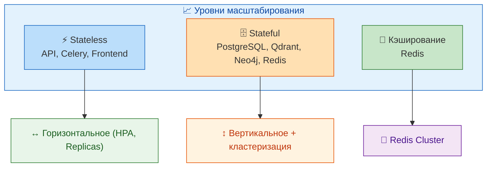

# 📈 SCALING_GUIDE.md

## 1. Введение

### 1.1. Цель документа

Данное руководство описывает стратегии и практические шаги по масштабированию компонентов системы «Омниканальный агент с долговременной памятью». Оно предназначено для DevOps-инженеров, администраторов и архитекторов, обеспечивающих работу системы в условиях растущей нагрузки.

В документе рассмотрены все компоненты системы: API-шлюз, Celery-воркеры, базы данных (PostgreSQL, Qdrant, Neo4j, Redis), объектное хранилище MinIO, а также слои приложения (агенты LangGraph, Mem0). Описаны как горизонтальное, так и вертикальное масштабирование, настройка ресурсов, автомасштабирование в Kubernetes и мониторинг для принятия решений.

### 1.2. Общие принципы

- **Горизонтальное масштабирование** — предпочтительный подход для stateless-компонентов (API, Celery).
- **Вертикальное масштабирование** — используется для stateful-компонентов (БД) с последующим переходом на кластеризацию.
- **Автомасштабирование** — реализуется через HPA в Kubernetes для динамической подстройки под нагрузку.
- **Graceful degradation** — при недоступности некоторых компонентов система продолжает работу с ограниченной функциональностью.



---

## 2. Горизонтальное масштабирование компонентов

### 2.1. API-шлюз (FastAPI)

**Текущее состояние:** Deployment в K8s с 2 репликами, настроен HPA для автоматического масштабирования.

**HPA-конфигурация:** [k8s/base/hpa.yml](../k8s/base/hpa.yml)

```yaml
apiVersion: autoscaling/v2
kind: HorizontalPodAutoscaler
metadata:
  name: backend-hpa
  namespace: omnichannel
spec:
  scaleTargetRef:
    apiVersion: apps/v1
    kind: Deployment
    name: backend
  minReplicas: 2
  maxReplicas: 10
  metrics:
    - type: Resource
      resource:
        name: cpu
        target:
          type: Utilization
          averageUtilization: 70
    - type: Resource
      resource:
        name: memory
        target:
          type: Utilization
          averageUtilization: 80
  behavior:
    scaleDown:
      stabilizationWindowSeconds: 300
      policies:
        - type: Percent
          value: 50
          periodSeconds: 60
    scaleUp:
      stabilizationWindowSeconds: 30
      policies:
        - type: Percent
          value: 100
          periodSeconds: 30
```

**Рекомендации по настройке:**
- Для пилотного проекта (до 1000 сессий) достаточно 2–4 реплик.
- При росте нагрузки HPA автоматически увеличит количество подов до 10.
- Основные триггеры: CPU (70%) и Memory (80%).

**Ручное масштабирование:**
```bash
kubectl scale deployment backend -n omnichannel --replicas=4
```

### 2.2. Celery Workers

**Текущее состояние:** Deployment с 1 репликой, планируется HPA на основе длины очереди.

**Рекомендации по количеству воркеров:**
- Для лёгкой нагрузки (до 100 задач/мин): 2 воркера с concurrency=4.
- Для средней нагрузки (до 500 задач/мин): 4 воркера с concurrency=8.
- Для высокой нагрузки (> 500 задач/мин): масштабировать до 8+ воркеров.

**Конфигурация concurrency:**
Переменная окружения `CELERY_WORKER_CONCURRENCY` в Deployment.

```bash
kubectl set env deployment/celery-worker -n omnichannel CELERY_WORKER_CONCURRENCY=8
```

**Мониторинг очереди:** длина очереди (Redis) и использование CPU воркеров.

### 2.3. Фронтенд (React)

**Текущее состояние:** Deployment с 2 репликами, статический контент (Nginx).

**Масштабирование:** Фронтенд не является ресурсоёмким, но при высоком трафике (тысячи одновременных пользователей) рекомендуется увеличить до 3–5 реплик.

```bash
kubectl scale deployment frontend -n omnichannel --replicas=3
```

---

## 3. Настройка ресурсов (лимиты CPU/Memory)

### 3.1. Рекомендуемые лимиты

| Компонент | CPU Request | CPU Limit | Memory Request | Memory Limit |
|-----------|-------------|-----------|----------------|--------------|
| **backend** | 250m | 500m | 256Mi | 512Mi |
| **celery-worker** | 500m | 1000m | 512Mi | 1024Mi |
| **frontend** | 50m | 100m | 64Mi | 128Mi |
| **postgres** | 500m | 1000m | 512Mi | 1024Mi |
| **redis** | 250m | 500m | 256Mi | 512Mi |
| **qdrant** | 1000m | 2000m | 1024Mi | 2048Mi |
| **neo4j** | 500m | 1000m | 512Mi | 1024Mi |
| **minio** | 250m | 500m | 256Mi | 512Mi |

**Обоснование:**
- **Qdrant** требует больше памяти для хранения индексов и векторов.
- **Celery** может потреблять больше CPU при интенсивной обработке LLM-задач.
- **PostgreSQL** и **Neo4j** нагружены дисковыми операциями, CPU не является основным лимитом.

### 3.2. Настройка в K8s

Лимиты задаются в манифестах Deployment (например, [k8s/base/backend.yml](../k8s/base/backend.yml)).

```yaml
resources:
  requests:
    memory: "256Mi"
    cpu: "250m"
  limits:
    memory: "512Mi"
    cpu: "500m"
```

**Важно:** Для production необходимо провести нагрузочное тестирование и скорректировать лимиты на основе реальных данных.

---

## 4. Масштабирование баз данных

### 4.1. PostgreSQL

**Текущее состояние:** Master-replica (внешний управляемый сервис или кластер внутри K8s).

**Стратегия масштабирования:**

| Нагрузка | Решение |
|----------|---------|
| < 1000 сессий | Одна мастер-нода с read-репликой для аналитики |
| 1000–5000 сессий | Увеличить ресурсы (CPU/Memory), добавить read-реплики |
| > 5000 сессий | Шардирование (например, Citus) или использование облачного managed-сервиса |

**Рекомендации:**
- Включите `pg_stat_statements` для мониторинга медленных запросов.
- Настройте автоматический vacuum для предотвращения bloat.
- Используйте пул соединений (PgBouncer) для уменьшения накладных расходов.

### 4.2. Qdrant

**Текущее состояние:** Кластер из 3+ нод (Raft consensus), используется для векторного поиска.

**Стратегия масштабирования:**

| Нагрузка | Решение |
|----------|---------|
| < 1 млн векторов | Один инстанс с достаточным размером памяти |
| 1–10 млн векторов | Кластер из 3 нод, шардирование по ключу `user_id` |
| > 10 млн векторов | Увеличить количество шардов и реплик |

**Настройка в docker-compose:**
```yaml
qdrant:
  image: qdrant/qdrant:latest
  deploy:
    resources:
      limits:
        memory: 2G
```

**Ключевые метрики мониторинга:**
- Размер коллекции (количество точек).
- Задержка поиска (p95).
- Использование памяти.

### 4.3. Neo4j

**Текущее состояние:** Enterprise-кластер с core и read-репликами.

**Стратегия масштабирования:**

| Нагрузка | Решение |
|----------|---------|
| < 100 тыс. узлов | Core + одна read-реплика |
| 100 тыс. – 1 млн узлов | Core (3 ноды) + read-реплики (2–3) |
| > 1 млн узлов | Увеличить память, использовать шардирование через federation |

**Настройка памяти:**
```yaml
neo4j:
  environment:
    NEO4J_server_memory_heap_initial__size: "256m"
    NEO4J_server_memory_heap_max__size: "512m"
    NEO4J_server_memory_pagecache_size: "256m"
```

**Рекомендации:**
- Используйте индексы для частых запросов.
- Мониторьте размер базы данных и рост графа.

### 4.4. Redis

**Текущее состояние:** Кластер из 6 нод (3 master + 3 slave), используется для кэша, очередей и чекпоинтов LangGraph.

**Стратегия масштабирования:**

| Нагрузка | Решение |
|----------|---------|
| < 10 ГБ данных | Кластер 6 нод (3+3) |
| 10–50 ГБ | Увеличить количество шардов (6+6) |
| > 50 ГБ | Использовать Redis Enterprise или внешний managed-сервис |

**Ключевые настройки:**
- `maxmemory` и политика вытеснения (`allkeys-lru`).
- AOF для персистентности (включена).

```yaml
redis:
  command: redis-server --appendonly yes --maxmemory 512mb --maxmemory-policy allkeys-lru
```

---

## 5. Кэширование

Кэширование используется для снижения нагрузки на БД и ускорения ответов.

**Текущие точки кэширования:**
- Сессионный кэш (Redis) — текущий контекст диалога.
- Кэш фактов — часто запрашиваемые факты (планируется).
- Кэш результатов LLM (опционально).

**Рекомендации:**
- Используйте Redis с TTL для временных данных.
- Настройте инвалидацию кэша при обновлении фактов.

---

## 6. Автомасштабирование в Kubernetes (HPA, VPA)

### 6.1. HPA (Horizontal Pod Autoscaler)

Настроен для backend ([k8s/base/hpa.yml](../k8s/base/hpa.yml)), планируется для Celery.

**Добавление HPA для Celery:**
```yaml
apiVersion: autoscaling/v2
kind: HorizontalPodAutoscaler
metadata:
  name: celery-worker-hpa
  namespace: omnichannel
spec:
  scaleTargetRef:
    apiVersion: apps/v1
    kind: Deployment
    name: celery-worker
  minReplicas: 1
  maxReplicas: 5
  metrics:
    - type: Pods
      pods:
        metric:
          name: celery_queue_length
        target:
          type: AverageValue
          averageValue: "10"
```

Для этого необходим Prometheus Adapter и экспорт метрики длины очереди (см. [MONITORING_GUIDE.md](MONITORING_GUIDE.md)).

### 6.2. VPA (Vertical Pod Autoscaler)

Рекомендуется для stateful-компонентов (БД) для автоматического изменения ресурсов.

**Пример для PostgreSQL:**
```yaml
apiVersion: autoscaling.k8s.io/v1
kind: VerticalPodAutoscaler
metadata:
  name: postgres-vpa
  namespace: omnichannel
spec:
  targetRef:
    apiVersion: apps/v1
    kind: StatefulSet
    name: postgres
  updatePolicy:
    updateMode: Auto
  resourcePolicy:
    containerPolicies:
      - containerName: postgres
        minAllowed:
          cpu: 500m
          memory: 512Mi
        maxAllowed:
          cpu: 2000m
          memory: 2048Mi
```

---

## 7. План масштабирования Mem0

**Текущее состояние:** Один инстанс Mem0 (в составе backend, через `Mem0MemoryService`).  
**Проблема:** Mem0 не поддерживает горизонтальное масштабирование «из коробки» (см. ADR #8 в [ARCHITECTURE.md](ARCHITECTURE.md)).

**План масштабирования:**

| Этап | Решение | Срок |
|------|---------|------|
| **Пилот** | Один инстанс Mem0 с увеличенными ресурсами (2 CPU, 4 ГБ RAM) | Сейчас |
| **Рост нагрузки** | Разработка обёртки `Mem0Pool` с балансировкой запросов между несколькими инстансами | Пост-пилот (2–3 мес.) |
| **Масштабное развёртывание** | Миграция на Mem0 Cloud или кастомную реализацию с шардированием | 6+ мес. |

**Реализация обёртки** (планируется):
```python
# backend/src/services/mem0_pool.py
class Mem0Pool:
    def __init__(self, instances: List[str]):
        self.instances = instances

    def get_instance(self) -> str:
        return random.choice(self.instances)
```

В `Mem0MemoryService` будет использоваться пул вместо фиксированного URL.

---

## 8. Мониторинг масштабирования

### 8.1. Ключевые метрики

| Метрика | Назначение | Порог для масштабирования |
|---------|------------|----------------------------|
| `http_request_duration_seconds` (p95) | Задержка API | > 3s (увеличить реплики) |
| `cpu_usage` (backend) | Использование CPU | > 70% (HPA сработает) |
| `memory_usage` (backend) | Использование памяти | > 80% (HPA сработает) |
| `celery_queue_length` | Длина очереди | > 100 (увеличить воркеры) |
| `qdrant_search_duration_seconds` | Задержка Qdrant | > 2s (увеличить ресурсы Qdrant) |
| `neo4j_query_duration_seconds` | Задержка Neo4j | > 1s (оптимизировать запросы) |

### 8.2. Дашборды

- **Kubernetes / Pods** — использование ресурсов подами.
- **Backend Performance** — задержки и ошибки.
- **Celery Dashboard** — длина очереди и статус воркеров (планируется).
- **Database** — метрики PostgreSQL, Qdrant, Neo4j.

---

## 9. Рекомендации по production-настройкам

### 9.1. Перед запуском пилота

1. Проведите нагрузочное тестирование.
2. Настройте HPA для backend и Celery.
3. Настройте вертикальное масштабирование для БД (VPA или ручное).
4. Включите мониторинг всех компонентов.
5. Установите алерты на критические метрики (см. [MONITORING_GUIDE.md](MONITORING_GUIDE.md)).

### 9.2. Во время пилота

- Ежедневно анализируйте использование ресурсов.
- Корректируйте лимиты и реплики по мере необходимости.
- Собирайте обратную связь от пользователей для оценки производительности.

### 9.3. После пилота

- На основе данных пересмотрите архитектуру масштабирования.
- Внедрите план масштабирования Mem0.
- Оптимизируйте запросы к БД.
