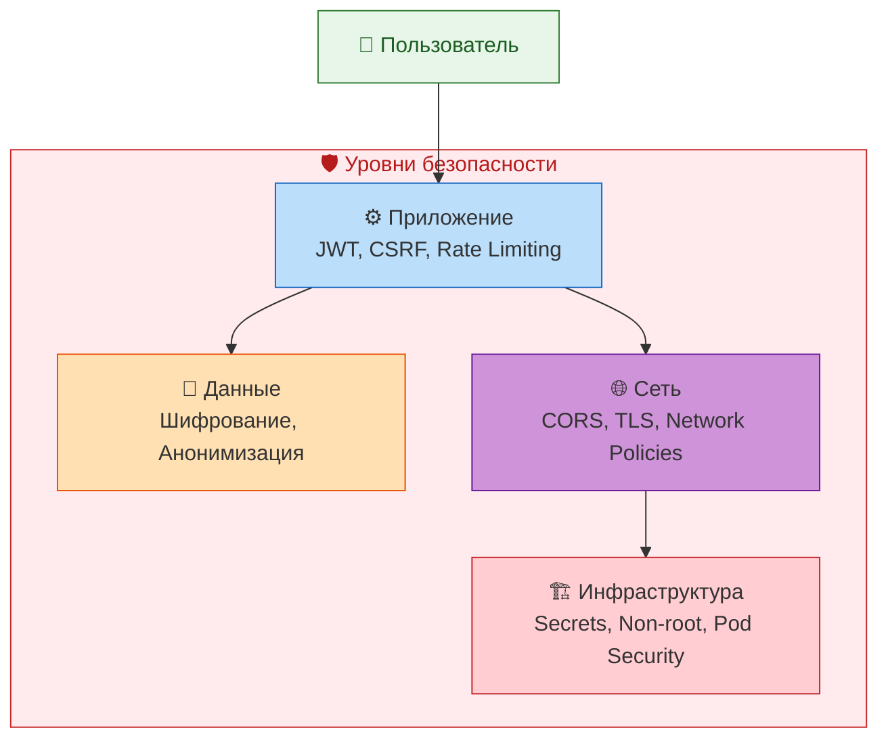
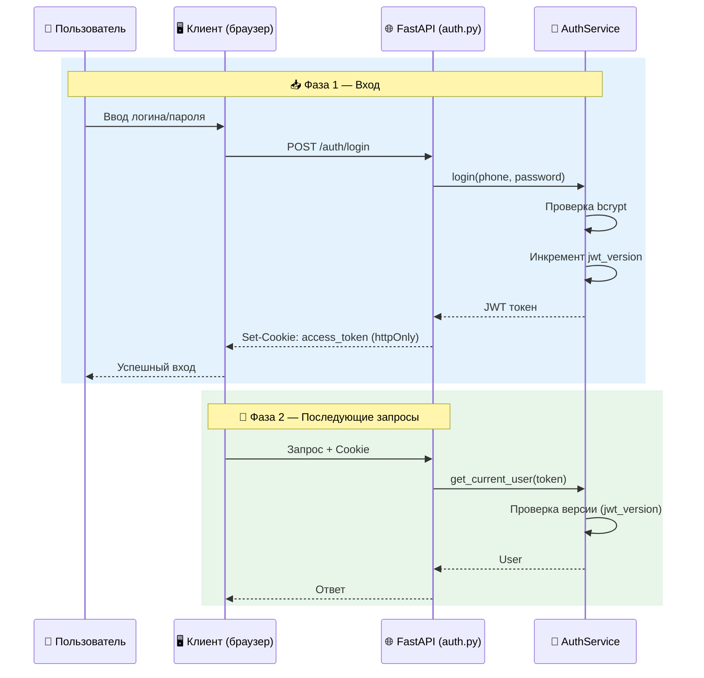
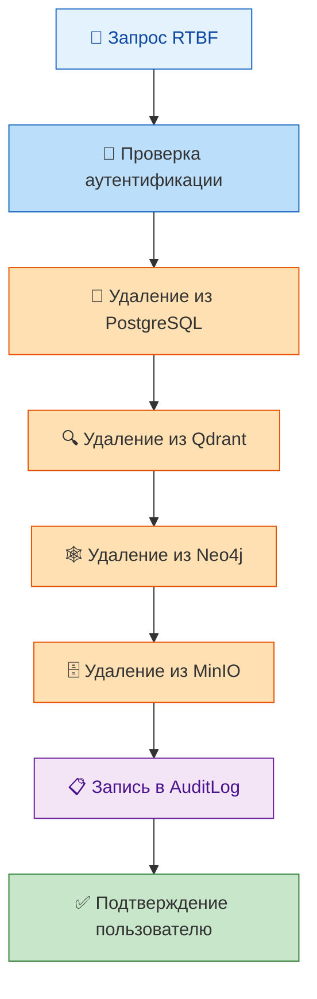

# 🔒 SECURITY_GUIDE.md

## 1. Введение

### 1.1. Цель документа

Данный документ описывает политику безопасности, меры защиты и процедуры реагирования для системы «Омниканальный агент с долговременной памятью». Он охватывает аутентификацию, авторизацию, защиту API, шифрование, анонимизацию, аудит, управление секретами и безопасность контейнеров.

Документ предназначен для security-инженеров, разработчиков, DevOps и администраторов. Он обеспечивает единое понимание того, как защищены данные пользователей и как система соответствует требованиям 152-ФЗ.

### 1.2. Общие принципы безопасности

Система строится на следующих принципах:

- **Защита данных по умолчанию** — все персональные данные шифруются и анонимизируются.
- **Минимальные привилегии** — доступ к данным и функциям ограничен ролями (user, operator, admin).
- **Аудит всех действий** — каждое действие с памятью и чувствительными данными логируется.
- **Безопасность на всех уровнях** — защита на уровне приложения, сети и инфраструктуры.
- **Соответствие 152-ФЗ** — полное соблюдение российского законодательства о персональных данных.



---

## 2. Аутентификация и управление доступом

### 2.1. JWT (JSON Web Token)

**Реализация:** [backend/src/services/auth_service.py](../backend/src/services/auth_service.py)

- **Алгоритм:** HS256.
- **Срок действия:** 24 часа (настраивается через `JWT_EXPIRATION_HOURS`).
- **Хранение:** httpOnly cookie с именем `access_token`.
- **Особенности:**
  - Версионирование токенов (`jwt_version`) — позволяет отозвать все токены при смене пароля.
  - При каждом входе `jwt_version` увеличивается, старые токены становятся недействительными.

**Поток аутентификации:**



### 2.2. Ролевая модель

| Роль | Права | Использование |
|------|-------|---------------|
| **user** | Базовые операции: чтение/запись своей памяти, чат, голос, согласие | Обычные пользователи |
| **operator** | Просмотр пользователей, каналов, аудита, управление памятью клиентов | Операторы поддержки |
| **admin** | Полный доступ: управление пользователями, каналами, настройками | Администраторы системы |

**Реализация проверки ролей:** [backend/src/dependencies.py](../backend/src/dependencies.py) (функция `get_current_admin`).

### 2.3. CSRF-защита

**Реализация:** [backend/src/api/auth.py](../backend/src/api/auth.py)

- **Метод:** Double-submit cookie.
- **Cookie:** `csrf_token` (не httpOnly, доступен для JavaScript).
- **Заголовок:** `X-CSRF-Token`.
- **Включение:** По умолчанию включён, может быть отключён через `ENABLE_CSRF_SKIP=true`.

**Принцип работы:**
1. При логине сервер генерирует CSRF-токен и отправляет его в cookie.
2. Клиент читает токен из cookie и отправляет его в заголовке `X-CSRF-Token` при каждом изменяющем запросе (POST, PUT, DELETE, PATCH).
3. Сервер сравнивает значения из cookie и заголовка. Если они совпадают — запрос разрешён.

### 2.4. Rate Limiting (планируется)

**Реализация:** Планируется через библиотеку `slowapi` ([IMPLEMENTATION_PLAN.md](IMPLEMENTATION_PLAN.md), Фаза I.2).

| Эндпоинт | Лимит | Период |
|----------|-------|--------|
| `/auth/login` | 5 запросов | 1 минута |
| `/auth/register` | 5 запросов | 1 минута |
| Все остальные аутентифицированные эндпоинты | 100 запросов | 1 минута |

### 2.5. Защита от брутфорса (планируется)

**Реализация:** Планируется в [backend/src/services/bruteforce_service.py](../backend/src/services/bruteforce_service.py) ([IMPLEMENTATION_PLAN.md](IMPLEMENTATION_PLAN.md), Фаза I.4).

- **Механизм:** отслеживание неудачных попыток входа по телефону.
- **Порог:** 5 неудачных попыток за 5 минут.
- **Блокировка:** 5 минут (с возможностью увеличения).
- **Сброс:** после успешного входа или истечения времени блокировки.

---

## 3. Защита API

### 3.1. Валидация входных данных

- **Инструмент:** Pydantic-схемы (файл [backend/src/schemas.py](../backend/src/schemas.py)).
- **Проверяются:** типы, форматы, допустимые значения (например, `fact_type` проверяется на соответствие списку).
- **Ошибки:** возвращаются в формате RFC 7807 (Problem Details).

### 3.2. Безопасность вебхуков

**Реализация:** [backend/src/api/webhooks.py](../backend/src/api/webhooks.py)

| Канал | Механизм защиты | Код |
|-------|-----------------|-----|
| **Telegram** | Проверка заголовка `X-Telegram-Bot-Api-Secret-Token` | `_verify_telegram_secret()` |
| **VK** | Проверка параметра `secret` в callback-данных | `_verify_vk_secret()` |
| **MAX** | Проверка не требуется (защита на уровне провайдера) | — |

**Важно:** Все проверки используют `hmac.compare_digest` для защиты от timing-атак.

### 3.3. CORS (Cross-Origin Resource Sharing)

**Реализация:** [backend/src/main.py](../backend/src/main.py)

- **Production (`APP_ENV=production`):** разрешены только домены из `CORS_ORIGINS` (список через запятую).
- **Development (`APP_ENV=development`):** разрешены все origin'ы (`allow_origins=["*"]`).
- **Методы:** явный список `["GET", "POST", "PUT", "DELETE", "PATCH", "OPTIONS"]`.

### 3.4. Валидация загружаемых файлов (голос)

**Реализация:** Планируется в [backend/src/api/voice.py](../backend/src/api/voice.py) ([IMPLEMENTATION_PLAN.md](../IMPLEMENTATION_PLAN.md), Фаза I.3).

- **Максимальный размер:** 10 МБ.
- **Разрешённые MIME-типы:** `audio/wav`, `audio/mpeg`, `audio/webm`, `audio/ogg`.
- **Ошибка:** 413 (Payload Too Large) или 400 (Bad Request).

---

## 4. Шифрование и анонимизация данных

### 4.1. Шифрование PII в БД (AES-256-GCM)

**Реализация:** [backend/src/utils/crypto.py](../backend/src/utils/crypto.py)

- **Алгоритм:** AES-256-GCM (аутентифицированное шифрование с дополнительными данными).
- **Ключ:** 32 байта, хранится в Vault (production) или .env (development).
- **Применение:** поле `value` в таблице `Fact` шифруется перед сохранением и расшифровывается при чтении.

**Схема шифрования:**

```mermaid
flowchart LR
    subgraph EncPath["🔒 Шифрование"]
        Plain["📄 Оригинальный текст"] --> Encrypt["encrypt()"]
        Encrypt --> AES["AES-256-GCM"]
        AES --> Nonce["+ случайный nonce"]
        Nonce --> Packed["nonce + ciphertext + tag"]
        Packed --> Base64["Base64-кодирование"]
    end

    Base64 --> DB[("🐘 PostgreSQL")]

    subgraph DecPath["🔓 Расшифровка"]
        DB --> Decode["Base64-декодирование"]
        Decode --> Decrypt["decrypt()"]
        Decrypt --> AES2["AES-256-GCM"]
        AES2 --> Plain2["📄 Оригинальный текст"]
    end

    style EncPath fill:#e8f5e9,stroke:#2e7d32,color:#1b5e20
    style DecPath fill:#e3f2fd,stroke:#1565c0,color:#0d47a1
    style Plain fill:#c8e6c9,stroke:#2e7d32
    style Encrypt fill:#c8e6c9,stroke:#2e7d32
    style AES fill:#a5d6a7,stroke:#2e7d32
    style Nonce fill:#c8e6c9,stroke:#2e7d32
    style Packed fill:#c8e6c9,stroke:#2e7d32
    style Base64 fill:#c8e6c9,stroke:#2e7d32
    style DB fill:#ffe0b2,stroke:#e65100
    style Decode fill:#bbdefb,stroke:#1565c0
    style Decrypt fill:#bbdefb,stroke:#1565c0
    style AES2 fill:#90caf9,stroke:#1565c0
    style Plain2 fill:#bbdefb,stroke:#1565c0
```



**Особенности:**
- Каждое шифрование использует случайный nonce (12 байт) — одинаковые тексты дают разные зашифрованные значения.
- Проверка на зашифрованность: функция `is_encrypted()` определяет, является ли значение зашифрованным.

### 4.2. Анонимизация PII (Presidio)

**Реализация:** [backend/src/utils/presidio_anonymizer.py](../backend/src/utils/presidio_anonymizer.py), [backend/src/utils/presidio_russian.py](../backend/src/utils/presidio_russian.py)

- **Поддерживаемые сущности:** PERSON, PHONE_NUMBER, EMAIL_ADDRESS, LOCATION, CREDIT_CARD, IP_ADDRESS, PASSPORT_RU, SNILS, INN, OGRN.
- **Механизм:** распознавание PII через Microsoft Presidio, замена на placeholder (например, `<PERSON>`).
- **Применение:** перед сохранением факта в `FactExtractorAgent`.

**Пример:**
```
Вход: "Меня зовут Иван Петров, паспорт 4515 123456, телефон +79991234567"
Выход: "Меня зовут <PERSON>, паспорт <PASSPORT_RU>, телефон <PHONE_NUMBER>"
```

### 4.3. Редикция PII в логах

**Реализация:** [backend/src/logging_config.py](../backend/src/logging_config.py) (класс `PIIRedactingFilter`)

- **Фильтруемые паттерны:** телефонные номера (`+7...`), email-адреса.
- **Замена:** на `[PHONE_REDACTED]` и `[EMAIL_REDACTED]`.
- **Применение:** ко всем логам через фильтр корневого логгера.

---

## 5. Аудит и логирование (152-ФЗ)

### 5.1. Аудит операций с памятью

**Реализация:** [backend/src/services/audit_service.py](../backend/src/services/audit_service.py), [backend/src/models.py](../backend/src/models.py) (таблица `AuditLog`)

| Поле | Описание |
|------|----------|
| `user_id` | Пользователь, чьи данные затронуты |
| `action` | Тип операции: READ, WRITE, DELETE |
| `fact_id` | Идентификатор факта (если применимо) |
| `timestamp` | Время операции |
| `source` | Источник: AI (автоматически) или OPERATOR (ручное действие) |
| `ip_address` | IP-адрес клиента (если доступен) |

**Логируются все операции:**
- Запись нового факта (`store_fact`).
- Чтение фактов (`get_facts`, `get_fact`, `search_facts`).
- Изменение факта (`supersede_fact`).
- Удаление факта (`delete_fact`).

### 5.2. Хранение логов

- **Срок хранения:** 3 года.
- **Хранилище:** зашифрованное MinIO (S3-совместимое).
- **Ретидирование:** PII-редикция (см. раздел 4.3).

---

## 6. Право на забвение (RTBF)

### 6.1. Процедура каскадного удаления

**Реализация:** [backend/src/services/right_to_be_forgotten_service.py](../backend/src/services/right_to_be_forgotten_service.py)



**Что удаляется:**
- PostgreSQL: факты, сессии, согласие (revoked), привязки каналов, пользователь.
- Qdrant: все векторные точки с `user_id`.
- Neo4j: все узлы и рёбра, связанные с пользователем.
- MinIO: все аудиофайлы пользователя.

**Срок исполнения:** < 24 часов (обычно менее 1 минуты).

### 6.2. API-эндпоинты

- `POST /consents/revoke` — отзыв согласия (триггерит RTBF).
- `POST /consents/data-deletion` — явный запрос на удаление (без отзыва согласия).

---

## 7. Безопасность контейнеров и Kubernetes

### 7.1. Non-root пользователь

**Реализация:** [Dockerfile.backend.prod](../Dockerfile.backend.prod), [Dockerfile.frontend.prod](../Dockerfile.frontend.prod)

```dockerfile
# Создание non-root пользователя
RUN groupadd -r appuser && useradd -r -g appuser appuser
USER appuser
```

### 7.2. Network Policies (K8s)

**Реализация:** [k8s/base/network-policy.yml](../k8s/base/network-policy.yml)

- **Ingress (входящий трафик):** разрешён только от ingress-контроллера и подов из того же namespace.
- **Egress (исходящий трафик):** разрешён только к БД (PostgreSQL, Redis, Qdrant, Neo4j) и DNS.

### 7.3. PodDisruptionBudget (PDB)

**Реализация:** [k8s/base/pdb.yml](../k8s/base/pdb.yml)

- Обеспечивает, что минимум 1 под backend всегда доступен при плановых обслуживаниях.

### 7.4. Secrets (безопасное хранение секретов)

- **Разработка:** `.env` файл (не коммитится).
- **Production:** K8s Secrets или HashiCorp Vault.

**Интеграция с Vault:** [backend/src/vault_client.py](../backend/src/vault_client.py)

---

## 8. Управление секретами

### 8.1. Иерархия секретов

| Уровень | Хранилище | Примеры секретов |
|---------|-----------|------------------|
| **Разработка** | `.env` (не коммитится) | JWT_SECRET, ENCRYPTION_KEY |
| **Staging** | K8s Secrets (зашифрованное хранилище) | Токены, ключи |
| **Production** | HashiCorp Vault (основное хранилище) | Все критичные секреты |

### 8.2. Список критичных секретов

| Секрет | Назначение | Где хранится |
|--------|------------|--------------|
| `JWT_SECRET` | Подпись JWT | Vault / K8s Secrets |
| `ENCRYPTION_KEY` | Ключ AES-256-GCM (32 байта) | Vault / K8s Secrets |
| `POSTGRES_PASSWORD` | Пароль PostgreSQL | K8s Secrets |
| `REDIS_URL` | Подключение к Redis (с паролем) | K8s Secrets |
| `QDRANT_API_KEY` | API-ключ Qdrant | K8s Secrets |
| `NEO4J_PASSWORD` | Пароль Neo4j | K8s Secrets |
| `TELEGRAM_BOT_TOKEN` | Токен Telegram бота | K8s Secrets |
| `VK_ACCESS_TOKEN` | Токен VK API | K8s Secrets |
| `YANDEX_API_KEY` | API-ключ YandexGPT | K8s Secrets |
| `VAULT_TOKEN` | Токен Vault | K8s Secrets |

### 8.3. Ротация ключей

- **JWT_SECRET:** ротация при смене пароля (автоматически через `jwt_version`).
- **ENCRYPTION_KEY:** ротация требует перешифрования всех фактов (процедура описана в [RECOVERY_PLAN.md](../RECOVERY_PLAN.md)).
- **Другие ключи:** ротация по графику (например, раз в квартал) или при утечке.

---

## 9. Реагирование на инциденты

### 9.1. Классификация инцидентов

| Уровень | Описание | Примеры |
|---------|----------|---------|
| **Критический** | Утечка данных, компрометация системы | Несанкционированный доступ к БД |
| **Высокий** | Нарушение работы, потеря данных | Отказ Qdrant, потеря фактов |
| **Средний** | Нарушение функциональности | Ошибки ASR/TTS, медленные ответы |
| **Низкий** | Косметические проблемы | Ошибки в UI, некритичные баги |

### 9.2. Процедура реагирования

1. **Обнаружение:** через алерты (Prometheus) или сообщение от пользователя/оператора.
2. **Анализ:** проверка логов, метрик, дашбордов.
3. **Сдерживание:** временное отключение уязвимого компонента (Feature Flag).
4. **Устранение:** применение фикса или откат изменений.
5. **Восстановление:** восстановление данных из бэкапов (если необходимо).
6. **Пост-анализ:** документирование инцидента, корректировка мер защиты.

---

## 10. Проверка безопасности (чек-лист)

Перед каждым релизом и пилотным запуском необходимо выполнить:

- [ ] Все секреты удалены из кода и хранятся в Vault/K8s Secrets.
- [ ] CSRF включён (кроме явного отключения для dev).
- [ ] Rate limiting настроен (если внедрён).
- [ ] JWT токены имеют ограниченный срок жизни.
- [ ] Все операции с памятью логируются в AuditLog.
- [ ] Шифрование (AES-256-GCM) работает для поля `value` в Facts.
- [ ] Анонимизация (Presidio) применяется перед сохранением фактов.
- [ ] Webhook-секреты (Telegram, VK) проверяются.
- [ ] CORS ограничен в production.
- [ ] Network Policies применены.
- [ ] Non-root пользователь используется в контейнерах.
- [ ] Право на забвение (RTBF) протестировано.