# 🖥️ UI_REFERENCE.md

## 1. Введение

### 1.1. Цель документа

Настоящий документ содержит полное описание пользовательского интерфейса (UI) системы «Омниканальный агент с долговременной памятью». Он предназначен для разработчиков фронтенда, дизайнеров, QA-инженеров и всех, кто взаимодействует с клиентской частью системы.

Документ охватывает:

- **Архитектуру UI** — как организован код, какие используются библиотеки и паттерны.
- **Компоненты** — все переиспользуемые UI-компоненты (shadcn/ui) с примерами использования.
- **Страницы** — каждая страница с описанием макета, состояния, взаимодействия с API и примерами кода.
- **Навигацию** — структуру маршрутов и навигационные элементы.
- **Глобальное состояние** — управление состоянием через Zustand.
- **Обработку ошибок** — перехват и отображение ошибок.
- **Тёмную тему** — реализация переключения темы.
- **Тестирование** — подходы к тестированию UI.

Все описания основаны на актуальном коде из [frontend/src/](../frontend/src/) и согласованы с бизнес-требованиями из [SPEC.md](SPEC.md) и [API_REFERENCE.md](API_REFERENCE.md).

### 1.2. Технологический стек

| Компонент | Технология | Версия | Назначение |
|-----------|------------|--------|------------|
| **Фреймворк** | React | 18.2 | Библиотека для построения интерфейсов |
| **Язык** | TypeScript | 5.3 | Типизация и безопасность |
| **Сборщик** | Vite | 5.1 | Быстрая разработка и сборка |
| **Стилизация** | Tailwind CSS | 3.4 | Утилитарные CSS-классы |
| **UI-библиотека** | shadcn/ui | — | Компоненты на основе Radix UI |
| **Иконки** | lucide-react | 1.24 | Набор иконок |
| **Маршрутизация** | react-router-dom | 6.22 | Клиентская маршрутизация |
| **Состояние** | Zustand | 4.5 | Глобальный стейт-менеджмент |
| **Формы** | react-hook-form | 7.81 | Управление формами |
| **Валидация** | zod | 4.4 | Схемы валидации |
| **Уведомления** | react-hot-toast | 2.6 | Всплывающие уведомления |
| **Анимации** | framer-motion | 12.42 | Плавные переходы |
| **Графики** | recharts | 3.9 | Визуализация данных |
| **Тестирование** | Vitest + Testing Library | — | Юнит-тестирование компонентов |

**Ссылки:**
- [frontend/package.json](../frontend/package.json) — все зависимости
- [frontend/vite.config.ts](../frontend/vite.config.ts) — конфигурация сборки
- [frontend/tailwind.config.js](../frontend/tailwind.config.js) — настройки Tailwind

---

## 2. Архитектура UI

### 2.1. Структура проекта

Проект организован по принципам **Feature-Sliced Design (FSD)** в упрощённом варианте:

```
frontend/src/
├── api/               # API-клиент (axios)
├── app/               # Точка входа, роутинг, провайдеры
├── components/        # Переиспользуемые компоненты
│   └── ui/            # shadcn/ui компоненты
├── features/          # Бизнес-фичи (заглушки)
├── lib/               # Утилиты, валидации
├── pages/             # Страницы приложения
│   ├── admin/         # Административные страницы
│   ├── audit/         # Аудит
│   ├── dashboard/     # Дашборд
│   ├── forget/        # Право на забвение
│   ├── login/         # Вход
│   ├── memory/        # Просмотр памяти
│   ├── operator/      # Операторский дашборд
│   ├── profile/       # Профиль пользователя
│   ├── register/      # Регистрация
│   ├── sessions/      # Сессии
│   └── voice-test/    # Тест голоса
├── shared/            # Общие типы, утилиты
├── store/             # Zustand-хранилища
├── test/              # Тестовые утилиты
├── index.css          # Глобальные стили
├── main.tsx           # Точка входа
└── vite-env.d.ts      # Vite-типы
```

**Ссылка:** [PROJECT_STRUCTURE.md](PROJECT_STRUCTURE.md) — полное дерево проекта.

### 2.2. Диаграмма компонентов

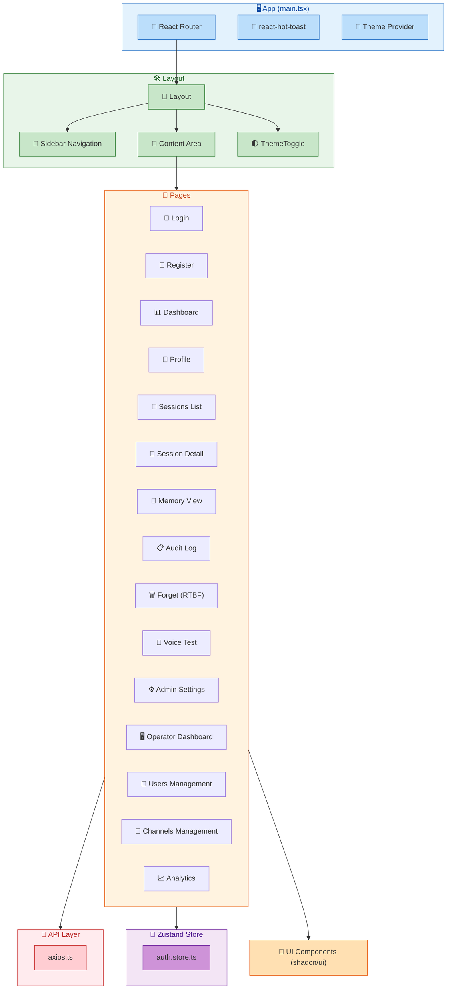

### 2.3. Навигация

Навигация реализована через **React Router** с защищёнными и публичными маршрутами.

**Маршруты:**

| Путь | Компонент | Доступ | Описание |
|------|-----------|--------|----------|
| `/login` | `LoginPage` | Публичный | Страница входа |
| `/register` | `RegisterPage` | Публичный | Страница регистрации |
| `/dashboard` | `DashboardPage` | Приватный | Главная панель |
| `/profile` | `ProfilePage` | Приватный | Профиль пользователя |
| `/sessions` | `SessionsListPage` | Приватный | Список сессий |
| `/sessions/:id` | `SessionDetailPage` | Приватный | Детали сессии |
| `/audit` | `AuditLogPage` | Приватный | Журнал аудита |
| `/memory/:userId?` | `MemoryViewPage` | Приватный | Память клиента |
| `/forget` | `ForgetPage` | Приватный | Право на забвение |
| `/voice-test` | `VoiceTestPage` | Приватный | Тест голоса |
| `/admin/settings` | `AdminSettingsPage` | Приватный (admin) | Настройки |
| `/operator` | `OperatorDashboard` | Приватный | Панель оператора |
| `/operator/users` | `UsersPage` | Приватный | Пользователи |
| `/operator/channels` | `ChannelsPage` | Приватный | Каналы |
| `/operator/analytics` | `AnalyticsDashboard` | Приватный | Аналитика |
| `/` | — | — | Редирект на `/login` |

**Код:** [frontend/src/app/App.tsx](../frontend/src/app/App.tsx)

```tsx
function PrivateRoute({ children }: { children: React.ReactNode }) {
  const { isAuthenticated } = useAuthStore();
  return isAuthenticated ? <Layout>{children}</Layout> : <Navigate to="/login" />;
}

function PublicRoute({ children }: { children: React.ReactNode }) {
  const { isAuthenticated } = useAuthStore();
  return isAuthenticated ? <Navigate to="/dashboard" /> : <>{children}</>;
}
```

**Анимация переходов:** используется `framer-motion` с `AnimatePresence` для плавной смены страниц.

---

## 3. Компоненты (shadcn/ui)

Все компоненты построены на основе **shadcn/ui** — библиотеки компонентов на базе Radix UI с кастомизацией через Tailwind CSS. Компоненты находятся в [frontend/src/components/ui/](../frontend/src/components/ui/).

### 3.1. Button

**Файл:** [frontend/src/components/ui/button.tsx](../frontend/src/components/ui/button.tsx)

**Варианты:** `default`, `outline`, `secondary`, `ghost`, `destructive`, `link`  
**Размеры:** `default`, `xs`, `sm`, `lg`, `icon`, `icon-xs`, `icon-sm`, `icon-lg`

**Пример использования:**
```tsx
import { Button } from "@/components/ui/button";

<Button variant="default" size="sm" onClick={handleClick}>
  <Save className="w-4 h-4" />
  Сохранить
</Button>
```

**Состояния:** disabled, loading (через `Loader2` и `animate-spin`).

### 3.2. Card

**Файл:** [frontend/src/components/ui/card.tsx](../frontend/src/components/ui/card.tsx)

**Составные части:**
- `Card` — обёртка
- `CardHeader` — шапка
- `CardTitle` — заголовок
- `CardDescription` — подзаголовок
- `CardContent` — содержимое
- `CardFooter` — футер
- `CardAction` — действие (кнопка, переключатель)

**Пример:**
```tsx
import { Card, CardHeader, CardTitle, CardContent } from "@/components/ui/card";

<Card>
  <CardHeader>
    <CardTitle>Согласие (152-ФЗ)</CardTitle>
  </CardHeader>
  <CardContent>
    {/* содержимое */}
  </CardContent>
</Card>
```

### 3.3. Input

**Файл:** [frontend/src/components/ui/input.tsx](../frontend/src/components/ui/input.tsx)

**Применение:** поля ввода с валидацией через `react-hook-form`.

**Пример с интеграцией react-hook-form:**
```tsx
import { Input } from "@/components/ui/input";

<Input
  {...register('phone')}
  placeholder="+7 (999) 123-45-67"
  aria-invalid={!!errors.phone}
/>
```

### 3.4. Badge

**Файл:** [frontend/src/components/ui/badge.tsx](../frontend/src/components/ui/badge.tsx)

**Варианты:** `default`, `secondary`, `destructive`, `outline`, `ghost`, `link`

**Использование для статусов:**
```tsx
<Badge variant={isActive ? 'default' : 'destructive'}>
  {isActive ? 'Активен' : 'Неактивен'}
</Badge>
```

### 3.5. Alert

**Файл:** [frontend/src/components/ui/alert.tsx](../frontend/src/components/ui/alert.tsx)

**Варианты:** `default`, `destructive`

**Пример:**
```tsx
<Alert variant="destructive">
  <AlertDescription>Ошибка загрузки данных</AlertDescription>
</Alert>
```

### 3.6. Skeleton

**Файл:** [frontend/src/components/ui/skeleton.tsx](../frontend/src/components/ui/skeleton.tsx)

**Применение:** состояние загрузки (loading skeleton).

```tsx
<Skeleton className="h-8 w-[200px]" />
<Skeleton className="h-[120px] w-full" />
```

### 3.7. Table

**Файл:** [frontend/src/components/ui/table.tsx](../frontend/src/components/ui/table.tsx)

**Составные части:** `Table`, `TableHeader`, `TableBody`, `TableRow`, `TableHead`, `TableCell`.

**Пример:**
```tsx
<Table>
  <TableHeader>
    <TableRow>
      <TableHead>Канал</TableHead>
      <TableHead>ID</TableHead>
      <TableHead>Статус</TableHead>
    </TableRow>
  </TableHeader>
  <TableBody>
    {sessions.map((session) => (
      <TableRow key={session.id}>
        <TableCell>{session.channel_type}</TableCell>
        <TableCell>{session.id}</TableCell>
        <TableCell><Badge>{session.status}</Badge></TableCell>
      </TableRow>
    ))}
  </TableBody>
</Table>
```

### 3.8. Switch

**Файл:** [frontend/src/components/ui/switch.tsx](../frontend/src/components/ui/switch.tsx)

**Применение:** переключатели для Feature Flags.

```tsx
<Switch checked={enabled} onCheckedChange={() => toggleFlag('enable_llm')} />
```

---

## 4. Страницы (детальное описание)

### 4.1. Login Page

**Файл:** [frontend/src/pages/login/index.tsx](../frontend/src/pages/login/index.tsx)

**Назначение:** Вход в систему.

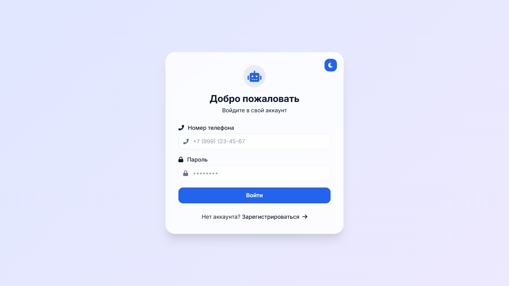

**Макет:**
- Центрированная карточка с формой.
- Поля: номер телефона, пароль.
- Кнопка «Войти» с индикатором загрузки.
- Ссылка на регистрацию.
- Отображение ошибок (через `Alert`).

**Состояния:**
- `isLoading` — из `useAuthStore`
- `error` — из `useAuthStore`
- Форма валидируется через `zod` (`loginSchema`)

**Взаимодействие с API:**
- Отправка `POST /auth/login` через `useAuthStore.login()`
- При успехе → редирект на `/dashboard`
- При ошибке → отображение `Alert`

**Код (ключевые фрагменты):**
```tsx
const { register, handleSubmit, formState: { errors } } = useForm<LoginFormData>({
  resolver: zodResolver(loginSchema),
});

const onSubmit = async (data: LoginFormData) => {
  try {
    await login(data.phone, data.password);
    navigate('/dashboard');
  } catch { /* error handled by store */ }
};
```

**Трассировка требований:** R05 (аутентификация).

---

### 4.2. Register Page

**Файл:** [frontend/src/pages/register/index.tsx](../frontend/src/pages/register/index.tsx)

**Назначение:** Регистрация нового пользователя.

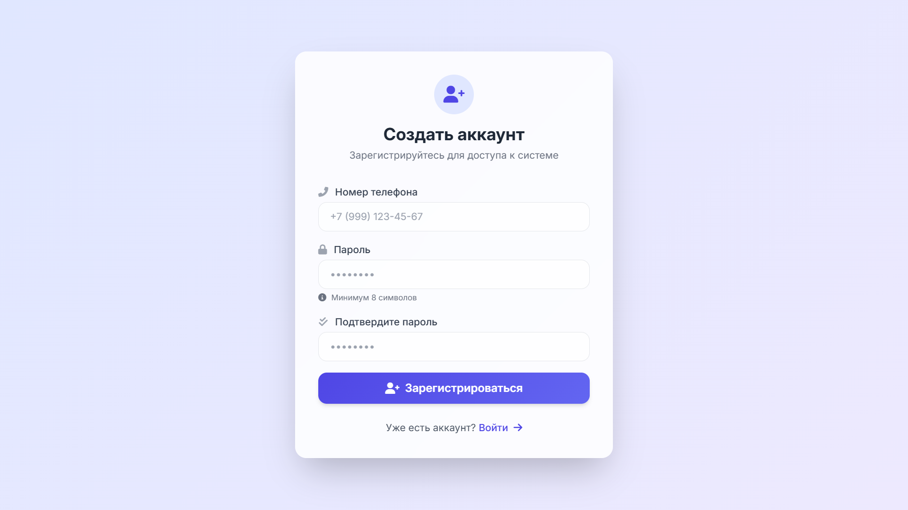

**Макет:** Аналогичен Login, но с полем подтверждения пароля.

**Валидация:** `registerSchema` (zod) — проверка совпадения паролей.

**Взаимодействие с API:** `POST /auth/register`, затем автоматический логин.

**Трассировка требований:** R05.

---

### 4.3. Dashboard Page

**Файл:** [frontend/src/pages/dashboard/index.tsx](../frontend/src/pages/dashboard/index.tsx)

**Назначение:** Главная панель управления.

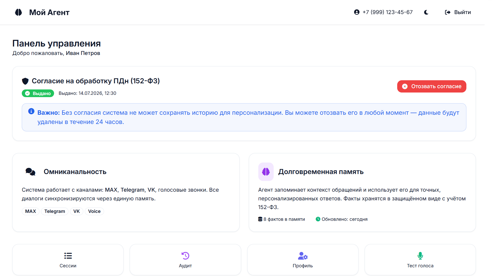

**Макет:**
- Приветственное сообщение с именем пользователя.
- Карточка «Согласие (152-ФЗ)»:
  - Статус (выдано/не выдано) через `Badge`.
  - Кнопка «Выдать согласие» / «Отозвать согласие».
  - Дата выдачи/отзыва.
  - Пояснительный текст (Alert).
- Карточки «Омниканальность» и «Долговременная память».
- Быстрые действия (кнопки-карточки на Сессии, Аудит, Профиль, Тест голоса).

**Состояния:**
- `consentStatus` — загружается через `api.get('/consents/status')`.
- `isLoadingConsent` — индикатор загрузки.

**Взаимодействие с API:**
- `GET /consents/status` — получение статуса.
- `POST /consents/grant` — выдача согласия.
- `POST /consents/revoke` — отзыв согласия (триггерит RTBF).

**Код (ключевые фрагменты):**
```tsx
const { data } = await api.get('/consents/status');
setConsentStatus(data);

const handleGrantConsent = async () => {
  await api.post('/consents/grant', { channel: 'WEB' });
  await fetchConsentStatus();
};
```

**Трассировка требований:** R05 (согласие), R08 (аудит).

---

### 4.4. Profile Page

**Файл:** [frontend/src/pages/profile/index.tsx](../frontend/src/pages/profile/index.tsx)

**Назначение:** Просмотр и редактирование профиля пользователя, управление согласием и паролем.

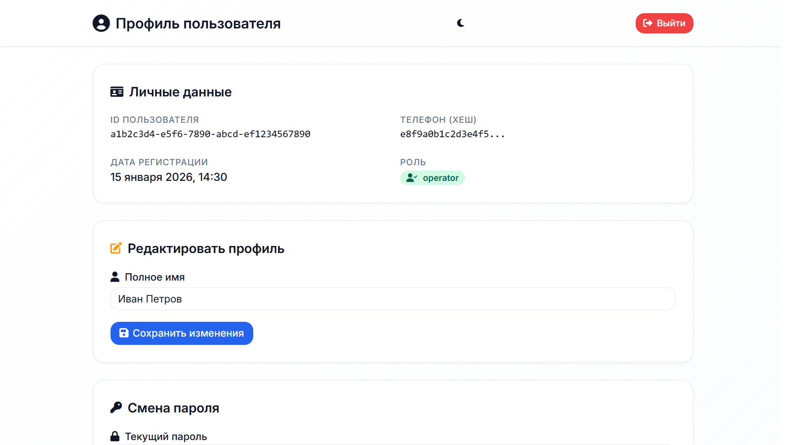

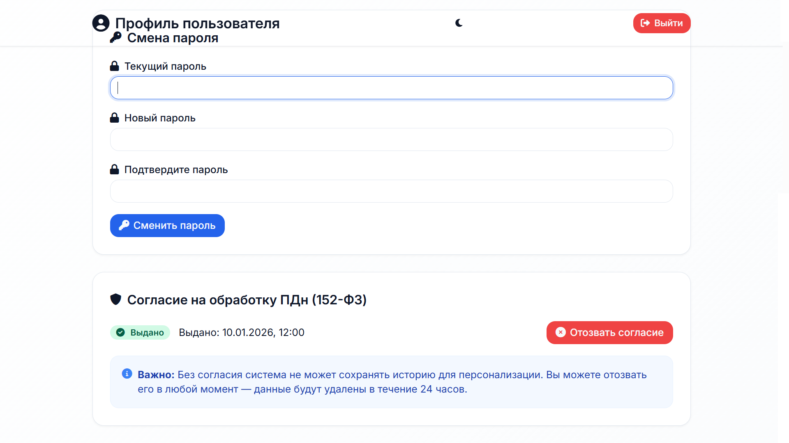

**Макет:**
- Карточка «Личные данные»: ID, телефон (хеш), дата регистрации, роль.
- Карточка «Редактировать профиль»: поле полного имени (заглушка, т.к. бэкенд пока не поддерживает обновление).
- Карточка «Смена пароля»: текущий, новый, подтверждение (заглушка).
- Карточка «Согласие (152-ФЗ)»: статус, кнопка выдачи/отзыва, даты.

**Состояния:**
- `fullName` — локальное состояние.
- `consentStatus` — загружается из API.
- `isLoadingConsent`, `isLoadingUpdate` — индикаторы.

**Трассировка требований:** R05, R08.

---

### 4.5. Sessions List Page

**Файл:** [frontend/src/pages/sessions/index.tsx](../frontend/src/pages/sessions/index.tsx)

**Назначение:** Список сессий с фильтрацией и пагинацией.

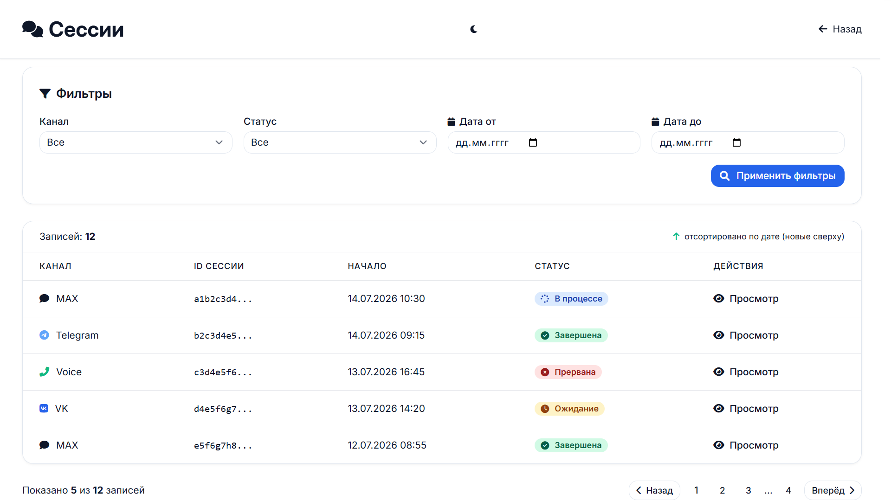

**Макет:**
- Фильтры: канал (select), статус (select), дата от/до (date inputs).
- Кнопка «Применить фильтры».
- Таблица сессий:
  - Канал (с иконкой)
  - ID (сокращённый)
  - Дата начала
  - Статус (Badge)
  - Действия (кнопка «Просмотр» → переход на детали)
- Пагинация (кнопки «Назад/Вперёд», номер страницы).

**Состояния:**
- `sessions` — массив сессий.
- `pageInfo` — { page, size, total, pages }.
- Фильтры — локальное состояние.

**Взаимодействие с API:** `GET /sessions?page=1&size=20&channel=...`

**Трассировка требований:** R10 (омниканальность).

---

### 4.6. Session Detail Page

**Файл:** [frontend/src/pages/operator/sessions/SessionDetail.tsx](../frontend/src/pages/operator/sessions/SessionDetail.tsx)

**Назначение:** Детальный просмотр сессии.

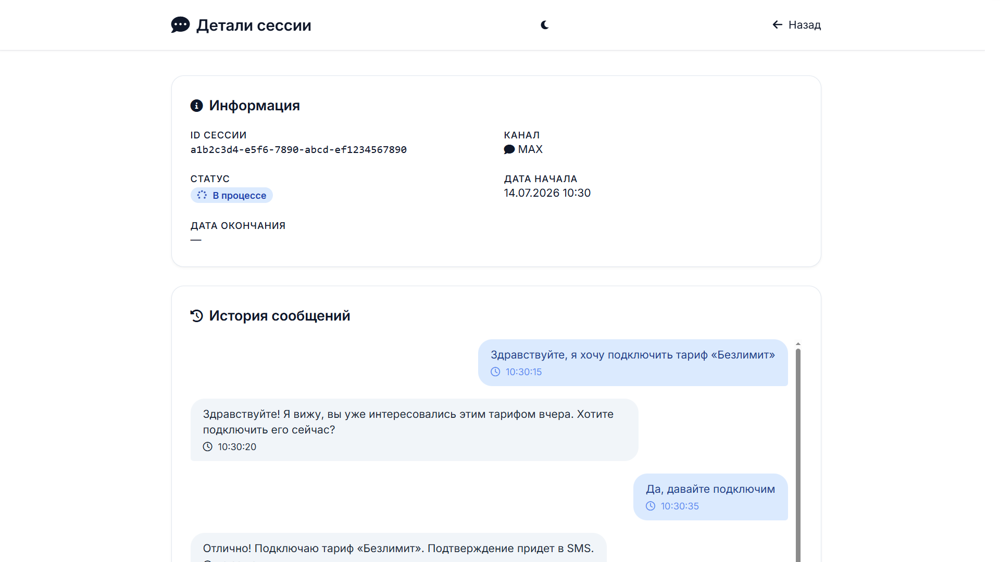

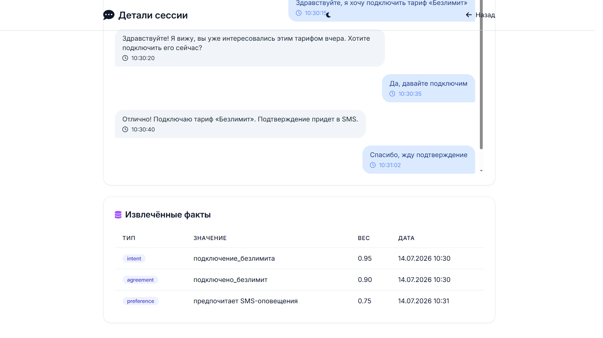

**Макет:**
- Информация о сессии (ID, пользователь, канал, статус, даты, контекст JSON).
- История сообщений (транскрипт) с разделением по ролям (user/assistant/system).
- Таблица извлечённых фактов (если есть).

**Состояния:**
- `session` — объект с деталями.
- `loading`, `error`.

**Взаимодействие с API:** `GET /sessions/{id}`.

**Трассировка требований:** R10, R01.

---

### 4.7. Audit Log Page

**Файл:** [frontend/src/pages/audit/index.tsx](../frontend/src/pages/audit/index.tsx)

**Назначение:** Просмотр аудит-лога с фильтрацией и пагинацией.

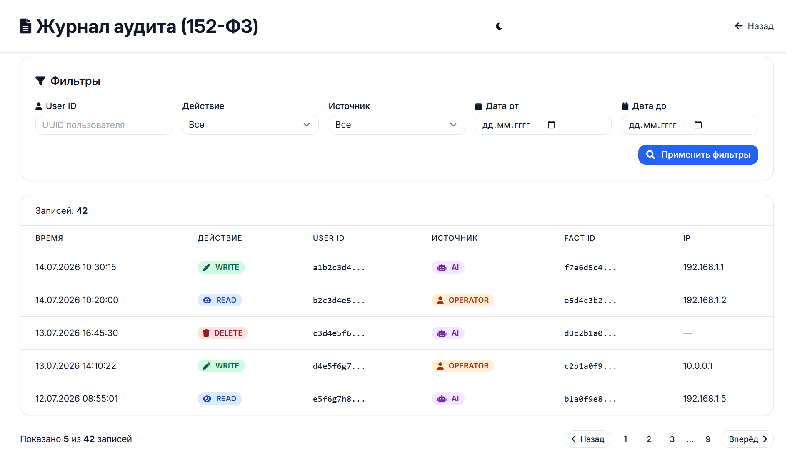

**Макет:**
- Фильтры: user_id (input), действие (select), источник (select), дата от/до.
- Таблица аудит-записей:
  - Время
  - Действие (Badge: READ/WRITE/DELETE)
  - User ID (сокращённый)
  - Источник (Badge: AI/OPERATOR)
  - Fact ID (если есть)
  - IP-адрес
- Пагинация.

**Состояния:** аналогичны Sessions List.

**Взаимодействие с API:** `GET /audit/logs?page=1&size=20&user_id=...`

**Трассировка требований:** R08 (аудит).

---

### 4.8. Memory View Page

**Файл:** [frontend/src/pages/memory/index.tsx](../frontend/src/pages/memory/index.tsx)

**Назначение:** Просмотр памяти конкретного пользователя.

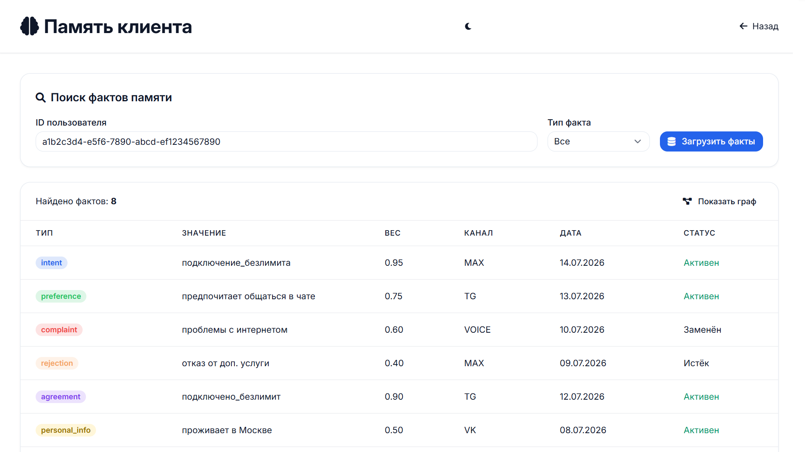

**Макет:**
- Поиск по ID пользователя (input + кнопка «Загрузить факты»).
- Фильтр по типу факта (select).
- Таблица фактов:
  - Тип (Badge с цветом)
  - Значение (текст)
  - Вес
  - Канал
  - Дата
  - Статус (активен/заменён/истёк)
- Переключение «Таблица / Граф» (граф — заглушка).

**Состояния:**
- `facts` — массив фактов.
- `targetUserId` — вводимый ID.
- `typeFilter` — фильтр по типу.

**Взаимодействие с API:** `GET /memory/users/{userId}/facts?fact_type=...`

**Трассировка требований:** R01, R05, R08.

---

### 4.9. Forget Page (RTBF)

**Файл:** [frontend/src/pages/forget/index.tsx](../frontend/src/pages/forget/index.tsx)

**Назначение:** Реализация права на забвение (152-ФЗ).

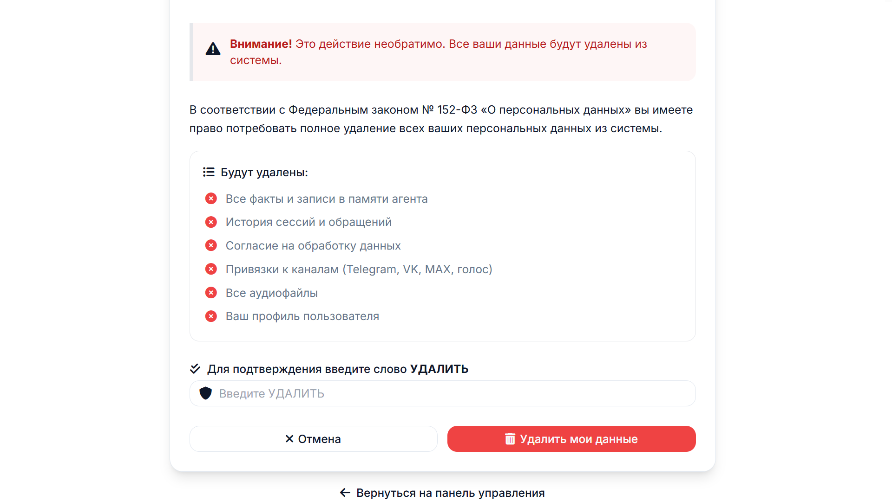

**Макет:**
- Предупреждение о необратимости удаления.
- Список данных, которые будут удалены.
- Поле ввода подтверждения (слово «УДАЛИТЬ»).
- Кнопка «Удалить мои данные».
- Индикатор выполнения (spinner).
- Сообщение об успехе / ошибке.

**Состояния:**
- `step` — 'confirm' | 'verifying' | 'success' | 'error'.
- `confirmationText` — вводимый текст.
- `isLoading`.

**Взаимодействие с API:** `POST /consents/data-deletion`.

**После успеха:** автоматический выход (logout) через 3 секунды.

**Трассировка требований:** R09 (RTBF).

---

### 4.10. Voice Test Page

**Файл:** [frontend/src/pages/voice-test/index.tsx](../frontend/src/pages/voice-test/index.tsx)

**Назначение:** Тестирование голосового пайплайна (ASR → LLM → TTS).

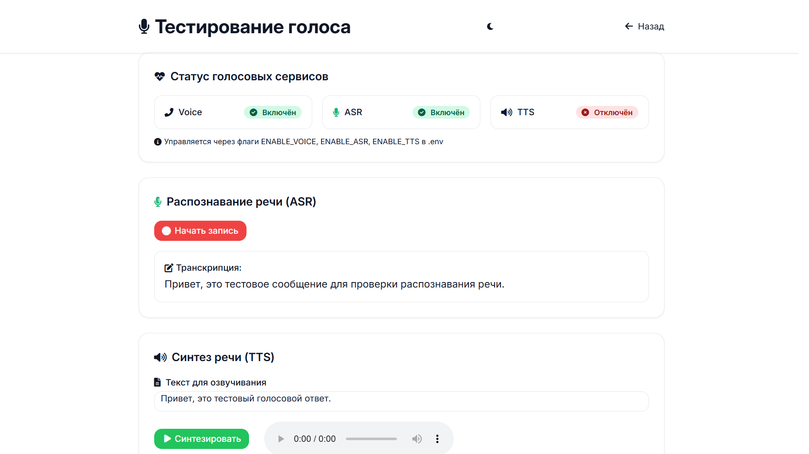

**Макет:**
- Кнопка «Записать» (микрофон) → запись через MediaRecorder API.
- Кнопка «Стоп» → остановка записи.
- Кнопка «Обработать» → отправка аудио на ASR, затем LLM, затем TTS.
- Статус (Badge: Готов / Запись... / Обработка... / Готово / Ошибка).
- Результаты:
  - ASR: распознанный текст.
  - LLM: ответ агента.
  - TTS: аудио-плеер с синтезированной речью.

**Состояния:**
- `status` — 'idle' | 'recording' | 'sending' | 'done' | 'error'.
- `audioChunks` — Blob[] для записи.
- `asrResult`, `llmReply`, `ttsAudioUrl`.

**Взаимодействие с API:**
- `POST /voice/transcribe` — ASR.
- `POST /chat/users/{id}/message` — LLM (можно использовать тестового пользователя).
- `POST /voice/synthesize` — TTS.

**Трассировка требований:** R11 (Voice-пайплайн).

---

### 4.11. Admin Settings Page

**Файл:** [frontend/src/pages/admin/settings.tsx](../frontend/src/pages/admin/settings.tsx)

**Назначение:** Административные настройки (доступ только для роли admin).

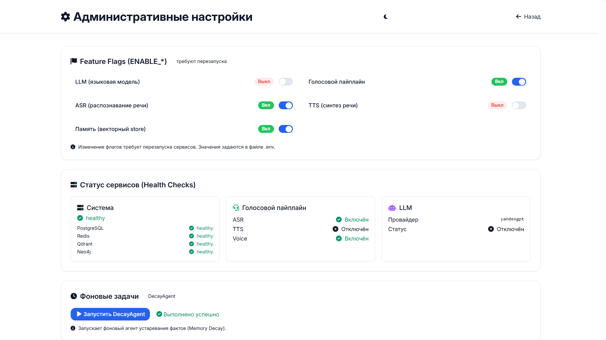

**Макет:**
- **Feature Flags** — карточки с переключателями (Switch) для ENABLE_LLM, ENABLE_VOICE, ENABLE_ASR, ENABLE_TTS, ENABLE_MEMORY (заглушка, т.к. бэкенд не поддерживает динамическое изменение).
- **Health Checks** — статусы сервисов (система, голос, LLM) с отображением состояния (healthy/unhealthy).
- **DecayAgent** — кнопка «Запустить DecayAgent» (заглушка).

**Состояния:**
- `health`, `voiceHealth`, `llmHealth` — загружаются из API.
- `flags` — локальное состояние (заглушка).

**Взаимодействие с API:** `GET /health`, `GET /voice/health`, `GET /chat/health`.

**Трассировка требований:** R14 (Feature Flags), R15 (мониторинг).

---

### 4.12. Operator Dashboard

**Файл:** [frontend/src/pages/operator/index.tsx](../frontend/src/pages/operator/index.tsx)

**Назначение:** Панель оператора с навигацией по разделам.

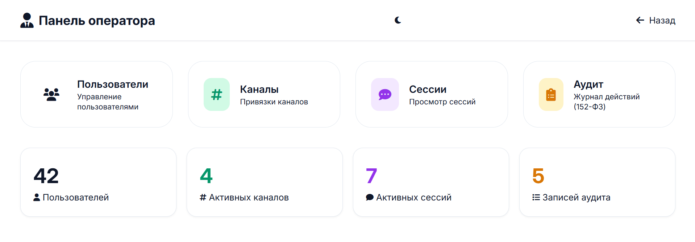

**Макет:**
- Карточки-ссылки:
  - Пользователи → `/operator/users`
  - Каналы → `/operator/channels`
  - Сессии → `/sessions` (или `/operator/sessions`)
  - Аудит → `/audit`
  - Аналитика → `/operator/analytics`
- Быстрая статистика (заглушка, пока 0).

**Трассировка требований:** R10 (управление каналами), R08 (аудит).

---

### 4.13. Users Management (Operator)

**Файл:** [frontend/src/pages/operator/users.tsx](../frontend/src/pages/operator/users.tsx)

**Назначение:** Управление пользователями (только admin/operator).

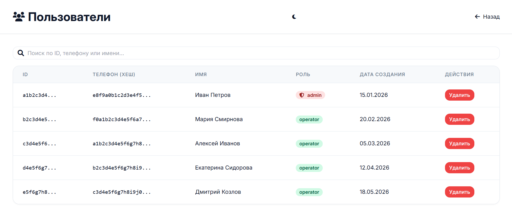

**Макет:**
- Поиск по ID, телефону, имени.
- Таблица пользователей: ID, телефон (хеш), имя, роль (Badge), дата создания, действия (удалить).

**Взаимодействие с API:** `GET /admin/users`, `DELETE /admin/users/{id}`.

**Трассировка требований:** R05 (аутентификация, роли).

---

### 4.14. Channels Management (Operator)

**Файл:** [frontend/src/pages/operator/channels.tsx](../frontend/src/pages/operator/channels.tsx)

**Назначение:** Управление привязками каналов.

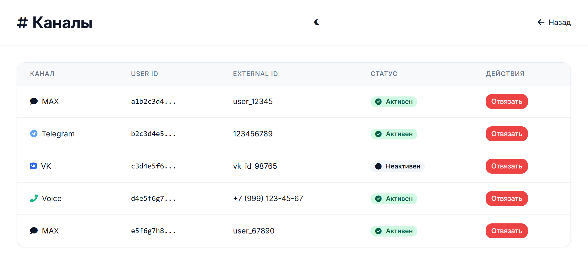

**Макет:** Таблица привязок: канал (с иконкой), user_id, external_id, статус (активен/неактивен), кнопка «Отвязать».

**Взаимодействие с API:** `GET /admin/channels`, `DELETE /admin/channels/{id}`.

**Трассировка требований:** R10 (омниканальность).

---

### 4.15. Analytics Dashboard (Operator)

**Файл:** [frontend/src/pages/operator/analytics.tsx](../frontend/src/pages/operator/analytics.tsx)

**Назначение:** Визуализация аналитических данных с помощью Recharts.

**Макет:**
- Статистические карточки (пользователи, сессии, факты, согласия, аудит сегодня).
- Графики:
  - Сообщения по каналам (BarChart).
  - Активность за 7 дней (AreaChart).
  - Часы пиковой активности (BarChart).
- Сводка (всего каналов, сообщений, пиковый час).

**Взаимодействие с API:** `GET /analytics/dashboard`, `GET /analytics/audit/timeline`, `GET /analytics/audit/peak-hours`.

**Трассировка требований:** R01, R02, R03, R04 (бизнес-метрики).

---

## 5. Глобальное состояние (Zustand)

### 5.1. Auth Store

**Файл:** [frontend/src/store/auth.store.ts](../frontend/src/store/auth.store.ts)

**Состояние:**
```typescript
interface AuthState {
  user: User | null;
  isAuthenticated: boolean;
  isLoading: boolean;
  error: string | null;
  login: (phone: string, password: string) => Promise<void>;
  register: (phone: string, password: string) => Promise<void>;
  logout: () => Promise<void>;
  checkAuth: () => Promise<void>;
  clearError: () => void;
}
```

**Логика:**
- `login` — вызывает `POST /auth/login`, затем `GET /auth/me` для получения пользователя.
- `register` — вызывает `POST /auth/register`, затем автоматический логин.
- `logout` — вызывает `POST /auth/logout`, очищает состояние.
- `checkAuth` — проверяет сессию через `GET /auth/me`.

**Использование в компонентах:**
```tsx
const { user, login, logout } = useAuthStore();
```

### 5.2. Другие store (планируются)

- `sessionStore` — для хранения текущей сессии (не реализован, пока локальное состояние).
- `memoryStore` — для кэширования фактов (не реализован).

---

## 6. Обработка ошибок и уведомления

### 6.1. Axios Interceptor

**Файл:** [frontend/src/api/axios.ts](../frontend/src/api/axios.ts)

- **401:** редирект на `/login` с уведомлением «Сессия истекла».
- **403:** уведомление «Недостаточно прав».
- **404:** уведомление «Ресурс не найден».
- **5xx:** уведомление «Ошибка сервера».
- **Network Error:** уведомление «Нет соединения с сервером».

### 6.2. React Hot Toast

**Файл:** [frontend/src/main.tsx](../frontend/src/main.tsx)

```tsx
import { Toaster } from 'react-hot-toast';

<Toaster
  position="top-right"
  toastOptions={{
    duration: 4000,
    style: { background: '#363636', color: '#fff' },
  }}
/>
```

### 6.3. AbortController

Для отмены запросов при размонтировании компонентов используется `AbortController`.

```tsx
const controller = new AbortController();
api.get('/endpoint', { signal: controller.signal });
return () => controller.abort();
```

---

## 7. Тёмная тема

**Файлы:**
- [frontend/src/components/ThemeToggle.tsx](../frontend/src/components/ThemeToggle.tsx) — переключатель.
- [frontend/tailwind.config.js](../frontend/tailwind.config.js) — `darkMode: "class"`.
- [frontend/src/index.css](../frontend/src/index.css) — CSS-переменные для light/dark.

**Реализация:**
```tsx
const [dark, setDark] = useState(() => {
  return localStorage.getItem('theme') === 'dark' ||
    (!localStorage.getItem('theme') && window.matchMedia('(prefers-color-scheme: dark)').matches);
});

useEffect(() => {
  document.documentElement.classList.toggle('dark', dark);
  localStorage.setItem('theme', dark ? 'dark' : 'light');
}, [dark]);
```

**Использование:** `ThemeToggle` размещён в `Layout` (sidebar и mobile header).

---

## 8. Тестирование UI

### 8.1. Инструменты

- **Vitest** — тест-раннер.
- **@testing-library/react** — рендеринг и взаимодействие.
- **@testing-library/jest-dom** — дополнительные матчеры.
- **happy-dom** — DOM-окружение.

### 8.2. Существующие тесты

| Файл | Количество тестов | Описание |
|------|-------------------|----------|
| `validations.test.ts` | 9 | Zod-схемы (login, register, consent) |
| `auth.store.test.ts` | 7 | Zustand store (login, logout, checkAuth) |
| `Layout.test.tsx` | 6 | Компонент Layout (навигация, рендеринг) |

**Запуск:** `npm test` в `frontend/`.

### 8.3. Пример теста

```tsx
import { render, screen } from '@testing-library/react';
import { MemoryRouter } from 'react-router-dom';
import Layout from '../components/Layout';

test('renders navigation links', () => {
  render(<MemoryRouter><Layout>Content</Layout></MemoryRouter>);
  expect(screen.getByText('Главная')).toBeInTheDocument();
});
```

---

## 9. Заключение

UI-часть системы построена на современном стеке React + TypeScript с использованием shadcn/ui для единообразных компонентов. Реализованы все ключевые страницы для управления аутентификацией, памятью, согласием, аудитом и административными функциями. Интерфейс адаптивен, поддерживает тёмную тему, имеет анимации и обратную связь для пользователя.

Все страницы интегрированы с бэкендом через REST API и используют Zustand для глобального состояния. Обработка ошибок централизована через axios-интерсепторы.