# 📋 USE_CASES.md

## 1. Введение

### 1.1. Цель документа

Настоящий документ содержит **детальное описание вариантов использования (Use Cases)** системы «Омниканальный агент с долговременной памятью». Каждый вариант использования описывает конкретный сценарий взаимодействия пользователя (или внешней системы) с системой, включая все шаги, альтернативные потоки, предусловия, постусловия и требования.

В отличие от пользовательских историй ([USER_STORIES.md](USER_STORIES.md)), которые фокусируются на потребностях пользователя, варианты использования детализируют **технические шаги** выполнения сценария, включая точные вызовы API, взаимодействие между компонентами и обработку ошибок.

Каждый вариант использования включает:

- **Краткое описание** — что делает сценарий.
- **Предусловия** — что должно быть выполнено до начала.
- **Постусловия** — что гарантируется после выполнения.
- **Основной поток** — пошаговое описание успешного сценария.
- **Альтернативные потоки** — обработка ошибок и исключений.
- **Диаграмму последовательности** — визуализация взаимодействия (Mermaid).
- **Ссылки на код** — конкретные файлы, классы, методы.
- **Трассировку требований** — связь с REQUIREMENTS.md.
- **Связь с пользовательскими историями** — ссылки на USER_STORIES.md.

### 1.2. Обозначения

- **UC-XX** — уникальный идентификатор варианта использования.
- **US-XX** — ссылка на пользовательскую историю.
- **RXX** — ссылка на требование из REQUIREMENTS.md.
- Ссылки на файлы кода: `[путь/к/файлу.py](../путь/к/файлу.py)`.
- Диаграммы выполнены в формате Mermaid.

### 1.3. Связанные документы

| Документ | Назначение |
|----------|------------|
| [REQUIREMENTS.md](REQUIREMENTS.md) | Полный перечень требований |
| [USER_STORIES.md](USER_STORIES.md) | Пользовательские истории |
| [API_REFERENCE.md](../API_REFERENCE.md) | Спецификация API |
| [AGENTS_REFERENCE.md](../AGENTS_REFERENCE.md) | Описание агентов |
| [DATA_FLOWS.md](../DATA_FLOWS.md) | Потоки данных |
| [UI_REFERENCE.md](../UI_REFERENCE.md) | Спецификация UI |

---

## 2. Список вариантов использования

| № | ID | Название | Приоритет | Связанные US |
|---|----|----------|-----------|--------------|
| 1 | UC-01 | Регистрация пользователя | Critical | US-01 |
| 2 | UC-02 | Вход в систему | Critical | US-02 |
| 3 | UC-03 | Выдача согласия | Critical | US-05 |
| 4 | UC-04 | Отзыв согласия | Critical | US-06 |
| 5 | UC-05 | Отправка текстового сообщения | Critical | US-07 |
| 6 | UC-06 | Голосовой звонок | High | US-08 |
| 7 | UC-07 | Право на забвение (RTBF) | Critical | US-11 |
| 8 | UC-08 | Просмотр фактов памяти | High | US-09 |
| 9 | UC-09 | Удаление факта | High | US-10 |
| 10 | UC-10 | Просмотр аудит-лога | High | US-12 |
| 11 | UC-11 | Фоновое устаревание фактов (Decay) | Medium | — |
| 12 | UC-12 | Асинхронное извлечение фактов | High | US-07 |

---

## 3. Детальное описание вариантов использования

### UC-01: Регистрация пользователя

| Атрибут | Значение |
|---------|----------|
| **ID** | UC-01 |
| **Название** | Регистрация нового пользователя |
| **Приоритет** | Critical |
| **Связанные US** | US-01 |
| **Требования** | R05 |

**Краткое описание:**  
Пользователь создаёт учётную запись, указывая номер телефона и пароль. Система проверяет уникальность телефона, хэширует пароль и телефон, создаёт пользователя.

**Предусловия:**  
- Пользователь не зарегистрирован в системе.
- Пользователь имеет доступ к веб-интерфейсу.

**Постусловия:**  
- Пользователь создан в БД.
- Пароль сохранён в виде bcrypt-хэша.
- Телефон сохранён в виде HMAC-SHA256 хэша.
- Пользователь автоматически аутентифицирован.

**Основной поток:**

1. Пользователь открывает страницу регистрации (`/register`).
2. Вводит номер телефона (в формате `+7XXXXXXXXXX`) и пароль (≥ 8 символов).
3. Отправляет форму.
4. Система валидирует входные данные через Zod-схему (`registerSchema`).
5. Система вызывает `POST /auth/register`.
6. Бэкенд хэширует телефон через `_hash_phone()` (HMAC-SHA256).
7. Бэкенд хэширует пароль через `bcrypt.hashpw()`.
8. Бэкенд создаёт пользователя в PostgreSQL.
9. Бэкенд автоматически выполняет вход (`login`).
10. Устанавливается JWT в httpOnly cookie.
11. Пользователь перенаправляется на `/dashboard`.

**Альтернативные потоки:**

| Шаг | Условие | Действие |
|-----|---------|----------|
| 4 | Невалидный телефон | Ошибка 400, сообщение «Формат: +7 (999) 123-45-67» |
| 4 | Пароль < 8 символов | Ошибка 400, сообщение «Пароль должен быть не менее 8 символов» |
| 6 | Телефон уже существует | Ошибка 409, сообщение «Пользователь уже существует» |

**Диаграмма последовательности:**

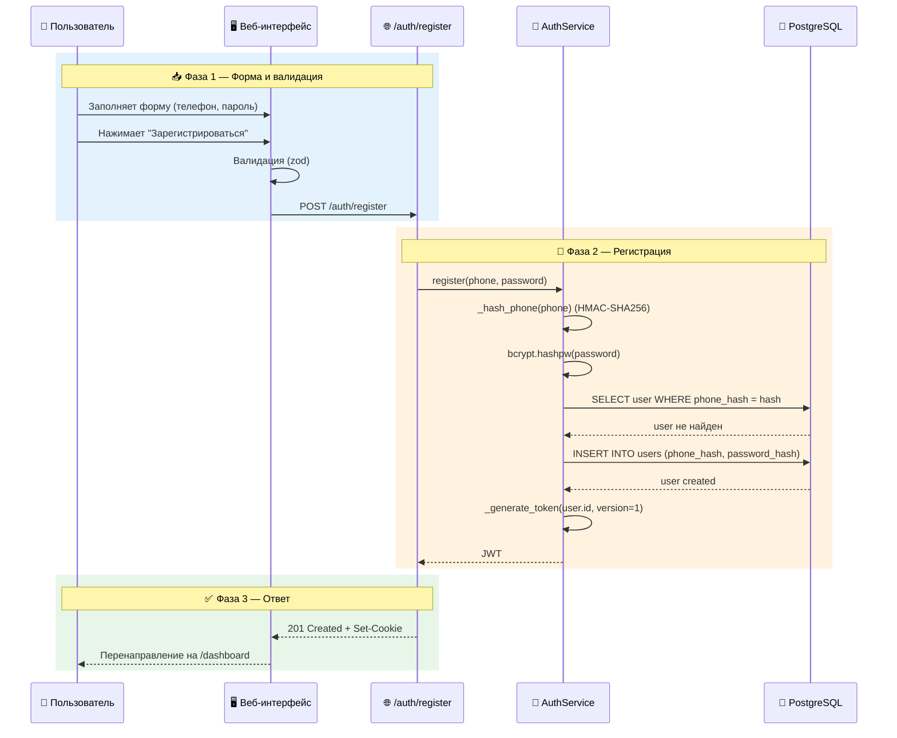

**Код:**

| Компонент | Файл | Метод/Класс |
|-----------|------|-------------|
| UI | [frontend/src/pages/register/index.tsx](../frontend/src/pages/register/index.tsx) | `onSubmit()` |
| Валидация | [frontend/src/lib/validations.ts](../frontend/src/lib/validations.ts) | `registerSchema` |
| API | [backend/src/api/auth.py](../backend/src/api/auth.py) | `register()` |
| Бизнес-логика | [backend/src/services/auth_service.py](../backend/src/services/auth_service.py) | `register()` |
| Хэширование | [backend/src/services/auth_service.py](../backend/src/services/auth_service.py) | `_hash_phone()`, `bcrypt.hashpw()` |

**Тесты:** [backend/tests/e2e/test_auth_e2e.py](../backend/tests/e2e/test_auth_e2e.py) — `test_register_user_success`, `test_register_user_duplicate`.

**Связанные документы:** [API_REFERENCE.md - 3.1](../API_REFERENCE.md#post-authregister), [USER_STORIES.md - US-01](USER_STORIES.md#us-01-регистрация-нового-пользователя)

---

### UC-02: Вход в систему

| Атрибут | Значение |
|---------|----------|
| **ID** | UC-02 |
| **Название** | Вход в систему |
| **Приоритет** | Critical |
| **Связанные US** | US-02 |
| **Требования** | R05, NFR-03 |

**Краткое описание:**  
Аутентифицированный пользователь входит в систему с использованием номера телефона и пароля. При успехе устанавливается JWT в httpOnly cookie и CSRF-токен.

**Предусловия:**  
- Пользователь зарегистрирован.
- Пользователь не аутентифицирован (сессия истекла или отсутствует).

**Постусловия:**  
- JWT установлен в httpOnly cookie.
- CSRF-токен установлен в cookie.
- `jwt_version` увеличен (старые токены становятся недействительными).

**Основной поток:**

1. Пользователь открывает страницу входа (`/login`).
2. Вводит телефон и пароль.
3. Отправляет форму.
4. Система валидирует данные через `loginSchema`.
5. Система вызывает `POST /auth/login`.
6. Бэкенд хэширует телефон через `_hash_phone()`.
7. Бэкенд находит пользователя по `phone_hash`.
8. Бэкенд проверяет пароль через `bcrypt.checkpw()`.
9. Бэкенд увеличивает `jwt_version` пользователя.
10. Бэкенд генерирует JWT с версией.
11. Устанавливается `access_token` cookie (httpOnly, Secure, SameSite=Strict).
12. Устанавливается `csrf_token` cookie (double-submit).
13. Пользователь перенаправляется на `/dashboard`.

**Альтернативные потоки:**

| Шаг | Условие | Действие |
|-----|---------|----------|
| 8 | Пароль не совпадает | Ошибка 401, сообщение «Неверный телефон или пароль» |
| 7 | Пользователь не найден | Ошибка 401, сообщение «Неверный телефон или пароль» |
| — | Превышено количество попыток | Ошибка 429, сообщение «Слишком много попыток, подождите» (планируется) |

**Диаграмма последовательности:**

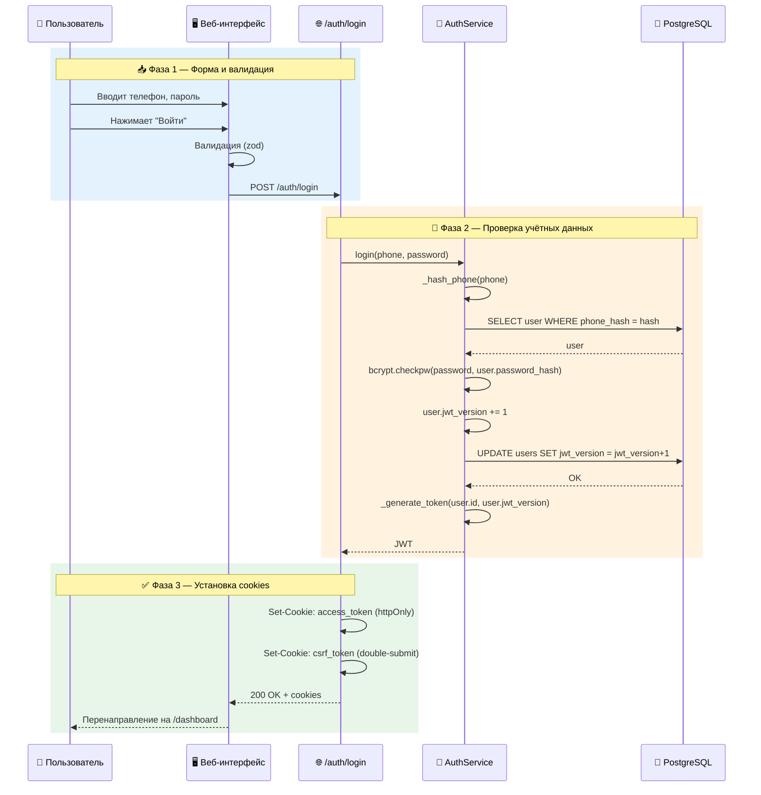

**Код:**

| Компонент | Файл | Метод/Класс |
|-----------|------|-------------|
| UI | [frontend/src/pages/login/index.tsx](../frontend/src/pages/login/index.tsx) | `onSubmit()` |
| API | [backend/src/api/auth.py](../backend/src/api/auth.py) | `login()` |
| Бизнес-логика | [backend/src/services/auth_service.py](../backend/src/services/auth_service.py) | `login()` |
| Проверка пароля | [backend/src/services/auth_service.py](../backend/src/services/auth_service.py) | `bcrypt.checkpw()` |
| CSRF | [backend/src/api/auth.py](../backend/src/api/auth.py) | `_generate_csrf_token()`, `_set_csrf_cookie()` |

**Тесты:** [backend/tests/e2e/test_auth_e2e.py](../backend/tests/e2e/test_auth_e2e.py) — `test_login_success`, `test_login_wrong_password`.

**Связанные документы:** [API_REFERENCE.md - 3.2](../API_REFERENCE.md#post-authlogin), [USER_STORIES.md - US-02](USER_STORIES.md#us-02-вход-в-систему)

---

### UC-03: Выдача согласия

| Атрибут | Значение |
|---------|----------|
| **ID** | UC-03 |
| **Название** | Выдача согласия на обработку данных (152-ФЗ) |
| **Приоритет** | Critical |
| **Связанные US** | US-05 |
| **Требования** | R05, DR-04 |

**Краткое описание:**  
Пользователь даёт явное согласие на обработку персональных данных. Без этого согласия система не сохраняет факты.

**Предусловия:**  
- Пользователь аутентифицирован.
- Пользователь не имеет активного согласия.

**Постусловия:**  
- В таблице `Consent` создана запись с `granted_at`.
- Агент начинает сохранять факты.

**Основной поток:**

1. Пользователь открывает профиль (`/profile`).
2. Видит карточку «Согласие (152-ФЗ)» с кнопкой «Выдать согласие».
3. Нажимает кнопку.
4. Система вызывает `POST /consents/grant` с `channel: "WEB"`.
5. Бэкенд проверяет аутентификацию (cookie).
6. Бэкенд создаёт запись в `Consent` с `granted_at = NOW()`.
7. Аудит: `AuditService.log_action(user_id, "WRITE")`.
8. Статус согласия обновляется.

**Альтернативные потоки:**

| Шаг | Условие | Действие |
|-----|---------|----------|
| 5 | Не аутентифицирован | Ошибка 401 |
| 6 | Уже есть активное согласие | Ошибка 400, «Согласие уже выдано» |

**Диаграмма последовательности:**

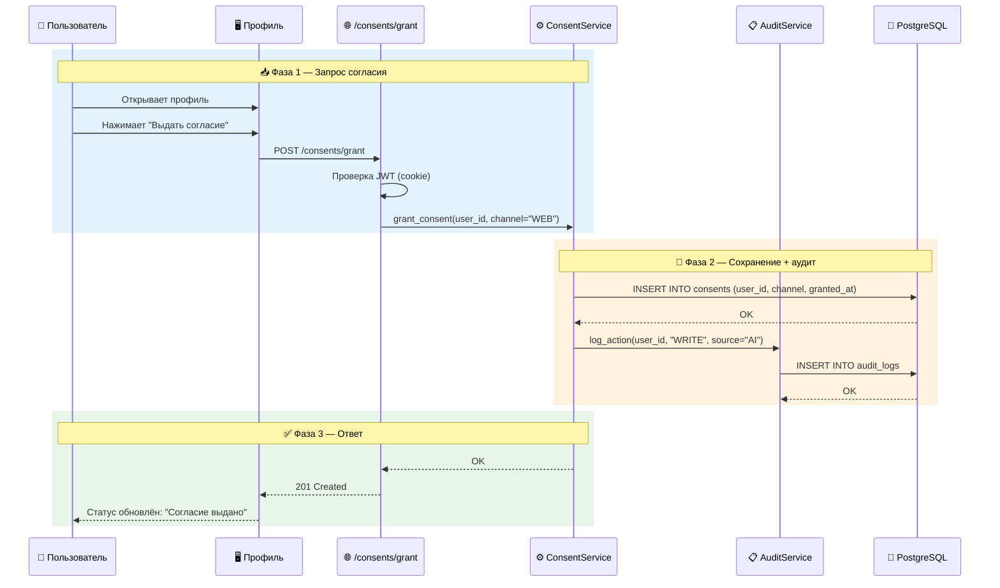

**Код:**

| Компонент | Файл | Метод/Класс |
|-----------|------|-------------|
| UI | [frontend/src/pages/profile/index.tsx](../frontend/src/pages/profile/index.tsx) | `handleGrantConsent()` |
| API | [backend/src/api/consents.py](../backend/src/api/consents.py) | `grant_consent()` |
| Бизнес-логика | [backend/src/services/consent_service.py](../backend/src/services/consent_service.py) | `grant_consent()` |
| Аудит | [backend/src/services/audit_service.py](../backend/src/services/audit_service.py) | `log_action()` |

**Тесты:** [backend/tests/e2e/test_consents_e2e.py](../backend/tests/e2e/test_consents_e2e.py) — `test_consent_grant`.

**Связанные документы:** [API_REFERENCE.md - 4.1](../API_REFERENCE.md#post-consentsgrant), [USER_STORIES.md - US-05](USER_STORIES.md#us-05-выдача-согласия-на-обработку-данных)

---

### UC-04: Отзыв согласия

| Атрибут | Значение |
|---------|----------|
| **ID** | UC-04 |
| **Название** | Отзыв согласия и удаление данных (RTBF) |
| **Приоритет** | Critical |
| **Связанные US** | US-06, US-11 |
| **Требования** | R09, DR-03, DR-04 |

**Краткое описание:**  
Пользователь отзывает согласие, что запускает каскадное удаление всех его данных из PostgreSQL, Qdrant, Neo4j и MinIO.

**Предусловия:**  
- Пользователь аутентифицирован.
- Пользователь имеет активное согласие.

**Постусловия:**  
- Согласие помечено как `revoked_at = NOW()`.
- Все факты, сессии, привязки и пользователь удалены из PostgreSQL.
- Все векторы удалены из Qdrant.
- Все узлы удалены из Neo4j.
- Все аудиофайлы удалены из MinIO.
- Аудит-запись создана.

**Основной поток:**

1. Пользователь открывает профиль (`/profile`).
2. Нажимает кнопку «Отозвать согласие».
3. Появляется подтверждение: «Вы уверены? Все данные будут удалены».
4. Пользователь подтверждает.
5. Система вызывает `POST /consents/revoke`.
6. Бэкенд проверяет аутентификацию.
7. Бэкенд проверяет наличие активного согласия.
8. Бэкенд устанавливает `revoked_at = NOW()`.
9. Бэкенд запускает `RightToBeForgottenService.delete_user_data()`:
   - Удаляет факты из PostgreSQL.
   - Удаляет векторы из Qdrant.
   - Удаляет узлы из Neo4j.
   - Удаляет аудиофайлы из MinIO.
10. Бэкенд создаёт аудит-запись.
11. Статус согласия обновляется.

**Альтернативные потоки:**

| Шаг | Условие | Действие |
|-----|---------|----------|
| 7 | Нет активного согласия | Ошибка 400, «Нет согласия для отзыва» |
| 9 | Ошибка при удалении из Qdrant | Логируется, продолжается удаление из других хранилищ |

**Диаграмма последовательности:**

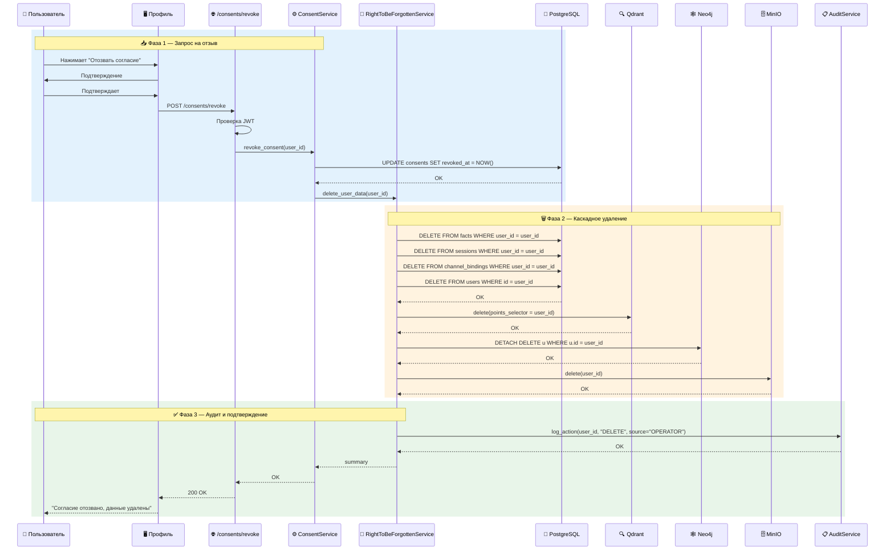

**Код:**

| Компонент | Файл | Метод/Класс |
|-----------|------|-------------|
| UI | [frontend/src/pages/profile/index.tsx](../frontend/src/pages/profile/index.tsx) | `handleRevokeConsent()` |
| API | [backend/src/api/consents.py](../backend/src/api/consents.py) | `revoke_consent()` |
| Бизнес-логика | [backend/src/services/consent_service.py](../backend/src/services/consent_service.py) | `revoke_consent()` |
| RTBF | [backend/src/services/right_to_be_forgotten_service.py](../backend/src/services/right_to_be_forgotten_service.py) | `delete_user_data()` |
| Удаление Qdrant | [backend/src/services/right_to_be_forgotten_service.py](../backend/src/services/right_to_be_forgotten_service.py) | `_delete_from_qdrant()` |
| Удаление Neo4j | [backend/src/services/right_to_be_forgotten_service.py](../backend/src/services/right_to_be_forgotten_service.py) | `_delete_from_neo4j()` |

**Тесты:** [backend/tests/unit/test_right_to_be_forgotten.py](../backend/tests/unit/test_right_to_be_forgotten.py), [backend/tests/e2e/test_consents_e2e.py](../backend/tests/e2e/test_consents_e2e.py).

**Связанные документы:** [API_REFERENCE.md - 4.2-4.4](../API_REFERENCE.md#post-consentsrevoke), [DATA_FLOWS.md - 4](../DATA_FLOWS.md#4-сценарий-3-право-на-забвение-rtbf), [USER_STORIES.md - US-06, US-11](USER_STORIES.md#us-06-отзыв-согласия)

---

### UC-05: Отправка текстового сообщения

| Атрибут | Значение |
|---------|----------|
| **ID** | UC-05 |
| **Название** | Отправка текстового сообщения с использованием памяти |
| **Приоритет** | Critical |
| **Связанные US** | US-07 |
| **Требования** | R01, R10, FR-01, FR-02, FR-03, FR-06 |

**Краткое описание:**  
Пользователь отправляет сообщение через любой канал (MAX, Telegram, VK). Система ищет релевантные факты, генерирует персонализированный ответ и асинхронно извлекает новые факты.

**Предусловия:**  
- Пользователь идентифицирован (external_id привязан к user_id).
- Пользователь имеет активное согласие (или система запрашивает его).

**Постусловия:**  
- Ответ отправлен пользователю.
- Новые факты (если есть) сохранены в память (асинхронно).
- Конфликты фактов разрешены (асинхронно).
- Аудит-запись создана (чтение).

**Основной поток:**

1. Внешняя система (MAX/Telegram/VK) отправляет webhook на `/webhook/{channel}`.
2. Система проверяет секрет (для Telegram/VK).
3. Система парсит payload, извлекает `external_id` и `text`.
4. Система находит `user_id` по `external_id` и каналу.
5. Система проверяет активное согласие.
6. **Асинхронно:** запускается Celery-задача `process_message.delay()`.
7. **Синхронно:** система выполняет гибридный поиск памяти (`MemorySearchService.search()`):
   - Ключевой поиск (PostgreSQL).
   - Векторный поиск (Qdrant).
   - Графовый поиск (Neo4j).
   - Реранкинг (Cross-Encoder).
8. Система передаёт релевантные факты в `ResponseGeneratorAgent.generate()`.
9. `ResponseGeneratorAgent` строит промпт, вызывает LLM, получает ответ.
10. Система отправляет ответ обратно в тот же канал.
11. **Асинхронно (в Celery):** извлекаются новые факты через `FactExtractorAgent.extract()`, сохраняются в память через `Mem0MemoryService.store_fact()`, разрешаются конфликты через `ConflictResolverAgent.resolve()`.

**Альтернативные потоки:**

| Шаг | Условие | Действие |
|-----|---------|----------|
| 2 | Неверный секрет Telegram/VK | Ошибка 403 |
| 5 | Нет активного согласия | Ответ: «Запросите согласие» |
| 7 | Qdrant недоступен | Пропуск векторного поиска |
| 9 | LLM недоступна | Использование fallback-ответа |
| 11 | Ошибка извлечения фактов | Логируется, ответ уже отправлен |

**Диаграмма последовательности:**

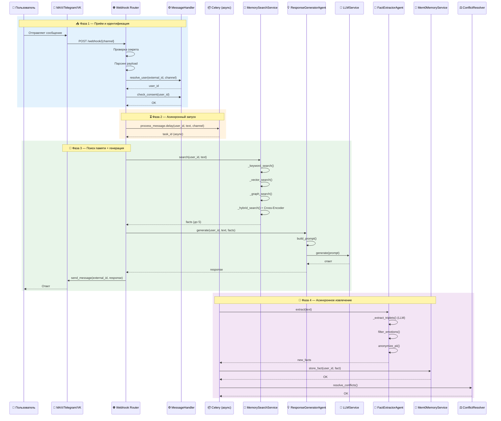

**Код:**

| Компонент | Файл | Метод/Класс |
|-----------|------|-------------|
| Webhook | [backend/src/api/webhooks.py](../backend/src/api/webhooks.py) | `max_webhook()`, `telegram_webhook()`, `vk_webhook()` |
| Обработка | [backend/src/services/message_handler.py](../backend/src/services/message_handler.py) | `handle_message()` |
| Поиск | [backend/src/services/memory_search_service.py](../backend/src/services/memory_search_service.py) | `search()`, `_hybrid_search()` |
| Генерация | [backend/src/agents/response_generator.py](../backend/src/agents/response_generator.py) | `generate()` |
| LLM | [backend/src/services/llm_service.py](../backend/src/services/llm_service.py) | `generate()` |
| Факты | [backend/src/tasks/fact_tasks.py](../backend/src/tasks/fact_tasks.py) | `extract_facts()` |
| Конфликты | [backend/src/agents/conflict_resolver.py](../backend/src/agents/conflict_resolver.py) | `resolve()` |

**Тесты:** [backend/tests/e2e/test_chat_e2e.py](../backend/tests/e2e/test_chat_e2e.py), [backend/tests/e2e/test_webhooks_e2e.py](../backend/tests/e2e/test_webhooks_e2e.py).

**Связанные документы:** [DATA_FLOWS.md - 2](../DATA_FLOWS.md#2-сценарий-1-текстовое-сообщение-в-max-с-использованием-памяти), [AGENTS_REFERENCE.md - 3,5,8](../AGENTS_REFERENCE.md#3-agent-factextractor), [USER_STORIES.md - US-07](USER_STORIES.md#us-07-отправка-текстового-сообщения)

---

### UC-06: Голосовой звонок

| Атрибут | Значение |
|---------|----------|
| **ID** | UC-06 |
| **Название** | Обработка голосового звонка |
| **Приоритет** | High |
| **Связанные US** | US-08 |
| **Требования** | R11, FR-05 |

**Краткое описание:**  
Пользователь звонит по телефону. Система транскрибирует речь (ASR), обрабатывает как текстовое сообщение и синтезирует ответ в речь (TTS).

**Предусловия:**  
- `ENABLE_VOICE=true`.
- Пользователь идентифицирован по номеру телефона.

**Постусловия:**  
- Аудио транскрибировано в текст.
- Ответ сгенерирован и синтезирован в речь.
- Аудио-ответ отправлен пользователю.

**Основной поток:**

1. CTI отправляет событие о входящем звонке (`POST /voice/event`).
2. Система находит `user_id` по номеру телефона.
3. Устанавливается WebSocket-соединение (`/voice/stream`).
4. Пользователь говорит, аудио-пакеты передаются в систему.
5. Система передаёт аудио в `WhisperASR.transcribe()` (ленивая загрузка модели).
6. Полученный текст передаётся в `VoiceService.process_voice()`.
7. `VoiceService` вызывает `ChatService.send_message()` (как в UC-05).
8. Полученный ответ передаётся в `SileroTTS.synthesize()` (ленивая загрузка модели).
9. Аудио-ответ отправляется обратно через WebSocket.
10. CTI воспроизводит ответ пользователю.

**Альтернативные потоки:**

| Шаг | Условие | Действие |
|-----|---------|----------|
| 2 | Пользователь не найден | Создаётся новый пользователь (гость) |
| 5 | ASR недоступен | Ошибка, звонок завершается |
| 8 | TTS недоступен | Отправляется текстовый ответ (если канал поддерживает) |

**Диаграмма последовательности:**

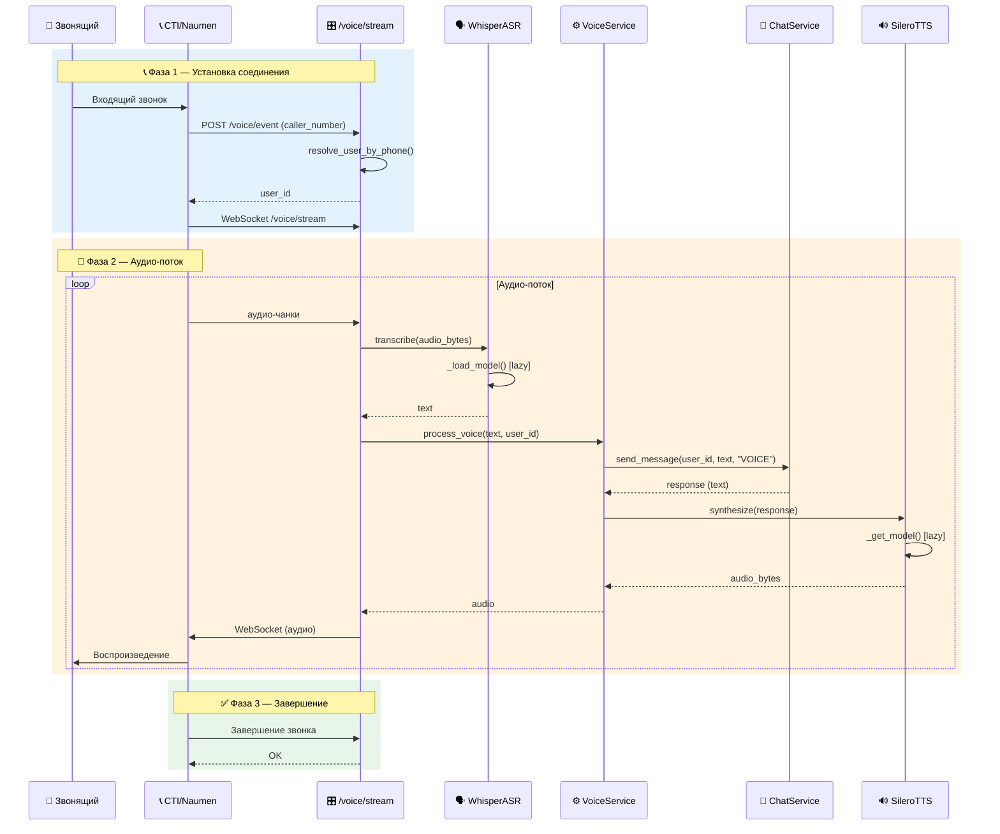

**Код:**

| Компонент | Файл | Метод/Класс |
|-----------|------|-------------|
| API | [backend/src/api/voice.py](../backend/src/api/voice.py) | `voice_stream()` (WebSocket) |
| ASR | [backend/src/services/whisper_asr.py](../backend/src/services/whisper_asr.py) | `transcribe()` |
| Voice Service | [backend/src/services/voice_service.py](../backend/src/services/voice_service.py) | `process_voice()` |
| TTS | [backend/src/services/silero_tts.py](../backend/src/services/silero_tts.py) | `synthesize()` |

**Тесты:** [backend/tests/integration/test_voice_integration.py](../backend/tests/integration/test_voice_integration.py).

**Связанные документы:** [DATA_FLOWS.md - 3](../DATA_FLOWS.md#3-сценарий-2-голосовой-звонок), [AGENTS_REFERENCE.md - 8.2](../AGENTS_REFERENCE.md#82-голосовой-пайплайн-voiceservice), [USER_STORIES.md - US-08](USER_STORIES.md#us-08-голосовое-взаимодействие)

---

### UC-07: Право на забвение (RTBF)

| Атрибут | Значение |
|---------|----------|
| **ID** | UC-07 |
| **Название** | Полное удаление данных пользователя (RTBF) |
| **Приоритет** | Critical |
| **Связанные US** | US-11 |
| **Требования** | R09, DR-03 |

**Краткое описание:**  
Пользователь запрашивает полное удаление всех своих данных через выделенную страницу. Система выполняет каскадное удаление из всех хранилищ.

**Предусловия:**  
- Пользователь аутентифицирован.

**Постусловия:**  
- Все данные пользователя удалены из всех хранилищ.
- Аудит-запись создана.
- Пользователь разлогинен.

**Основной поток:**

1. Пользователь переходит на страницу `/forget`.
2. Ознакамливается с информацией о удаляемых данных.
3. Вводит слово «УДАЛИТЬ» в поле подтверждения.
4. Нажимает кнопку «Удалить мои данные».
5. Система вызывает `POST /consents/data-deletion`.
6. Бэкенд проверяет аутентификацию.
7. Бэкенд запускает `RightToBeForgottenService.delete_user_data()`.
8. Все хранилища очищаются.
9. Создаётся аудит-запись.
10. Пользователь автоматически разлогинивается через 3 секунды.

**Альтернативные потоки:**

| Шаг | Условие | Действие |
|-----|---------|----------|
| 3 | Неправильное подтверждение | Ошибка, запрос повторного ввода |
| 7 | Ошибка при удалении | Логируется, но процесс продолжается |

**Диаграмма последовательности:**

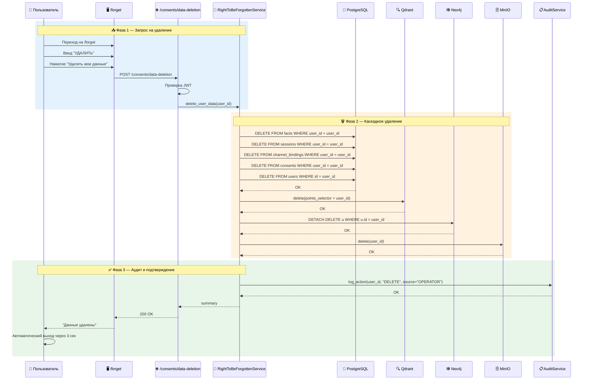

**Код:**

| Компонент | Файл | Метод/Класс |
|-----------|------|-------------|
| UI | [frontend/src/pages/forget/index.tsx](../frontend/src/pages/forget/index.tsx) | `handleDeleteRequest()` |
| API | [backend/src/api/consents.py](../backend/src/api/consents.py) | `request_data_deletion()` |
| RTBF | [backend/src/services/right_to_be_forgotten_service.py](../backend/src/services/right_to_be_forgotten_service.py) | `delete_user_data()` |

**Тесты:** [backend/tests/unit/test_right_to_be_forgotten.py](../backend/tests/unit/test_right_to_be_forgotten.py).

**Связанные документы:** [API_REFERENCE.md - 4.4](../API_REFERENCE.md#post-consentsdata-deletion), [UI_REFERENCE.md - 4.9](../UI_REFERENCE.md#49-forget-page-rtbf), [USER_STORIES.md - US-11](USER_STORIES.md#us-11-право-на-забвение-rtbf)

---

### UC-08: Просмотр фактов памяти

| Атрибут | Значение |
|---------|----------|
| **ID** | UC-08 |
| **Название** | Просмотр сохранённых фактов памяти |
| **Приоритет** | High |
| **Связанные US** | US-09 |
| **Требования** | R05, R08, DR-04 |

**Краткое описание:**  
Пользователь (или оператор) просматривает все сохранённые факты о пользователе.

**Предусловия:**  
- Пользователь аутентифицирован.
- Пользователь имеет активное согласие (для просмотра своих данных) или роль operator/admin.

**Постусловия:**  
- Факты отображены в таблице.
- Аудит-запись создана (чтение).

**Основной поток:**

1. Пользователь переходит на страницу `/memory`.
2. Вводит ID пользователя (свой или другого, если оператор).
3. Нажимает «Загрузить факты».
4. Система вызывает `GET /memory/users/{user_id}/facts`.
5. Бэкенд проверяет аутентификацию и согласие.
6. Бэкенд выполняет запрос к PostgreSQL, расшифровывает значения.
7. Бэкенд создаёт аудит-запись (READ).
8. Факты отображаются в таблице с колонками: тип, значение, вес, канал, дата, статус.

**Альтернативные потоки:**

| Шаг | Условие | Действие |
|-----|---------|----------|
| 5 | Нет согласия | Ошибка 403 |
| 6 | Нет фактов | Пустой список |

**Диаграмма последовательности:**

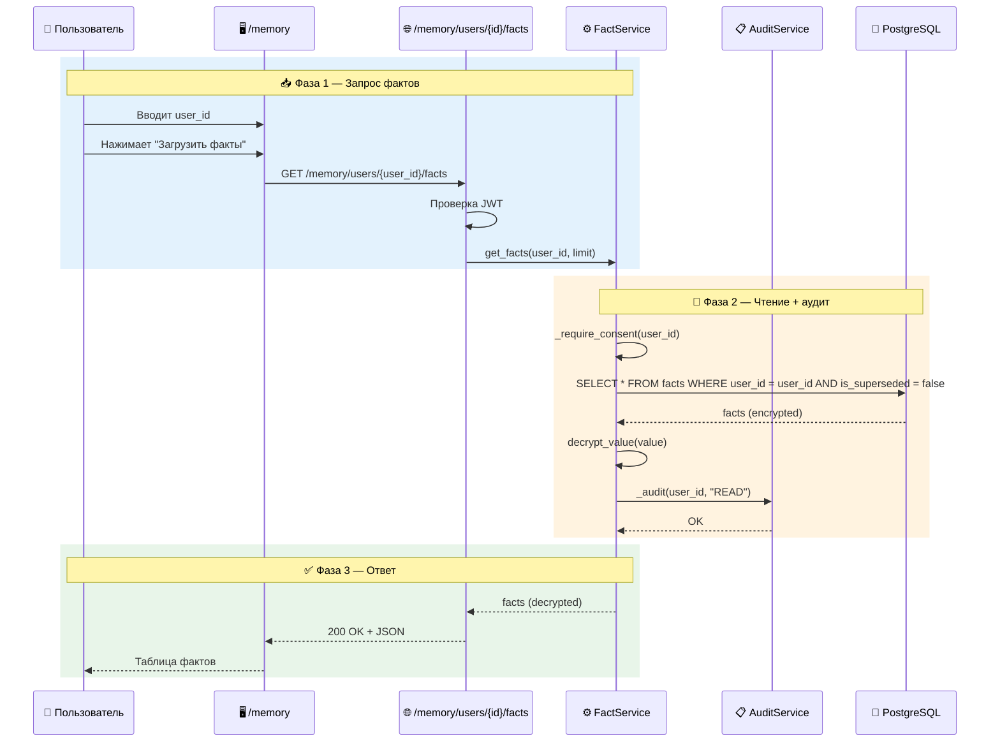

**Код:**

| Компонент | Файл | Метод/Класс |
|-----------|------|-------------|
| UI | [frontend/src/pages/memory/index.tsx](../frontend/src/pages/memory/index.tsx) | `fetchFacts()` |
| API | [backend/src/api/memory.py](../backend/src/api/memory.py) | `get_facts()` |
| Бизнес-логика | [backend/src/services/fact_service.py](../backend/src/services/fact_service.py) | `get_facts()` |

**Тесты:** [backend/tests/unit/test_fact_service.py](../backend/tests/unit/test_fact_service.py) — `test_get_facts`, `test_get_fact_by_id`.

**Связанные документы:** [API_REFERENCE.md - 5.2](../API_REFERENCE.md#get-memoryusersuser_idfacts), [UI_REFERENCE.md - 4.8](../UI_REFERENCE.md#48-memory-view-page), [USER_STORIES.md - US-09](USER_STORIES.md#us-09-просмотр-сохранённых-фактов)

---

### UC-09: Удаление факта

| Атрибут | Значение |
|---------|----------|
| **ID** | UC-09 |
| **Название** | Удаление конкретного факта памяти |
| **Приоритет** | High |
| **Связанные US** | US-10 |
| **Требования** | R09, DR-03, DR-04 |

**Краткое описание:**  
Пользователь или оператор удаляет конкретный факт из памяти.

**Предусловия:**  
- Пользователь аутентифицирован.
- Пользователь имеет права на удаление (владелец факта или operator/admin).

**Постусловия:**  
- Факт удалён из PostgreSQL, Qdrant и Neo4j.
- Аудит-запись создана (DELETE).

**Основной поток:**

1. Пользователь на странице `/memory` видит таблицу фактов.
2. Нажимает кнопку удаления для конкретного факта.
3. Появляется подтверждение.
4. Пользователь подтверждает.
5. Система вызывает `DELETE /memory/users/{user_id}/facts/{fact_id}`.
6. Бэкенд проверяет аутентификацию и права.
7. Бэкенд удаляет факт из PostgreSQL.
8. Бэкенд удаляет вектор из Qdrant.
9. Бэкенд удаляет узел из Neo4j.
10. Бэкенд создаёт аудит-запись (DELETE).

**Альтернативные потоки:**

| Шаг | Условие | Действие |
|-----|---------|----------|
| 7 | Факт не найден | Ошибка 404 |
| 8-9 | Ошибка при удалении из Qdrant/Neo4j | Логируется, но факт уже удалён из PG |

**Диаграмма последовательности:**

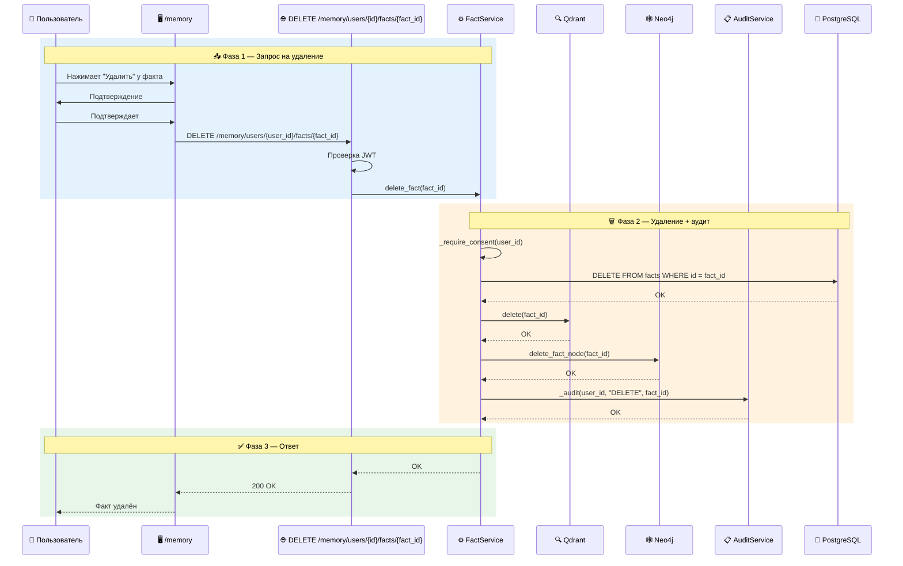

**Код:**

| Компонент | Файл | Метод/Класс |
|-----------|------|-------------|
| UI | [frontend/src/pages/memory/index.tsx](../frontend/src/pages/memory/index.tsx) | `handleDeleteFact()` |
| API | [backend/src/api/memory.py](../backend/src/api/memory.py) | `delete_fact()` |
| Бизнес-логика | [backend/src/services/fact_service.py](../backend/src/services/fact_service.py) | `delete_fact()` |

**Связанные документы:** [API_REFERENCE.md - 5.4](../API_REFERENCE.md#delete-memoryusersuser_idfactsfact_id), [USER_STORIES.md - US-10](USER_STORIES.md#us-10-удаление-конкретного-факта)

---

### UC-10: Просмотр аудит-лога

| Атрибут | Значение |
|---------|----------|
| **ID** | UC-10 |
| **Название** | Просмотр аудит-лога |
| **Приоритет** | High |
| **Связанные US** | US-12 |
| **Требования** | R08, DR-04 |

**Краткое описание:**  
Оператор (или администратор) просматривает аудит-лог операций с памятью.

**Предусловия:**  
- Пользователь аутентифицирован.
- Пользователь имеет роль operator или admin.

**Постусловия:**  
- Аудит-записи отображены в таблице.

**Основной поток:**

1. Пользователь переходит на страницу `/audit`.
2. Отображаются записи аудита с пагинацией.
3. Доступны фильтры: user_id, действие, источник, дата.
4. Пользователь может применить фильтры и обновить список.

**Диаграмма последовательности:**

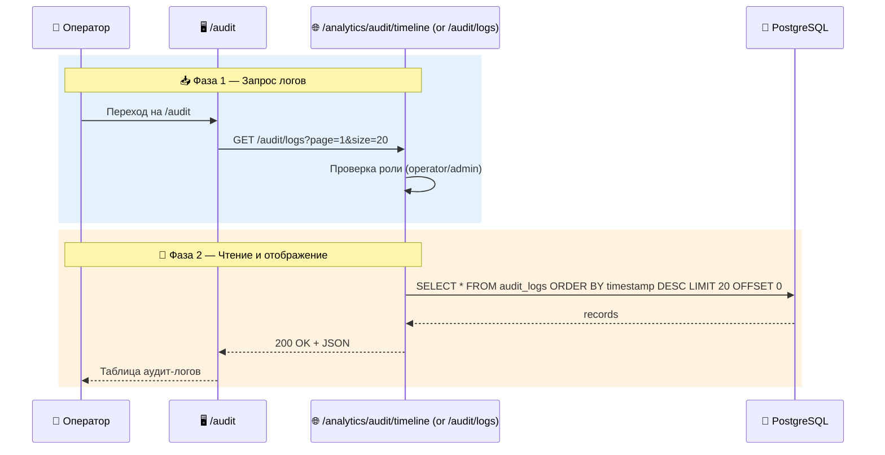

**Код:**

| Компонент | Файл | Метод/Класс |
|-----------|------|-------------|
| UI | [frontend/src/pages/audit/index.tsx](../frontend/src/pages/audit/index.tsx) | `fetchLogs()` |
| API | [backend/src/api/analytics.py](../backend/src/api/analytics.py) | (планируется, пока прямой доступ к БД) |
| Бизнес-логика | [backend/src/services/audit_service.py](../backend/src/services/audit_service.py) | `get_user_audit_logs()` |

**Связанные документы:** [UI_REFERENCE.md - 4.7](../UI_REFERENCE.md#47-audit-log-page), [USER_STORIES.md - US-12](USER_STORIES.md#us-12-просмотр-аудит-лога)

---

### UC-11: Фоновое устаревание фактов (Decay)

| Атрибут | Значение |
|---------|----------|
| **ID** | UC-11 |
| **Название** | Фоновое устаревание фактов |
| **Приоритет** | Medium |
| **Связанные US** | — |
| **Требования** | R03, R12 |

**Краткое описание:**  
Фоновый процесс (Celery Beat) периодически уменьшает вес фактов и удаляет устаревшие.

**Предусловия:**  
- `ENABLE_MEMORY=true`.
- Celery Beat запущен.

**Постусловия:**  
- Вес фактов уменьшен на 1%.
- Факты с весом < 0.1 помечены как `superseded`.
- Факты с истекшим `expires_at` удалены.

**Основной поток:**

1. Каждый час Celery Beat запускает задачу `run_decay_agent`.
2. Задача выполняет `UPDATE facts SET weight = weight * 0.99 WHERE is_superseded = false`.
3. Задача выполняет `UPDATE facts SET is_superseded = true WHERE weight < 0.1`.
4. Задача выполняет `UPDATE facts SET is_superseded = true WHERE expires_at < NOW()`.
5. Результат логируется.

**Диаграмма последовательности:**

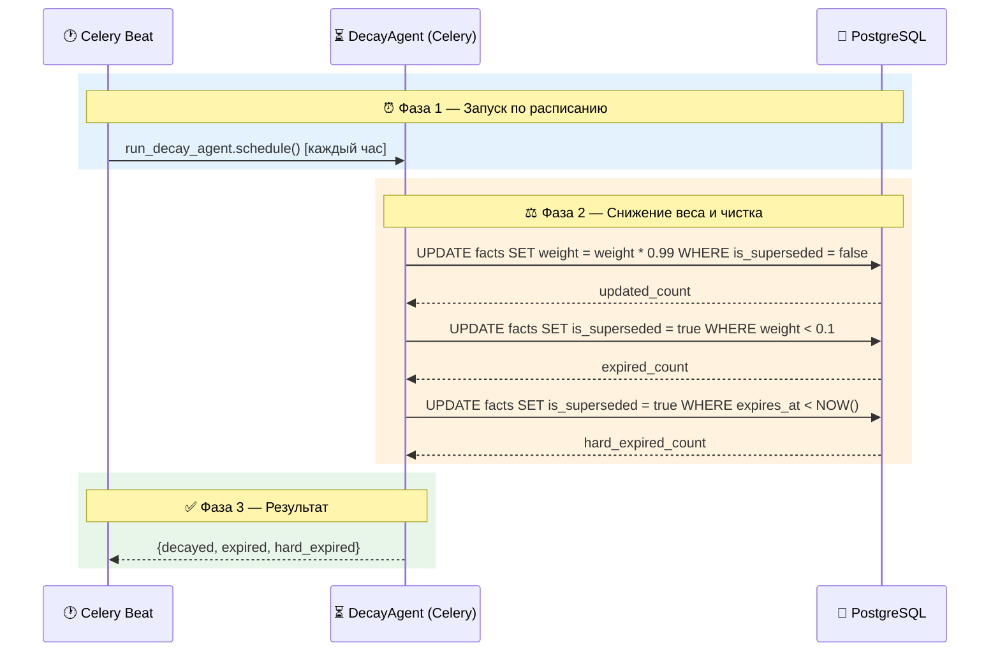

**Код:**

| Компонент | Файл | Метод/Класс |
|-----------|------|-------------|
| Настройка | [backend/src/celery_app.py](../backend/src/celery_app.py) | `beat_schedule` |
| Задача | [backend/src/tasks/decay_tasks.py](../backend/src/tasks/decay_tasks.py) | `run_decay_agent()` |

**Связанные документы:** [DATA_FLOWS.md - 6](../DATA_FLOWS.md#6-сценарий-5-decay-фоновое-устаревание), [AGENTS_REFERENCE.md - 7](../AGENTS_REFERENCE.md#7-agent-decayagent-фоновый)

---

### UC-12: Асинхронное извлечение фактов

| Атрибут | Значение |
|---------|----------|
| **ID** | UC-12 |
| **Название** | Асинхронное извлечение фактов (Celery) |
| **Приоритет** | High |
| **Связанные US** | US-07 |
| **Требования** | R01, FR-01, FR-06, R06 |

**Краткое описание:**  
После отправки сообщения система асинхронно извлекает и сохраняет новые факты, не блокируя ответ пользователю.

**Предусловия:**  
- Сообщение получено и обработано.
- У пользователя есть активное согласие.

**Постусловия:**  
- Факты извлечены, анонимизированы и сохранены.
- Конфликты разрешены.
- Аудит-записи созданы.

**Основной поток:**

1. `process_message.delay()` запускает задачу Celery.
2. Задача вызывает `FactExtractorAgent.extract(message)`.
3. `FactExtractorAgent` вызывает LLM для извлечения фактов.
4. Фильтруются эмоции.
5. Анонимизируется PII через Presidio.
6. Каждый факт сохраняется через `Mem0MemoryService.store_fact()`.
7. Проверяются конфликты через `ConflictResolverAgent.resolve()`.
8. Результат логируется.

**Диаграмма последовательности:**

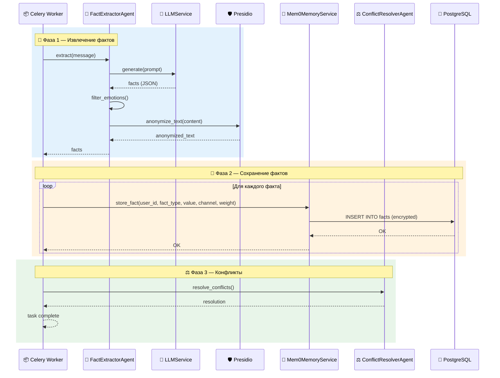

**Код:**

| Компонент | Файл | Метод/Класс |
|-----------|------|-------------|
| Задача | [backend/src/tasks/fact_tasks.py](../backend/src/tasks/fact_tasks.py) | `extract_facts()` |
| Агент | [backend/src/agents/fact_extractor.py](../backend/src/agents/fact_extractor.py) | `extract()` |
| Сохранение | [backend/src/services/mem0_memory_service.py](../backend/src/services/mem0_memory_service.py) | `store_fact()` |
| Конфликты | [backend/src/agents/conflict_resolver.py](../backend/src/agents/conflict_resolver.py) | `resolve()` |

**Связанные документы:** [DATA_FLOWS.md - 2.3 Шаг 7](../DATA_FLOWS.md#шаг-7-асинхронное-извлечение-и-сохранение-фактов-в-фоне), [AGENTS_REFERENCE.md - 3,6,8](../AGENTS_REFERENCE.md#3-agent-factextractor)

---

## 4. Матрица вариантов использования и требований

| Use Case | Требования | User Stories | Статус |
|----------|------------|--------------|--------|
| UC-01 | R05 | US-01 | ✅ |
| UC-02 | R05, NFR-03 | US-02 | ✅ |
| UC-03 | R05, DR-04 | US-05 | ✅ |
| UC-04 | R09, DR-03, DR-04 | US-06, US-11 | ✅ |
| UC-05 | R01, R10, FR-01, FR-02, FR-03, FR-06 | US-07 | ✅ |
| UC-06 | R11, FR-05 | US-08 | ✅ |
| UC-07 | R09, DR-03 | US-11 | ✅ |
| UC-08 | R05, R08, DR-04 | US-09 | ✅ |
| UC-09 | R09, DR-03, DR-04 | US-10 | ✅ |
| UC-10 | R08, DR-04 | US-12 | ✅ |
| UC-11 | R03, R12 | — | ✅ |
| UC-12 | R01, FR-01, FR-06, R06 | US-07 | ✅ |

---

## 5. Заключение

Все ключевые варианты использования, необходимые для пилотного запуска, реализованы и задокументированы. Каждый Use Case имеет чёткую структуру, диаграмму последовательности, ссылки на код и трассировку требований.

Документ обеспечивает полное понимание того, как система работает на уровне отдельных сценариев, и служит мостом между бизнес-требованиями и технической реализацией.